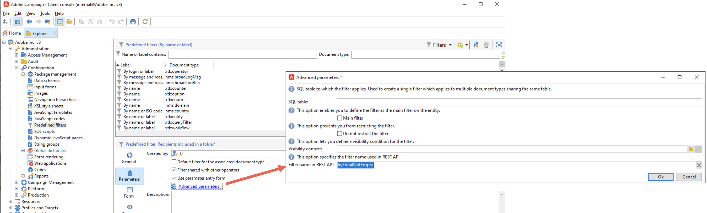

# Recommendations e limitações {#limitations}

## Permissões e segurança {#permissions}

### Mapeamento de perfis de produto

No Campaign Standard, você recebeu acesso elevado à função de administrador para APIs, independentemente do perfil de produto atribuído. O Campaign v8 apresenta um conjunto diferente de perfis de produto, exigindo o mapeamento de perfis de produto do Campaign Standard para o Campaign v8.

Com a migração, dois perfis de produto são adicionados às suas contas técnicas existentes ou pré-criadas: Administrador e Centro de mensagens (para acessar APIs transacionais). Revise o mapeamento do perfil de produto e atribua o perfil de produto necessário se não quiser que o perfil de produto do administrador seja mapeado com sua conta técnica.

### ID do inquilino

Após a migração, para qualquer integração futura, é recomendável usar sua **ID de locatário do Campaign v8** em URLs REST, substituindo sua ID de locatário do Campaign Standard anterior.

### Uso da chave

O gerenciamento de valores de PKey difere entre o Campaign Standard e o Campaign v8. Se você estava armazenando PKeys com Campaign Standard, certifique-se de que sua implementação formará dinamicamente chamadas de API subsequentes usando PKeys ou hrefs obtidos de chamadas de API anteriores.

## APIs disponíveis {#deprecated}

Por enquanto, as APIs REST listadas abaixo estão disponíveis para uso:

* **Perfis**
* **Serviços e assinaturas**
* **Recursos personalizados**
* **Fluxos de trabalhos**

>[!AVAILABILITY]
>
>Por enquanto, a API REST de **mensagens transacionais** não está disponível.
>
>As REST APIs listadas abaixo estão obsoletas e não estão disponíveis para uso:
>* Histórico de marketing
>* Unidades organizacionais
>* Gerenciamento de privacidade

## Filtragem

* Para usar os filtros em cargas da API REST, é necessário editá-los no Campaign v8 e fornecer um nome para usar em suas cargas. Para fazer isso, acesse os parâmetros adicionais do filtro na guia **[!UICONTROL Parâmetros]** e forneça o nome desejado no campo **[!UICONTROL Nome do filtro na API REST]**.

  


* O prefixo &quot;by&quot; necessário para usar filtros personalizados não é mais necessário. O nome do filtro deve ser usado como está em suas solicitações.

  Exemplo:

  `GET https://mc.adobe.io/<ORGANIZATION>/campaign/profileAndServicesExt/<resourceName>/<customFilterName>?<customFilterparam>=<customFilterValue>`

## Campos de banco de dados descartados

Alguns campos do banco de dados estão sendo removidos durante a migração. Ao usar um campo solto, as APIs REST retornarão valores em branco. No futuro, todos os campos ignorados serão descontinuados e removidos.

## POST com recursos vinculados

Ao usar o seguinte formato de corpo de solicitação, com &quot;vehicleOwner&quot; representando o link para &quot;nms:recipient&quot;:

```
{
    "vehicleNumber": "20009",
    "vehicleName": "Model E",
    "vehicleOwner":{
        "firstName":"tester 11",
        "lastName":"Smith 11"
    }
}
```

As informações do link são ignoradas. Consequentemente, um novo registro é gerado em &quot;cusVehicle&quot; contendo apenas valores de &quot;vehicleNumber&quot; e &quot;vehicleName&quot;. No entanto, o link permanece nulo, resultando em &quot;vehicleOwner&quot; sendo definido como nulo.

No Campaign v8, quando a mesma estrutura de corpo de solicitação é usada e o &quot;veículo&quot; é vinculado a um perfil, ocorre um erro. Este erro ocorre porque a propriedade &quot;firstName&quot; não é reconhecida como válida para &quot;cusVehicle&quot;. No entanto, um corpo de solicitação que inclui apenas os atributos sem o link funciona sem problemas.

## operações de PATCH

* O Campaign v8 não oferece suporte ao PATCH com um corpo de solicitação vazio: ele retorna um status 204 Sem conteúdo.
* Embora o Campaign Standard seja compatível com PATCH em elementos/atributos em um esquema, observe que as operações de PATCH no local não são compatíveis com o Campaign v8. Tentar um PATCH no local resultará em um Erro interno do servidor 500 com uma mensagem de erro indicando que a propriedade &#39;zipCode&#39; não é válida para o recurso &#39;profile&#39;.

## Respostas REST

A seção abaixo lista pequenas diferenças entre as respostas REST do Campaign Standard e do v8.

* Para registros de GET únicos, a resposta inclui o href na resposta.
* Quando consultado com o atributo, o Campaign v8 fornece Count e Pagination na resposta.
* Após as operações POST, os valores dos recursos vinculados são retornados na resposta.

## Códigos de erro e mensagens

A seção abaixo lista as diferenças entre códigos de erro e mensagens do Campaign Standard e do Campaign v8.

| Cenário | Campaign Standard | Campaign v8 |
|  ---  |  ---  |  ---  |
| Usar uma PKey inválida no corpo da solicitação | 500 - Atributo &#39;O5iRp40EGA&#39; desconhecido (consulte a definição do esquema &#39;Profiles (nms:recipient)&#39;). XTK-170036 Não é possível analisar a expressão &#39;@id = @O5iRp40EGA&#39;. | 404 - Não é possível descriptografar a PKey. (PKey=@jksad) |
| Usar uma PKey Inválida no URI | 500 - Atributo &#39;O5iRp40EGA&#39; desconhecido (consulte a definição do esquema &#39;Profiles (nms:recipient)&#39;). XTK-170036 Não é possível analisar a expressão &#39;@id = @O5iRp40EGA&#39;. | 404 - Não é possível descriptografar a PKey. (PKey=@jksad) Endpoint sem suporte. (endpoint=rest/profileAndServices/profile/@jksad) |
| Uso de duas Pkeys brutas diferentes no URI e no corpo da solicitação | 500 - RST-360011 Ocorreu um erro - entre em contato com o administrador. RST-360012 Operação inconsistente no recurso &#39;serviço&#39; - Não é possível atualizar a chave &#39;SVC3&#39; para &#39;SVC4&#39;. | 500 - Ocorreu um erro - entre em contato com o administrador. |
| Uso de PKey no URI e de uma PKey bruta diferente no corpo da solicitação | 500 - Já existe um &#39;Serviço&#39; com a mesma chave &#39;SVC4&#39;. PGS-220000 Erro PostgreSQL: ERRO: o valor de chave duplicado viola a restrição exclusiva &quot;nmsservice_name&quot; DETAIL: A chave (sname)=(SVC4) já existe. | 500 - Ocorreu um erro - entre em contato com o administrador. |
| Uso de ID bruta não existente no URI | 404 - RST-360011 Ocorreu um erro - entre em contato com o administrador. Não é possível localizar o documento com o caminho &#39;Service&#39; da chave &#39;adobe_nl:0&#39; (documento com o esquema &#39;service&#39; e o nome &#39;adobe_nl&#39;) | 404 - Não é possível localizar o documento com o caminho &#39;Service&#39; da chave &#39;adobe_nl&#39; (documento com o esquema &#39;service&#39; e o nome &#39;adobe_nl&#39;) |
| Uso de raw-id não existente no corpo da solicitação | 404 - RST-360011 Ocorreu um erro - entre em contato com o administrador. Não é possível localizar o documento com o caminho &#39;Service&#39; da chave &#39;adobe_nl&#39; (documento com o esquema &#39;service&#39; e o nome &#39;adobe_nl&#39;) | 404 - Não é possível localizar o documento com o caminho &#39;Service&#39; da chave &#39;adobe_nl&#39; (documento com o esquema &#39;service&#39; e o nome &#39;adobe_nl&#39;) |
| - | 500 - RST-360011 Ocorreu um erro - entre em contato com o administrador. | 500 - Ocorreu um erro - entre em contato com o administrador. |
| Insira um perfil/serviço com valor de enumeração de gênero inválido (ou qualquer coisa) | 500 - RST-360011 Ocorreu um erro - entre em contato com o administrador. O valor &#39;invalid&#39; não é válido para a enumeração &#39;nms:recipient:gender&#39; do campo &#39;@gender&#39; | 500 -Ocorreu um erro - entre em contato com o administrador. |

## Perfil - Fuso horário

Com o Campaign Standard, o fuso horário é exibido como parte da resposta JSON de **profileAndServices/profile** chamadas de API REST.

Com o Campaign v8, o fuso horário é exibido somente para o usuário como parte das chamadas de API REST **profileAndServicesExt/profile**. Não faz parte das chamadas REST API **profileAndServices/profile** porque está sendo adicionado em um esquema estendido.

## Fluxos de trabalho - Acionamento de sinal externo

A API de GET do fluxo de trabalho do Campaign Standard retorna nomes de parâmetros como as variáveis de instância do fluxo de trabalho e seus tipos de dados (booleano, string etc.). Isso é usado para criar o corpo da solicitação JSON formatado corretamente ao acionar o sinal por meio de uma chamada de API POST.

O Campaign v8 não é compatível com variáveis de instância de fluxo de trabalho de publicidade, mas espera que os desenvolvedores saibam o que são. Dessa forma, após a migração, as informações de parâmetros no corpo da solicitação do POST precisarão ser construídas sem a disponibilidade de informações de parâmetros na resposta da API do GET.

<!--## Transactional messages

* With Campaign Standard, a POST request returns empty fields for elements and attributes in the request body. With Campaign v8, the response returns values that match the ones in the request body instead.

* When publishing an event configuration, the API preview panel displays the REST URL alongside the request body syntax.

    Since Campaign v8 does not support event configuration fields definition (event creation is just adding a value to eventType enumeration), there is no API preview panel when adding an event type. The REST URL is displayed  in the transactional message user interface once an event transactional message is published.-->
