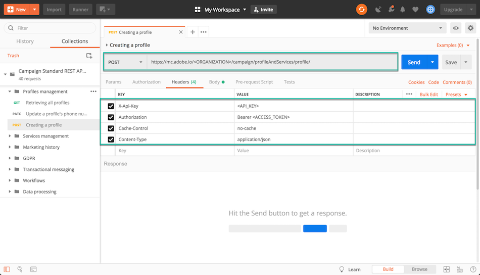

# Por que usar APIs Campaign Standard {#why-using-campaign-standard-apis}

O Adobe Campaign Standard fornece APIs que permitem que os sistemas existentes se integrem à plataforma do Campaign para resolver problemas do mundo real em tempo real.

Sites públicos, como a página de inscrição ou recusa, precisam se conectar a sistemas de back-end para armazenar informações de perfil. Sistemas de back-end como o Adobe Campaign têm a flexibilidade e o poder de assimilar dados de perfil e executar operações personalizadas neles.

Veja alguns exemplos:

* Registro de clientes potenciais online.
* Perfil do cliente existente e gerenciamento de preferência de comunicação de marketing.
* Acionamento de comunicação transacional com base em eventos - confirmação de pedido, itinerário de reserva, redefinição de senha etc.
* Até mesmo abandono de carrinho por e-mail.

As páginas de aterrissagem de inscrição fornecem uma maneira de os clientes ou clientes potenciais registrarem seu nome e endereço de email. Depois que o Campaign Standard captura as informações e preferências do perfil, ele pode enviar mensagens personalizadas com base nos interesses da pessoa.

Eles são criados com os elementos abaixo:

1. Um formulário de registro com ouvintes de API de campanha.

   

1. Ações personalizadas a serem executadas com base em caixas de seleção. Um cliente que selecionasse &quot;Ofertas especiais de email&quot; receberia um email personalizado diferente com um cupom de presente em comparação ao processo normal de registro.

   

1. Um perfil pode alterar seus detalhes depois de clicar no link &quot;Atualizar detalhes&quot; no email. Isso leva o perfil à página &quot;Atualizar seu perfil e detalhes de preferência&quot;. Para executar a operação, os detalhes do perfil (Pkey) são passados para o servidor do Campaign e o perfil é recuperado e representado. Quando o perfil clicar no botão &quot;Update&quot;, as informações serão atualizadas no sistema (por meio de um comando PATCH).

   

Uma coleção de solicitações está disponível para ajudá-lo a se familiarizar com as solicitações de APIs do Campaign Standard. Essa coleção no formato JSON fornece solicitações de API pré-projetadas que representam casos de uso comuns.

As etapas abaixo descrevem um caso de uso passo a passo para importar e usar a coleção para criar um perfil no banco de dados do Campaign Standard.

>[!NOTE]
>
>Nosso exemplo usa Postman. No entanto, fique à vontade para usar seu cliente REST favorito.

1. Baixe a coleção JSON clicando em [aqui](https://helpx.adobe.com/content/dam/help/en/campaign/kb/working-with-acs-api/_jcr_content/main-pars/download_section/download-1/KB_postman_collection.json.zip).

1. Abra o Postman e selecione a **Arquivo** / **Importar** menu.

1. Arraste e solte o arquivo baixado na janela. As solicitações de API pré-projetadas são exibidas, prontas para uso.

   

1. Selecione o **Criação de um perfil** , atualize a solicitação POST e o **Cabeçalhos** com suas próprias informações (&lt;organization>, &lt;api_key>, &lt;access_token>). Para obter mais informações, consulte [esta seção](setting-up-api-access.md).

   

1. Preencha o **Corpo** com as informações que deseja adicionar ao novo perfil, em seguida, clique na guia **Enviar** botão para executar a solicitação.

   

1. Depois que um objeto é criado, uma chave primária (PKey) é associada a ele. Ela é visível na resposta da solicitação, bem como em outros atributos.

   

1. Abra a instância do Campaign Standard e verifique se o perfil foi criado com todas as informações da carga.

   
