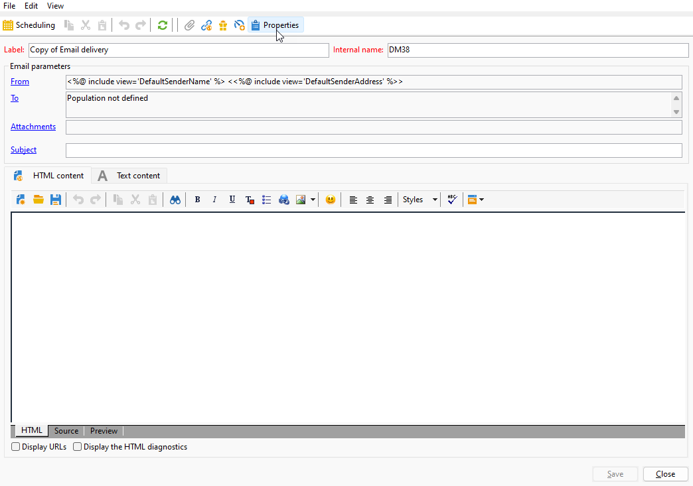
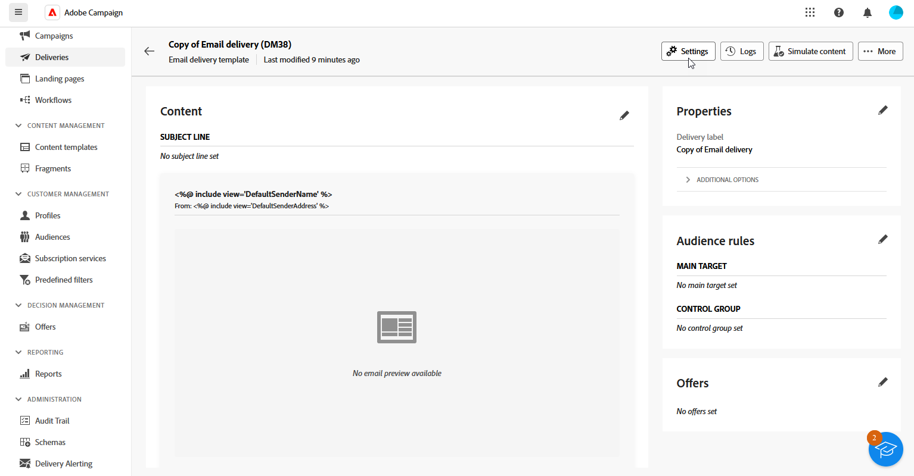

# Atribuir sua marca {#branding-assign}

## Vincular uma marca a um modelo {#linking-a-brand-to-a-template}

Para usar os parâmetros definidos para uma marca, ela deve estar vinculada a um template do delivery. Para fazer isso, é necessário criar ou editar um template.

Seu modelo será vinculado à marca. No editor de email, elementos como **Endereço de email do remetente padrão**, **Nome do remetente padrão** ou **logotipo** usarão os dados da marca configurada.

>[!BEGINTABS]

>[!TAB Adobe Campaign V8]

Para criar um template do delivery, você pode duplicar um template incorporado, converter um delivery existente em um template ou criar um template do delivery do zero. [Saiba mais](https://experienceleague.adobe.com/pt-br/docs/campaign/campaign-v8/send/create-templates)

Depois que o modelo for criado, você pode vinculá-lo a uma marca. Para fazer isso:

1. Navegue até **[!UICONTROL Recursos]** `>` **[!UICONTROL Modelos]** `>` **[!UICONTROL Modelos de entrega]** no Adobe Campaign Explorer.

1. Selecione um template de delivery ou duplique um existente.

   

1. Acesse as **[!UICONTROL Propriedades]** do modelo de entrega selecionado.

   

1. Na guia **[!UICONTROL Geral]**, selecione sua marca no menu suspenso **[!UICONTROL Marca]**.

   

1. Após a configuração, selecione **OK**.

Agora você pode usar esse template para enviar seus deliveries.

>[!TAB Adobe Campaign Web]

Para criar um template do delivery, você pode duplicar um template incorporado, converter um delivery existente em um template ou criar um template do delivery do zero. [Saiba mais](https://experienceleague.adobe.com/pt-br/docs/campaign-web/v8/msg/delivery-template)

Depois que o modelo for criado, você pode vinculá-lo a uma marca. Para fazer isso:

1. Navegue até a guia **[!UICONTROL Modelos]**, no menu esquerdo **[!UICONTROL Entregas]**, e selecione um modelo de entrega.

   

1. Clique em **[!UICONTROL Configurações]**.

   

1. Na guia **[!UICONTROL Delivery]**, acesse o campo **[!UICONTROL Branding]** e selecione a marca que deseja vincular ao modelo.

   

1. Confirme a seleção e salve o template.

Agora você pode usar esse template para enviar seus deliveries.

>[!ENDTABS]

## Atribuir uma marca ao seu delivery {#assigning-a-brand-to-an-email}

>[!BEGINTABS]

>[!TAB Adobe Campaign V8]

Para criar um novo delivery independente, siga as etapas abaixo.

1. Para criar uma nova entrega, navegue até a guia **[!UICONTROL Campanhas]**.

1. Clique em **[!UICONTROL Entregas]** e clique no botão **[!UICONTROL Criar]** acima da lista de entregas existentes.

   

1. Selecione um template de delivery.

1. Acesse as **[!UICONTROL Propriedades]** do modelo de entrega selecionado.

   

1. Na guia **[!UICONTROL Geral]**, selecione sua marca no menu suspenso **[!UICONTROL Marca]**.

   

1. Após a configuração, selecione **OK**.

1. Personalize ainda mais seus deliveries. Para obter mais informações sobre como criar um email, consulte a seção [Design e enviar emails](https://experienceleague.adobe.com/pt-br/docs/campaign-web/v8/msg/email/create-email).

>[!TAB Adobe Campaign Web]

Para criar um novo delivery independente, siga as etapas abaixo.

1. Navegue até o menu **[!UICONTROL Entregas]** no painel esquerdo e clique no botão **[!UICONTROL Criar entrega]**.

   

1. Selecione Email or Push notification como canal e escolha um template de delivery na lista.

1. Clique no botão **[!UICONTROL Criar entrega]** para confirmar.

1. Na página **[!UICONTROL Propriedades]**, clique em **[!UICONTROL Configurações]**.

   

1. Na guia **[!UICONTROL Delivery]**, acesse o campo **[!UICONTROL Branding]**.

   

1. Selecione a marca que deseja vincular ao modelo.

   

1. Personalize ainda mais seus deliveries. Para obter mais informações sobre como criar um email, consulte a seção [Criar seu primeiro email](https://experienceleague.adobe.com/pt-br/docs/campaign-web/v8/msg/email/create-email).

>[!ENDTABS]
