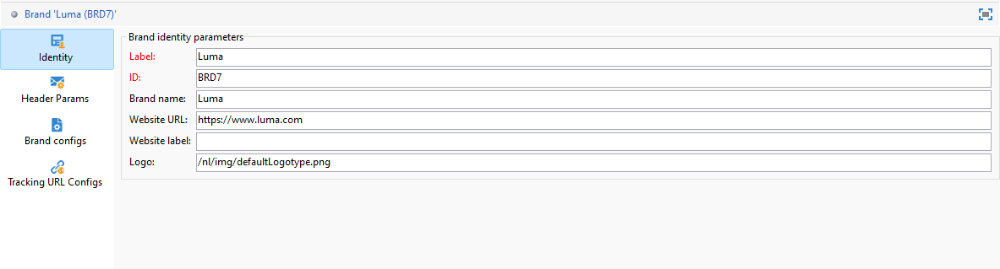
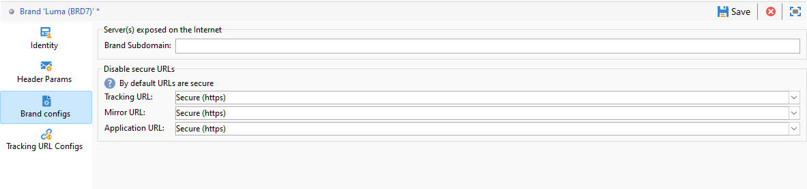

# Configurar marcas {#branding-configure}

>[!IMPORTANT]
>
>As marcas não podem ser criadas ou modificadas pelos usuários finais: essas operações têm de ser efetuadas pelo administrador técnico do Adobe Campaign. Para receber qualquer solicitação, entre em contato com o Atendimento ao cliente da Adobe.

No Adobe Campaign V8, as Marcas podem ser encontradas no menu **[!UICONTROL Administração > Plataforma > Marca]**.

Uma **[!UICONTROL Marca]** é definida pelas seguintes características:

* Uma **[!UICONTROL identidade]** que define e personaliza sua marca. Esta seção contém os seguintes campos:

   * **[!UICONTROL Rótulo]** visível na interface
   * **[!UICONTROL ID]**
   * **[!UICONTROL Nome da marca]**
   * **[!UICONTROL URL do site]** e **[!UICONTROL Rótulo do site]** da marca
   * **[!UICONTROL Logotipo da marca]**

  

* **[!UICONTROL Parâmetros de cabeçalho de emails enviados]** que personaliza o que os recipients das campanhas verão. Esta seção contém os seguintes campos:

   * **[!UICONTROL Remetente (endereço de email)]** com o endereço de email da marca.
   * **[!UICONTROL Remetente (nome)]** com o nome da marca.
   * **[!UICONTROL Responder a (endereço de email)]** com o endereço de email ao qual o cliente pode responder.
   * **[!UICONTROL Responder a (nome)]** com o nome da marca.
   * **[!UICONTROL Erro (endereço de email)]** com o endereço de email que será usado em caso de erro.

  >[!IMPORTANT]
  >
  >Após atualizar os parâmetros de cabeçalho dos emails, caso o nome e o endereço de email do remetente não tiverem sido alterados no email criado a partir do modelo, verifique as configurações avançadas do modelo.

  

* As **[!UICONTROL Configurações de marca]** definem os servidores usados para rastreamento também para acesso à página de aterrissagem. Esta seção contém os seguintes campos:

   * **[!UICONTROL Subdomínio da marca]** refere-se à URL do subdomínio designado específica para esta marca, solicitada para delegação do Adobe.

  Observe que a configuração para rastreamento, espelhamento e servidores de aplicativos é armazenada em contas externas separadas associadas ao roteamento. Essas configurações são aplicadas durante o provisionamento e não devem ser modificadas. Para exibir URLs, acesse a guia **[!UICONTROL Prefixos de marca]** da sua conta externa.

  

* O menu **[!UICONTROL Configurações de URL de rastreamento]** permite que você aprimore o rastreamento de URL definindo parâmetros adicionais para integração com ferramentas de análise da Web, como Adobe Analytics e Google Analytics.

  Use o menu **[!UICONTROL Parâmetros de URL Adicionais]** para criar parâmetros adicionais como pares de valor-chave junto com suas condições de aplicabilidade. Cada nome de parâmetro deve ser exclusivo e não vazio, e cada valor de parâmetro deve ser não vazio. A condição de aplicabilidade pode estar vazia, mas nenhum desses valores pode incluir tags JST.

  Esses parâmetros serão aplicados às URLs rastreadas que correspondem a qualquer nome de domínio especificado na **[!UICONTROL Lista de Nomes de Domínio]**, que pode incluir expressões regulares.
