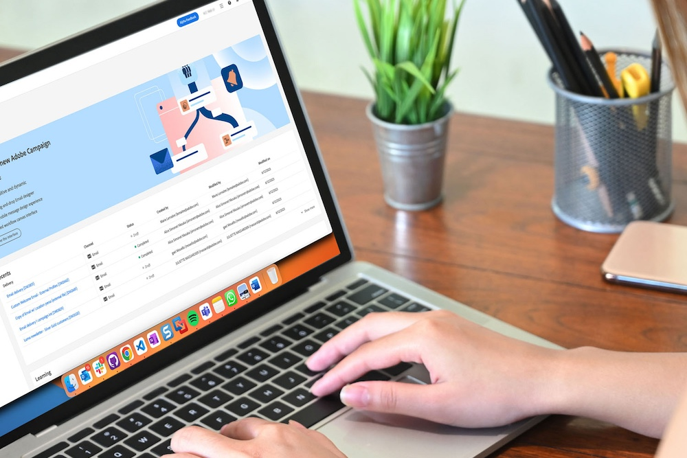

# Transição do Campaign Standard para o Campaign v8 {#triggers-home}

Como usuário do Campaign Standard em transição para o Campaign v8, você pode se beneficiar da nova versão da interface da Web do Adobe Campaign e do eficiente console v8. A transição é perfeita e permitirá que você use todos os recursos intuitivos projetados para simplificar a criação de campanhas personalizadas entre canais. A interface da Web do Campaign também traz uma tela conectada ao Adobe Experience Platform para oferecer uma experiência unificada.

Além disso, essa transição trará muitos benefícios:

* Infraestrutura de TI robusta
* Suporte Avançado
* Integração com o Adobe Experience Platform
* Interface do usuário e experiência consistentes

Para obter mais informações sobre os principais recursos e diferenças de conceito, consulte [esta página](https://experienceleague.adobe.com/pt-br/docs/campaign-web/v8/start/acs-migration).

## Novidades

Dê uma olhada em todos os recursos e funcionalidades oferecidos pela [Interface do Usuário da Web do Campaign](https://experienceleague.adobe.com/pt-br/docs/campaign-web/v8/campaign-web-home) e pelo [Campaign v8](https://experienceleague.adobe.com/pt-br/docs/campaign/campaign-v8/campaign-home).

Para que você possa fazer a transição sem problemas, adicionamos os principais recursos do Campaign Standard para o v8:

>[!BEGINTABS]

>[!TAB Relatórios dinâmicos]

Você pode acessar o Dynamic Reporting, que fornece relatórios totalmente personalizáveis e em tempo real para medir o impacto de suas atividades de marketing.

>[!TAB Marca Centralizada]

Agora, os seus administradores técnicos podem definir uma ou várias marcas para centralizar os parâmetros que afetam a identidade de uma marca.

>[!TAB APIs rest]

Você pode usar as APIs Rest para criar integrações com o Adobe Campaign e criar seu próprio ecossistema, conectando o Adobe Campaign ao painel de tecnologias que você usa.

>[!ENDTABS]

## Comece com as noções básicas

<table style="table-layout:fixed">
  <tr style="border: 0;">
    <td>
    
    
<strong>Conheça a nova interface</strong> 

    </td>
    <td>
    
    
<strong>Tela de fluxo de trabalho recriada</strong> 
 
    </td>
    <td>
    
    
<strong>Conheça o Designer de email</strong> 
    
</td>
    <td>
    
    
<strong>Tornar seu conteúdo dinâmico</strong> 

    </td>
  </tr>
  <tr style="border: 0;">
    <td align="center"></td>
    <td align="center"></td>
    <td align="center"></td>
    <td align="center"></td>
    </tr>
</table>

