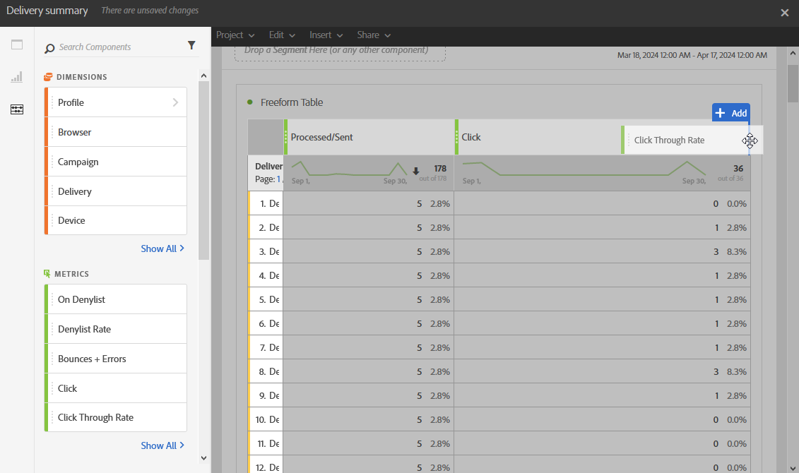

# Adicionar painéis{#adding-panels}

## Adição de um painel em branco {#adding-a-blank-panel}

Para iniciar seu relatório, você pode adicionar um conjunto de painéis a um relatório pronto para uso ou personalizado. Cada painel contém diferentes conjuntos de dados e é composto por tabelas e visualizações de forma livre.

Esse painel permite criar relatórios conforme necessário. Você pode adicionar quantos painéis desejar em seus relatórios para filtrar seus dados com diferentes períodos de tempo.

1. Clique em **Painéis** ícone. Você também pode adicionar um painel clicando no **Guia Inserir** e seleção **Novo painel em branco**.

   

1. Arraste e solte a **Painel em branco** no painel.

   

Agora é possível adicionar uma tabela de forma livre ao painel para começar a direcionar dados.

## Adição de uma tabela de forma livre {#adding-a-freeform-table}

As tabelas de forma livre permitem criar uma tabela para analisar seus dados usando as diferentes métricas e dimensões disponíveis no **Componente** tabela.

Cada tabela e visualização é redimensionável e pode ser movida para personalizar melhor seu relatório.

1. Clique em **[!UICONTROL Painéis]** ícone.

   

1. Arraste e solte a **[!UICONTROL Forma livre]** no painel.

   Você também pode adicionar uma tabela clicando no ícone **[!UICONTROL Inserir]** guia e seleção **[!UICONTROL Nova forma livre]** ou clicando em **[!UICONTROL Adicionar uma tabela de forma livre]** em um painel vazio.

   

1. No **[!UICONTROL Solte um segmento aqui]** adicione um **[!UICONTROL Segmento]** do **[!UICONTROL Componentes]** na barra superior.

   

1. Arraste e solte itens da **[!UICONTROL Componentes]** nas colunas e linhas para criar sua tabela.

   

1. Clique em **[!UICONTROL Configurações]** ícone para alterar como os dados são exibidos em suas colunas.

   

   A variável **[!UICONTROL Configurações de coluna]** é composto por:

   * **[!UICONTROL Número]**: permite mostrar ou ocultar números de resumo na coluna.
   * **[!UICONTROL Percentual]**: permite mostrar ou ocultar a porcentagem na coluna.
   * **[!UICONTROL Interpretar o zero como valor inexistente]**: permite mostrar ou ocultar quando o valor é igual a zero.
   * **[!UICONTROL Histórico]**: permite mostrar ou ocultar a barra de progresso horizontal em células.
   * **[!UICONTROL Incluir novas tentativas]**: permite incluir tentativas no resultado. Isso só está disponível para **[!UICONTROL Enviado]** e **[!UICONTROL Devoluções + Erros]**.

1. Selecione uma ou várias linhas e clique no botão **[!UICONTROL Visualizar]** ícone. Uma visualização é adicionada para refletir as linhas selecionadas.

   

Agora é possível adicionar quantos componentes forem necessários e também adicionar visualizações para fornecer representações gráficas de seus dados.
