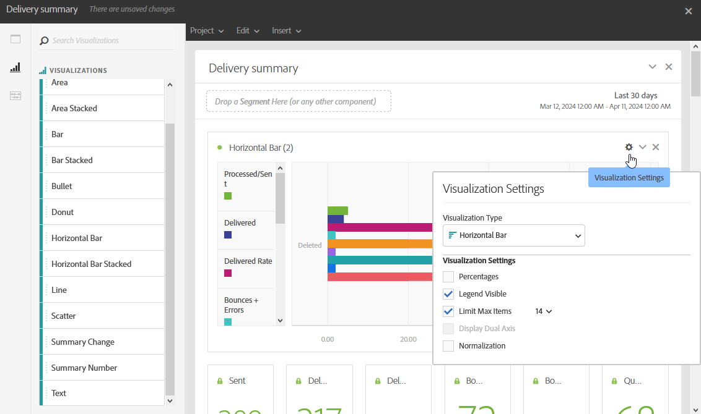

# Adicionar visualizações{#adding-visualizations}

A guia **Visualizações** permite arrastar e soltar itens de visualização, como área, rosca e gráfico. As visualizações fornecem representações gráficas de seus dados.

1. Na guia **[!UICONTROL Visualizações]**, arraste e solte um item de visualização em um painel.

   

1. Depois de adicionar uma visualização ao painel, os Relatórios dinâmicos detectam automaticamente os dados na tabela de forma livre. Selecione as configurações da visualização.
1. Se você tiver mais de uma tabela de forma livre, escolha a fonte de dados disponível para adicionar ao seu gráfico na janela **Configurações de Source de Dados**. Essa janela também está disponível clicando no ponto colorido ao lado do título da visualização.

   

1. Clique no botão de configurações **[!UICONTROL Visualização]** para alterar diretamente o tipo de gráfico ou o que é exibido nele, como:

   * **Percentuais**: Exibe os valores em porcentagem.
   * **Ancorar eixo Y no zero**: força o eixo y para zero mesmo que os valores sejam maiores que zero.
   * **Legenda visível**: permite ocultar a legenda.
   * **Normalização**: força a correspondência dos valores.
   * **Exibir Eixo Duplo**: Adiciona outro eixo ao gráfico.
   * **Limitar Máximo de Itens**: Limita o número de gráficos exibidos.
   * **Limite**: permite que você defina um limite para o seu gráfico. Aparece como uma linha pontilhada preta.

   

Essa visualização permite que você tenha uma visualização mais clara dos dados em seus relatórios.
