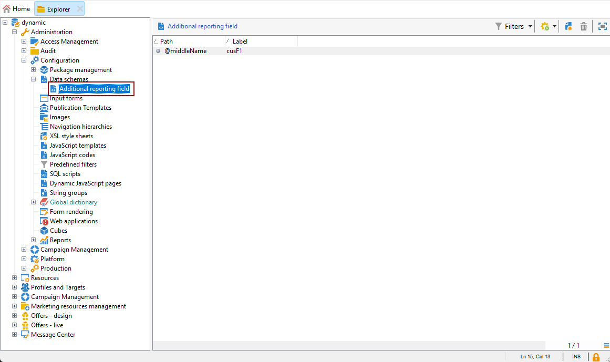

# Criação de uma dimensão de perfil{#creating-a-custom-profile-dimension}

Os relatórios também podem ser criados e gerenciados com base nos dados do perfil criados durante a extensão do schema do recipient.

* [Etapa 1: estender o esquema do recipient](##extend-schema)
* [Etapa 2: vincular o novo campo personalizado](#link-custom)
* [Etapa 3: criar um relatório dinâmico para filtrar recipients com a dimensão de perfil](#create-report)

## Etapa 1: estender o esquema do recipient {#extend-schema}

Para adicionar um novo campo de perfil, é necessário estender o esquema, siga as etapas abaixo:

1. Navegue até a pasta **[!UICONTROL Administração]** > **[!UICONTROL Configuração]** > **[!UICONTROL Esquemas de dados]** no Explorer.

   

1. Identifique o esquema de recipient personalizado e selecione-o. Se você ainda não tiver estendido o esquema nms:recipient interno, consulte [este procedimento](https://experienceleague.adobe.com/pt-br/docs/campaign/campaign-v8/developer/shemas-forms/extend-schema).

1. Adicione o campo personalizado ao editor de esquemas.

   Por exemplo, para adicionar um campo personalizado de Fidelidade no esquema do destinatário:

   ```
   <attribute label="Loyalty" name="loyalty" type="string"/>
   ```

   

1. Clique em **[!UICONTROL Salvar]**.

1. Em seguida, identifique o esquema broadLogRcp personalizado e selecione-o. Se você ainda não tiver estendido o esquema interno do Log de entrega, consulte [este procedimento](https://experienceleague.adobe.com/pt-br/docs/campaign/campaign-v8/developer/shemas-forms/extend-schema).

1. Adicione o mesmo campo personalizado do esquema do Recipient ao editor de esquemas.

   

1. Clique em **[!UICONTROL Salvar]**.

1. Para aplicar as modificações feitas aos esquemas, inicie o assistente de Atualização de banco de dados por meio de **[!UICONTROL Ferramentas]** > **[!UICONTROL Avançado]** > **[!UICONTROL Atualizar estrutura de banco de dados]** e execute Atualizar a estrutura do banco de dados. [Saiba mais](https://experienceleague.adobe.com/pt-br/docs/campaign/campaign-v8/developer/shemas-forms/update-database-structure)

   

O novo campo de perfil agora está pronto para ser usado e selecionado pelos recipients.

## Etapa 2: vincular o novo campo personalizado {#link-custom}

>[!NOTE]
>
> Você só pode adicionar até 20 campos personalizados ao relatório Dinâmico.

Agora que o campo de perfil foi criado, precisamos vinculá-lo à dimensão de relatórios dinâmicos correspondente.

Antes de estender o log com nosso campo de perfil, verifique se a janela PII foi aceita para enviar dados PII para o relatório dinâmico. Para obter mais informações, consulte esta [página](pii-agreement.md).

1. Navegue até a pasta **[!UICONTROL Administração]** > **[!UICONTROL Configuração]** > **[!UICONTROL Esquemas de dados]** > **[!UICONTROL Campo de relatórios adicional]** no Explorer.

   

1. Clique em **[!UICONTROL Novo]** para criar a dimensão de relatório Dinâmico correspondente.

1. Selecione **[!UICONTROL Editar expressão]** e navegue pelo esquema de Destinatário para encontrar o campo de perfil criado anteriormente.

   

1. Clique em **[!UICONTROL Concluir]**.

1. Digite sua dimensão **[!UICONTROL Rótulo]**, visível em Relatórios dinâmicos, e clique em **[!UICONTROL Salvar]**.

   

O campo de perfil agora está disponível como uma dimensão de perfil em seus relatórios. Para excluir sua dimensão de perfil, você pode selecioná-la e clicar no ícone **[!UICONTROL Excluir]**.

Agora que o esquema de recipient foi estendido com esse campo de perfil e sua dimensão personalizada criada, você pode começar a direcionar recipients em deliveries.

## Etapa 3: criar um relatório dinâmico para filtrar recipients com a dimensão de perfil {#create-report}

Depois de enviar o delivery, você pode detalhar os relatórios usando a dimensão de perfil.

1. Na guia **[!UICONTROL Relatórios]**, selecione um relatório pronto para uso ou clique no botão **[!UICONTROL Criar]** para iniciar um do zero.

   

1. Na categoria **[!UICONTROL Dimension]**, clique em **[!UICONTROL Perfil]** e arraste e solte sua dimensão de perfil na tabela de forma livre.

   

1. Arraste e solte quaisquer métricas para começar a filtrar seus dados.

1. Arraste e solte uma visualização no seu espaço de trabalho se necessário.

