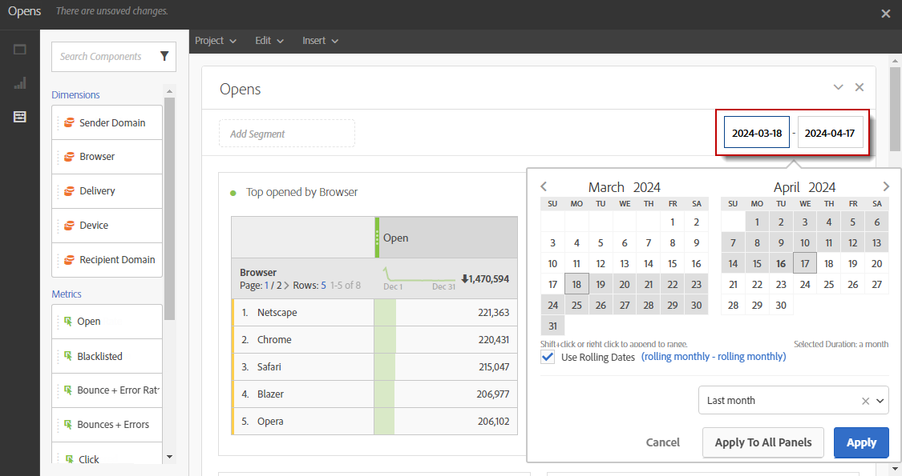

# Definição do período do relatório{#defining-the-report-period}

>[!NOTE]
>
>O relatório de dados está disponível para os últimos 13 meses. Para obter mais informações sobre os períodos de retenção de dados, entre em contato com os consultores da Adobe ou com os administradores técnicos.

Antes de iniciar ou acessar um relatório, você deve aplicar um período. O período especificado pode ser acessado na parte superior direita do relatório.

Por padrão, para uma campanha ou programa, o período do filtro é definido como as datas de início e término do programa ou da campanha. Para um delivery, a data inicial corresponde à data de envio e a data final à data de envio mais 7 dias.

Para modificar o filtro, selecione uma data de início e um período ou use o período de tempo predefinido, como semana passada, dois meses atrás etc.

O relatório é atualizado automaticamente quando um filtro é aplicado ou modificado. O período do relatório selecionado controlará os eventos que ocorreram no período, não todo o conjunto de dados de seus deliveries que foram criados no intervalo, por exemplo, se um delivery foi executado de 1º a 5º de janeiro e o período do relatório for de 1º a 2º de janeiro, você poderá ver dados parciais. Isso pode afetar as contagens de aberturas/cliques, pois aberturas ou cliques podem ocorrer até mesmo um mês após o envio do delivery.

