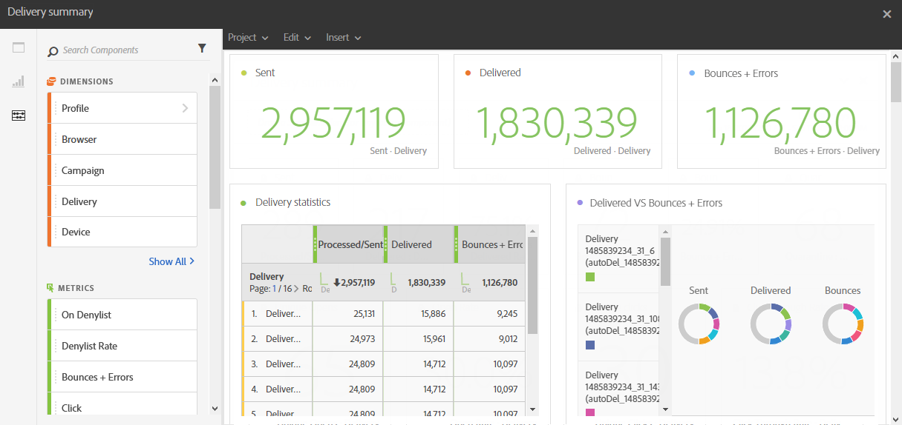

# Resumo da entrega{#delivery-summary}

O relatório de **[!UICONTROL Resumo da entrega]** detalha as principais informações relativas a um email ou a vários emails.

Cada tabela é representada por números de resumo e gráficos. É possível alterar como os detalhes são mostrados nas respectivas configurações de visualização.

A tabela **Estatísticas de entrega** contém os dados disponíveis para emails enviados, como:

* **[!UICONTROL Processado/enviado]**: o número total de envios para a entrega.
* **[!UICONTROL Entregues]**: o número de mensagens enviadas com êxito em relação ao número total de mensagens enviadas. Erros gerados (rejeições) são considerados. No entanto, as reclamações (declarações de spam) e mensagens ausentes como &quot;ausente&quot; não são consideradas.
* **[!UICONTROL Rejeições + Erros]**: o número total de erros acumulados durante o processamento de entrega e retorno automático em relação ao número total de mensagens enviadas.

A tabela **Open and clicks** contém os dados disponíveis para a atividade de recipient para cada delivery, como:

* **Clique**: o número de vezes que um conteúdo foi clicado em uma entrega.
* **Aberto**: o número de vezes que uma mensagem foi aberta em uma entrega.
* **Aberturas únicas**: o número de destinatários que abriram a entrega.
* **Cliques únicos**: o número de destinatários que clicaram em um conteúdo em uma entrega.

A tabela **Repartição de domínio** exibe o status das entregas de acordo com o domínio do destinatário.
