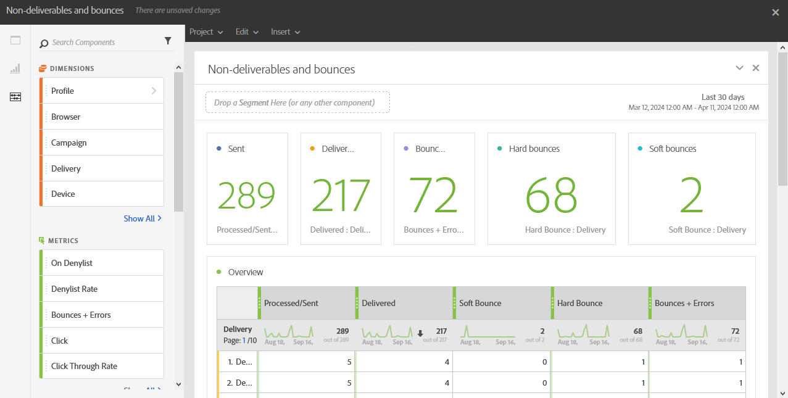

# Não entregues e devolvidos{#non-deliverables-and-bounces}

O relatório **[!UICONTROL Não entregues e rejeitados]** fornece detalhes sobre todos os erros encontrados durante uma entrega.

A tabela **[!UICONTROL Visão geral]** contém os dados disponíveis sobre os possíveis erros que podem ser encontrados para cada entrega, como:

* **Processados/enviados**: o número de emails enviados.
* **Entregues**: o número de emails entregues.
* **Rejeição temporária**: o número total de erros temporários, como uma caixa de entrada cheia.
* **Rejeição permanente**: o número total de erros permanentes, como um endereço de email incorreto.
* **Rejeições + Erros**: o número de mensagens que não puderam ser entregues.

A tabela **Detalhamento por domínio** lista as rejeições por domínios de destinatários.
