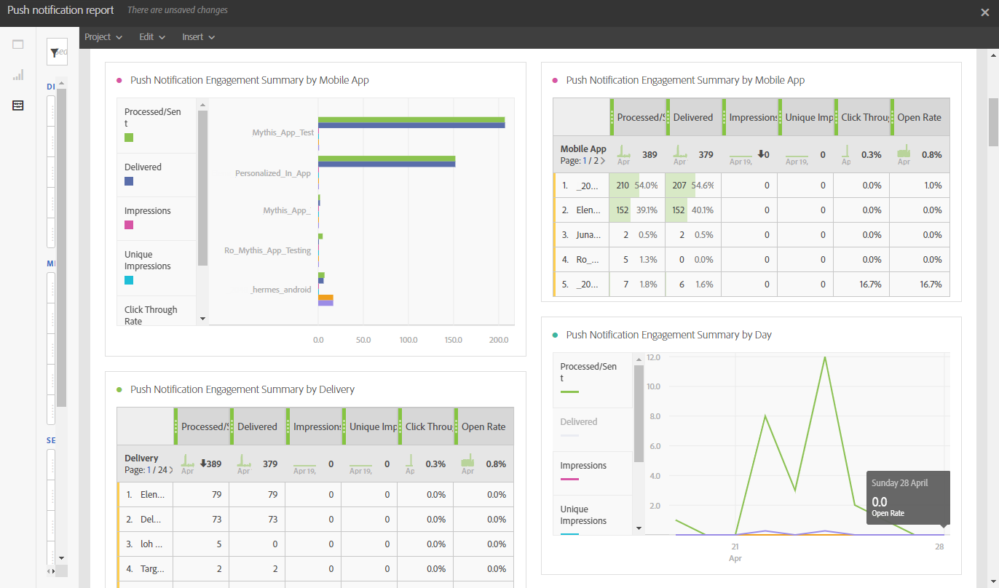

# Relatório de notificação por push{#push-notification-report}

>[!CAUTION]
>
>Observe que você deve arrastar e soltar a variável **[!UICONTROL Tipo de mensagem]** As métricas para suas tabelas dividem os dados dependendo dos tipos de delivery; nesse caso, deliveries de notificação por push.

A variável **Notificação por push** O relatório de fornece detalhes do desempenho de marketing das notificações por push no Adobe Campaign. Esse relatório pronto para uso ajuda você a entender como os usuários interagem com notificações por push, aplicativos móveis e deliveries.

Cada tabela é representada por números de resumo e gráficos. É possível alterar como os detalhes são mostrados nas respectivas configurações de visualização.

A primeira tabela **Resumo de engajamento da notificação por push** O é dividido em três categorias: por dia, por aplicativo móvel e por delivery. Ele contém os dados disponíveis para a reatividade do recipient ao delivery:

* **[!UICONTROL Processado/enviado]**: Número total de notificações por push enviadas.
* **[!UICONTROL Entregue]**: número de notificações por push enviadas com êxito em relação ao número total de notificações por push enviadas.
* **[!UICONTROL Impressões]**: Número de vezes que uma notificação por push foi entregue ao dispositivo e deixada intocada na central de notificações. Na maioria dos casos, o número de impressões deve ser semelhante ao número entregue. Isso garante que o dispositivo recebeu a mensagem e transmitiu essas informações de volta ao servidor.
* **[!UICONTROL Impressões exclusivas]**: Número de impressões por recipient.
* **[!UICONTROL Taxa de cliques]**: porcentagem de usuários que interagiram com a notificação por push.
* **[!UICONTROL Taxa de aberturas]**: porcentagem de notificações por push abertas.

A segunda tabela **Notificação por push: cliques e aberturas** O é dividido em três categorias: por dia, por aplicativo móvel e por delivery. Ele contém os dados disponíveis para o comportamento do recipient por delivery:

* **[!UICONTROL Impressões]**: total de notificações por push vistas pelos destinatários.
* **[!UICONTROL Impressões exclusivas]**: Número de impressões por recipient.
* **[!UICONTROL Clique em]**: Número de vezes que uma notificação por push foi entregue ao dispositivo e clicada pelo usuário. O usuário queria visualizar a notificação, que será movida para o rastreamento de Abertura por push ou a descartará.
* **[!UICONTROL Cliques únicos]**: Número de vezes que um usuário único interage com a notificação por push, por exemplo, cliques na notificação ou no botão.
* **[!UICONTROL Abertura]**: número total de notificações por push entregues ao dispositivo e clicadas pelos usuários que abriram o aplicativo. Isso é semelhante ao clique por push, exceto que uma abertura por push não será acionada se a notificação tiver sido descartada.
* **[!UICONTROL Aberturas únicas]**: Número de recipients que abriram o delivery.
