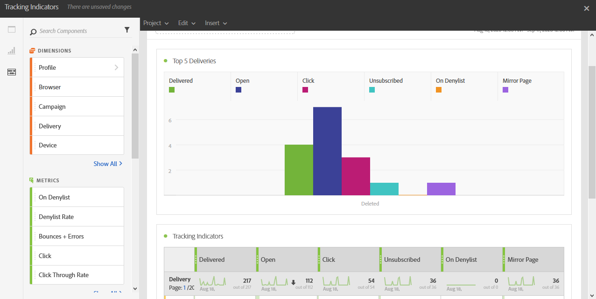

# Indicadores de rastreamento{#tracking-indicators}

O relatório **[!UICONTROL Indicadores de rastreamento]** contém os indicadores principais para o comportamento de rastreamento após o recebimento de mensagens de email.

>[!NOTE]
>
>Para acessar esses dados, o rastreamento deve ser ativado ao preparar um delivery.

A tabela **[!UICONTROL Indicadores de rastreamento]** e o gráfico **Cinco principais entregas** contêm os dados disponíveis para rastreamento de email, como:

* **[!UICONTROL Entregues]**: o número de mensagens enviadas com êxito. Erros gerados (rejeições) são considerados. no entanto, as reclamações (declarações de spam) e mensagens ausentes como &quot;ausente&quot; não são consideradas.
* **Aberto**: o número de vezes que uma mensagem foi aberta em uma entrega.
* **Clique**: o número de vezes que o conteúdo foi clicado em uma entrega.
* **Cancelar assinatura**: o número de cliques no link de assinatura.
* **Spam:** o número de destinatários que declararam um email como spam.
* **Mirror Page**: o número de cliques no link da mirror page.
