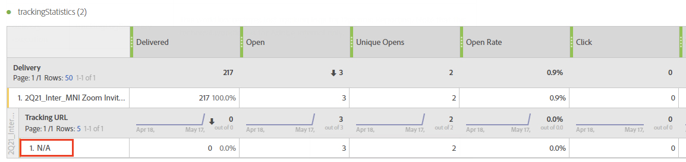

# Solução de problemas{#troubleshooting}

Você pode encontrar nesta seção perguntas comuns relacionadas aos relatórios dinâmicos.

## Para Aberturas únicas e Cliques únicos, a contagem na linha agregada não corresponde àquelas em linhas individuais {#unique-open-clicks-no-match}

Esse é um comportamento esperado.
Podemos usar o exemplo a seguir para explicar esse comportamento.

Um email é enviado aos perfis P1 e P2.

P1 abre o email duas vezes no primeiro dia e depois três vezes no segundo dia.

Ao passo que, o P2 abre o email uma vez no primeiro dia e não o reabre nos dias seguintes.
Esta é uma representação visual da interação dos perfis com o email enviado:

<table> 
 <thead> 
  <tr> 
   <th align="center"> <strong>Dia</strong>   </th> 
   <th align="center"> <strong>Aberturas</strong>   </th> 
   <th align="center"> <strong>Aberturas únicas</strong>   </th> 
  </tr> 
 </thead> 
 <tbody> 
  <tr> 
   <td align="center"> Dia 1  </td> 
   <td align="center"> 2 + 1 = 3  </td> 
   <td align="center"> 1 + 1 = 2  </td> 
  </tr> 
  <tr> 
   <td align="center"> Dia 2  </td> 
   <td align="center"> 3 + 0 = 3  </td> 
   <td align="center"> 1 + 0 = 1  </td> 
  </tr>
 </tbody> 
</table>

Para entender o número geral de aberturas únicas, precisamos somar as contagens de linhas de **[!UICONTROL Aberturas únicas]**, que nos dá o valor 3. Mas como o email foi direcionado para apenas 2 perfis, a taxa de Abertura deve mostrar 150%.

Para não obter uma porcentagem maior que 100, a definição de **[!UICONTROL Aberturas únicas]** é mantida como o número de broadlogs exclusivos que foram abertos. Nesse caso, mesmo que P1 tenha aberto o email no Dia 1 e no Dia 2, suas aberturas exclusivas ainda serão 1.

Isso resultará na seguinte tabela:

<table> 
 <thead> 
  <tr> 
   <th align="center"> <strong></strong>   </th> 
   <th align="center"> <strong>Aberturas</strong>   </th> 
   <th align="center"> <strong>Aberturas únicas</strong>   </th> 
  </tr> 
 </thead> 
 <tbody> 
  <tr> 
   <td align="center"> <strong> Dia </strong>  </td> 
   <td align="center"> <strong> 6 </strong>  </td> 
   <td align="center"> <strong> 2</strong>  </td>
  </tr> 
  <tr> 
   <td align="center"> Dia 1  </td> 
   <td align="center"> 3  </td> 
   <td align="center"> 2  </td>
  </tr> 
  <tr> 
   <td align="center"> Dia 2  </td> 
   <td align="center"> 3  </td> 
   <td align="center"> 1  </td> 
  </tr> 
 </tbody> 
</table>

>[!NOTE]
>
>As contagens únicas baseiam-se em um esboço baseado em HLL. Isso pode causar pequenas imprecisões em contagens grandes.

## As contagens abertas não correspondem à contagem do Banco de Dados {#open-counts-no-match-database}

Isso pode ocorrer porque a heurística é usada nos relatórios dinâmicos para rastrear aberturas mesmo quando não é possível rastrear a ação **[!UICONTROL Abrir]**.

Por exemplo, se um usuário tiver desabilitado imagens em seu cliente e clicar em um link no email, a **[!UICONTROL Abertura]** talvez não seja rastreada pelo banco de dados, mas o **[!UICONTROL Clique]** será.

Portanto, as contagens de logs de rastreamento **[!UICONTROL Abrir]** podem não ter a mesma contagem no banco de dados.

Essas ocorrências são adicionadas como **&quot;um clique de email implica uma abertura de email&quot;**.

>[!NOTE]
>
>Como as contagens únicas se baseiam em um esboço baseado em HLL, podem ocorrer pequenas inconsistências entre as contagens.

## Como são calculadas as contagens de deliveries recorrentes/transacionais? {#counts-recurring-deliveries}

Ao trabalhar com deliveries recorrentes e transacionais, as contagens serão atribuídas aos deliveries pai e filho.
Podemos usar o exemplo de uma entrega recorrente chamada **R1** definida para execução todos os dias no dia 1 (RC1), dia 2 (RC2) e dia 3 (RC3).
Vamos supor que apenas uma única pessoa abriu todas as entregas secundárias várias vezes. Nesse caso, as entregas secundárias recorrentes individuais mostrarão a contagem de **[!UICONTROL Aberto]** como 1 para cada uma.
No entanto, como a mesma pessoa clicou em todas as entregas, a entrega pai recorrente também terá **[!UICONTROL Abertura única]** como 1.

Os relatórios devem ter a seguinte aparência:

<table> 
 <thead> 
  <tr> 
   <th align="center"> <strong>Entrega</strong>   </th> 
   <th align="center"> <strong>Enviado</strong>   </th> 
   <th align="center"> <strong>Entregue</strong>   </th>
   <th align="center"> <strong>Aberturas</strong>   </th> 
   <th align="center"> <strong>Aberturas únicas</strong>   </th>
  </tr> 
 </thead> 
 <tbody> 
  <tr> 
   <td align="center"> <strong>R1</strong>  </td> 
   <td align="center"> <strong>100</strong>  </td> 
   <td align="center"> <strong>90</strong>  </td> 
   <td align="center"> <strong>10</strong>  </td> 
   <td align="center"> <strong>3</strong>  </td> 
  </tr> 
  <tr> 
   <td align="center"> RC1  </td> 
   <td align="center"> 20  </td> 
   <td align="center"> 20  </td> 
   <td align="center"> 6  </td> 
   <td align="center"> 1  </td> 
  </tr>
    <tr> 
   <td align="center"> RC2  </td> 
   <td align="center"> 40  </td> 
   <td align="center"> 30  </td> 
   <td align="center"> 2  </td> 
   <td align="center"> 1  </td> 
  </tr> 
    <tr> 
   <td align="center"> RC3  </td> 
   <td align="center"> 40  </td> 
   <td align="center"> 40  </td> 
   <td align="center"> 2  </td> 
   <td align="center"> 1  </td> 
  </tr> 
 </tbody> 
</table>

## Qual é o significado das cores na tabela dos meus relatórios? {#reports-color-signification}

As cores exibidas em seus relatórios são aleatórias e não podem ser personalizadas. Elas representam uma barra de progresso e são exibidas para ajudá-lo a destacar melhor o valor máximo atingido em seus relatórios.

No exemplo abaixo, a célula é da mesma cor, já que seu valor é 100%.

Se você alterar a **[!UICONTROL Formatação condicional]** para personalizada, quando o valor atingir o limite superior a célula ficará mais verde. Ao passo que, se ele atingir o limite inferior, ficará mais vermelho.

Por exemplo, aqui definimos o **[!UICONTROL Limite superior]** a 500 e o **[!UICONTROL Limite inferior]** a 0.

## Por que o valor N/D aparece em meus relatórios?

O valor **N/D** pode aparecer às vezes em seus relatórios dinâmicos. Isso pode ser exibido por três motivos:

* A entrega foi excluída e é mostrada aqui como **N/D** para não causar discrepância nos resultados.
* Ao arrastar e soltar a dimensão **[!UICONTROL Entrega transacional]** em seus relatórios, o valor **N/D** poderá aparecer como resultado. Isso acontece porque o Dynamic Report busca cada delivery, mesmo que não seja transacional. Isso também pode acontecer ao arrastar e soltar a dimensão **[!UICONTROL Entrega]** para o seu relatório, mas nesse caso, o valor **N/D** representará entregas transacionais.
* Quando uma dimensão é usada com uma métrica não relacionada à dimensão. No exemplo abaixo, um detalhamento é adicionado com a dimensão **[!UICONTROL URL de Rastreamento]**, mesmo que a contagem de **[!UICONTROL Cliques]** esteja definida como 0 nessa entrega.

  

## Relatórios de deliveries mostram dados incompletos ao usar o Target mapping personalizado

Se você estiver usando mapeamentos de público-alvo personalizados importados nos deliveries e nenhum dado for exibido em relatórios diferentes, isso pode significar que os enriquecimentos de relatórios não foram criados para esses mapeamentos de público-alvo.

Para resolver isso:

* Depois de importar o Target mapping de um XML, também será necessário importar o enriquecimento de relatórios.

* Em vez de importar o Target mapping, você pode criá-lo diretamente na interface do usuário da Web do Adobe Campaign que criará automaticamente o enriquecimento de relatórios.

## Discrepância entre o número do cabeçalho da coluna e a soma das linhas

A discrepância entre o número do cabeçalho da coluna e a soma de todas as linhas é esperada para os seguintes casos:

* **Métricas exclusivas**: o uso de métricas exclusivas pode alterar a contagem total exibida no cabeçalho, pois se baseia em IDs de destinatários em vez de uma simples soma de contagens de linhas. Consequentemente, um único perfil pode acionar vários eventos em várias dimensões, levando a várias linhas no conjunto de dados. No entanto, no cabeçalho, cada perfil é contado apenas uma vez.

  Por exemplo:

   * Se um perfil A abrir um email em três dias diferentes, a análise por dia mostrará A em três linhas, mas no cabeçalho, A contará como 1.

   * Se o perfil A clicar em três links diferentes em um email no mesmo dia, o detalhamento por URL de rastreamento mostrará A em três linhas, mas no cabeçalho, A contará como 1. O mesmo se aplica aos detalhamentos por dispositivo e navegador.

* **Métricas abertas**: a contagem de Aberturas é determinada agregando o total de eventos Abertos reais e de eventos de cliques únicos (por ID de destinatário), exceto casos em que um evento aberto não ocorreu, pois um link de email não pode ser clicado sem um evento aberto.

  Por exemplo:

   * Quando o perfil A abre um email rastreado (com o URL U1), ele é registrado como um evento aberto com o URL anotado como nulo. Clicar no U1 mais tarde gera um evento de clique. Embora o clique de A em U1 seja contado como um evento aberto também, não há evento aberto específico para U1. Portanto, A é contado apenas uma vez na contagem aberta exclusiva.

   * Um perfil R abre um email no dia 1, registra um evento aberto e clica em um link. Nos próximos dois dias, R reabre o email e clica no link novamente, gerando um evento de clique a cada dia. Embora o engajamento de R seja rastreado diariamente no número de abertura, R é contado apenas uma vez no cabeçalho da coluna, com foco em engajamentos exclusivos.

* **Evento negado**: em Relatórios, evento negado significa tentativas de entrega que foram marcadas inicialmente como bem-sucedidas, mas que falharam após novas tentativas. Eles são indicados por uma contagem de -1. Para evitar confusão, essas contagens negativas são excluídas dos números da métrica de entrega exibidos. Como resultado, o total de todas as linhas para a métrica de entrega pode não corresponder ao número do cabeçalho da coluna.
