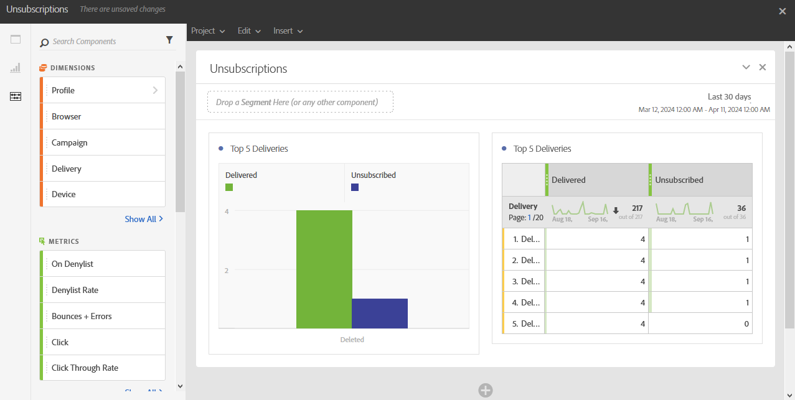

# Cancelamentos de assinatura{#unsubscriptions}

O relatório **[!UICONTROL Assinaturas canceladas]** identifica as entregas com mais cancelamentos.

A variável **[!UICONTROL 5 principais entregas]** A tabela e o gráfico exibem as cinco principais entregas com o maior número de mensagens entregues e o número de destinatários que cancelaram a inscrição. Os dados listados aqui são baseados no número de cliques no link de unsubscription da mensagem.
