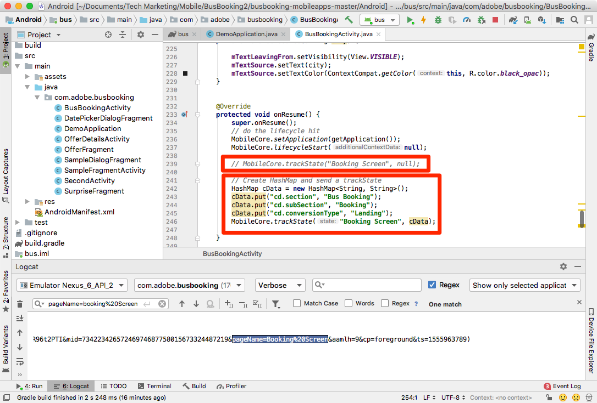

# Adicionar o Adobe Analytics

Nesta lição, você ativará o rastreamento do Adobe Analytics no aplicativo.

[O Adobe Analytics](https://docs.adobe.com/content/help/en/analytics/landing/home.html) é uma solução líder do setor que faz você ser capaz de entender seus clientes como pessoas e de orientar seus negócios com informações de inteligência de clientes.

Nas lições [Adicionar extensões](launch-add-extensions.md) e [Instalar o SDK](launch-install-the-mobile-sdk.md) móvel, você adicionou a extensão do Adobe Analytics à propriedade Iniciar e a importou para o aplicativo de amostra.  Agora, basta adicionar código para rastrear os estados e as ações no aplicativo!

## Objetivos de aprendizagem

No final desta lição, você poderá:

* Verifique se as medições de ciclo de vida estão sendo enviadas para o Adobe Analytics
* Adicione código para rastrear estados em seu aplicativo com dados adicionais
* Adicione código para rastrear ações em seu aplicativo com dados adicionais

Há muitas coisas que podem ser implementadas para o Analytics no Launch. Esta lição não é exaustiva, mas deve fornecer uma visão geral sólida das principais técnicas necessárias para a implementação em seu próprio aplicativo.

## Pré-requisitos

You should have already completed the lessons in the [Configure Launch](launch-create-a-property.md) section. Nessa seção, você adicionou a extensão do Analytics e configurou o servidor de rastreamento e as IDs do conjunto de relatórios.

## Medições de ciclo de vida e Adobe Analytics

As medições de ciclo de vida são métricas e dimensões baseadas no ambiente que podem ser facilmente ativadas em um aplicativo usando o SDK da Experience Platform Mobile.

Você já ativou as Medições de ciclo de vida ao adicionar a extensão Core à sua propriedade e seguiu as Instruções de instalação móvel fornecidas na interface. Essas métricas e dimensões, incluindo métricas específicas do ambiente e do aplicativo, como a versão do aplicativo, o número de usuários envolvidos, a versão do SO, a separação de tempo, os dias desde a última utilização etc. pode ser muito útil na análise do aplicativo, especialmente quando você cria segmentos do Analytics a partir deles para aplicar a todos os relatórios. A lista completa de métricas está disponível na [documentação](https://docs.adobe.com/content/help/en/mobile-services/android/metrics.htmlh).

## Importação da biblioteca ACPCore

Na lição anterior chamada ["Install the Mobile SDK"](launch-install-the-mobile-sdk.md), você adicionou uma declaração de importação para disponibilizar a biblioteca do AdobeCore no arquivo BusBooksActivity. Essa mesma biblioteca será usada para chamadas de API adicionais nas atividades desta lição. Nos próximos exercícios, você usará APIs para rastrear estados ("trackState") e ações ("trackAction") no aplicativo, que são definidos na biblioteca do AdobeCore.  No novo SDK do Experience Cloud Platform Mobile, as APIs trackState e trackAction foram movidas da biblioteca do Analytics para a biblioteca principal, possibilitando a utilização dessas APIs para fins diferentes do rastreamento do Adobe Analytics.

## Rastrear estados

No seu aplicativo, você pode ter telas de conteúdo diferentes que você está fornecendo para seus usuários. Estes são o equivalente às páginas em um site. O Adobe Analytics fornece um método para que você envie essas "ocorrências de exibição de página" e as visualize nos mesmos relatórios usados para suas propriedades da Web. Esse método é chamado "trackState".

Neste tutorial, você colocará o código de uma chamada trackState em apenas uma tela (página) no aplicativo. Na vida real, você replicará isso em todas as outras telas/estados do aplicativo.

Abaixo está uma sintaxe e um exemplo de código da documentação que você pode copiar e colar neste tutorial ou em seu próprio aplicativo.

**Sintaxe:**

```java
public static void trackState(final String state, final Map<String, String> contextData)
```

**Exemplo:**

```java
HashMap cData = new HashMap<String, String>();
contextData.put("key", "value");
MobileCore.trackState("state name",contextData);
```

### Rastrear um estado sem dados

1. Com o aplicativo de amostra aberto no Android Studio, vá para BusBooksActivity e role para baixo perto da parte inferior da função onResume
1. Adicionar uma chamada de método trackState
1. Defina `state name` para "Ecrã de reserva"
1. Em vez de adicionar dados extras, adicione `null` como um espaço reservado na chamada da API
1. Ou copie e cole no seguinte:

   ```java
   MobileCore.trackState("Booking Screen", null);
   ```


**Para validar o trackState**

1. Salvar, criar e executar o projeto
1. Quando o simulador executar e abrir a tela inicial do aplicativo, exiba o console de depuração do Logcat do Android Studio
1. Procure no console pelo `pageName=Booking%20Screen`
1. Observe que a variável pageName está definida como `Booking Screen` (com %20 como um espaço codificado) e não há outros pares de dados personalizados. Embora tecnicamente você esteja definindo um "nome de estado" e não um "nome de página", o nome do parâmetro usado é para fornecer consistência `pageName` às implementações do site.

   

### Rastrear um estado com dados

1. Volte para BusBooksActivity e adicione uma importação à parte superior do arquivo `import java.util.HashMap;` abaixo das importações existentes
1. Na `onResume()` função, comente (ou exclua) a chamada trackState básica do último exercício
1. Adicione uma nova chamada de método trackState, desta vez com dados criando e nomeando um HashMap, usando o comando "put" para incluir alguns pares de chave/valor e, em seguida, chamando esse HashMap na chamada para trackState
1. Deixe o `state name` modo "Ecrã de reserva"
1. Ou copie e cole em:

   ```java
   HashMap cData = new HashMap<String, String>();
   cData.put("cd.section", "Bus Booking");
   cData.put("cd.subSection", "Booking");
   cData.put("cd.conversionType", "Landing");
   MobileCore.trackState("Booking Screen", cData);
   ```

   

**Validação do trackState com dados**

1. Salvar, criar e executar o projeto novamente
1. Quando o simulador executar e abrir a tela inicial do aplicativo, exiba o console de depuração do Logcat do Android Studio
1. Pesquisar `subSection` (ou qualquer uma das chaves ou valores inseridos no código)
1. Agora veja que, além de pageName ser definido, você também tem os pares de chave/valor que foram enviados na ocorrência

   

>[!NOTE] Caso esteja familiarizado com "props e eVars" no Analytics, você observará que esses nomes de variáveis não estão no SDK. Todos os dados de chave/valor provenientes do SDK serão enviados como variáveis [](https://docs.adobe.com/content/help/en/analytics/implementation/javascript-implementation/variables-analytics-reporting/context-data-variables.html)contextData e, portanto, precisarão ser mapeados para props ou eVars (ou outras variáveis) usando Regras [de](https://docs.adobe.com/content/help/en/analytics/admin/admin-tools/processing-rules/processing-rules.html) processamento na interface do usuário do Analytics.

## Rastrear ações

Semelhante ao rastreamento de ações sem carregamento de página em um site, você geralmente deseja rastrear uma ação que um usuário realiza no aplicativo, por exemplo, cliques em coisas que não carregam outra tela. Isso é feito de forma semelhante ao trackState usado acima, exceto que esse método é chamado `trackAction`.

Abaixo estão sintaxe e um exemplo de código da documentação.

**Sintaxe:**

```java
public static void trackAction(final String action, final Map<String, String> contextData) data;
```

**Exemplo:**

```java
HashMap<String, String> contextData = new HashMap<String, String>();
contextData.put("key", "value");
MobileCore.trackAction("action taken", contextData);
```

### Rastrear interação com o alternador de destino

Neste exemplo de aplicativo de reserva de barramento, você pode alternar a cidade de origem com a cidade de destino clicando na seta entre esses dois valores. Você decidiu que deseja rastrear a interação com esse recurso no Adobe Analytics.


Esse alternador é controlado no arquivo BusBooksActivity no projeto de amostra. Neste exercício, você enviará uma ocorrência trackAction sempre que as pessoas clicarem nela.

#### Para adicionar o código trackAction

1. Com o projeto de amostra aberto no Android Studio, vá para BusBooksActivity
1. Localize a função "mBtnFlip.setOnClickListener", na linha 57 ou ao redor dela
1. Expanda a função, se necessário, para que você possa ver todo o código
1. Na função onClick, em chamada para `flipSourceDesti()`, adicione uma `trackAction()` chamada
1. Defina o nome da ação como "Inverter destino" e adicione "nulo" para o parâmetro contextData (já que não precisamos enviar nenhuma informação adicional desta vez)
1. Você pode copiar e colar o seguinte código

   ```java
   MobileCore.trackAction("Flip Destination", null);
   ```

A função agora se parece com:


#### Validação do código trackAction

1. Depois de adicionar o código, salve o projeto, execute e crie
1. Clique no ícone de lixo para limpar o console do Logcat
1. Clique na seta de Alternador de destino no simulador, observando que uma nova solicitação (ou mais) no console será exibida.
1. Procurar `Flip%20Destination` no Logcat
1. Observe que os parâmetros action e pev2 Flip%20Destination (com espaço codificado)
1. Observe a `pe=lnk_o` chave/valor na mesma linha, mostrando que esta é uma ocorrência de "link personalizado", acionada por trackAction

   <!---->

Bom trabalho! Você concluiu a lição do Analytics. É claro que há muitas outras coisas que você pode fazer para aprimorar nossa implementação do Analytics, mas espero que isso tenha dado a você algumas das principais habilidades que você precisará para atender ao resto de suas necessidades.

## Benefícios adicionais de trackState e trackAction

Nesses últimos exercícios, você conseguiu enviar dados do aplicativo para o Adobe Analytics usando as APIs trackState e trackAction. Como o Experience Platform Mobile SDK está enraizado no Launch, há muito mais coisas que você pode fazer na interface do Launch, aproveitando o código que você acabou de adicionar.

No Launch, você pode criar Regras acionadas pelas APIs trackState e trackAction e fazer com que elas executem ações adicionais, como fazer solicitações para outras soluções da Adobe ou parceiros externos.

[Próximo "Adicionar o Adobe Audience Manager" &gt;](audience-manager.md)
