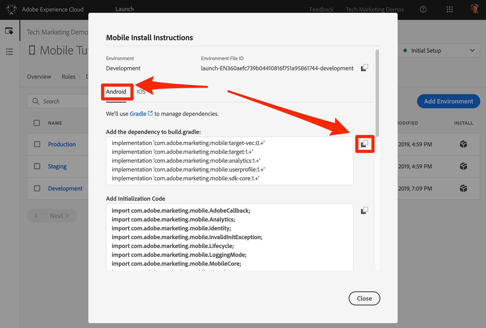

# Instalar o SDK do Mobile

Nesta lição, você implementará o SDK móvel com as extensões e configurações correspondentes ao ambiente de Desenvolvimento da propriedade Launch.

## Pré-requisitos

Nesta lição, começaremos a adicionar o código ao aplicativo de Reserva de barramento, caso ainda não o tenha feito:

1. Baixar e instalar o [Android Studio](https://developer.android.com/studio)
1. Baixe o aplicativo [Bus Books](https://github.com/Adobe-Marketing-Cloud/busbooking-mobileapps)

## Objetivos de aprendizagem

No final desta lição, você poderá:

* Obtenha as instruções de instalação para sua propriedade Mobile Launch
* Entender a diferença entre um ambiente de desenvolvimento, de armazenamento temporário e de produção
* Atualize seu `build.gradle` arquivo para adicionar o SDK móvel
* Importe o SDK móvel para seu aplicativo
* Verificar se o SDK foi implementado com êxito
* Ativar Medições de ciclo de vida no aplicativo

## Obtenha as instruções de instalação

As Instruções de instalação para propriedades do Launch móvel são uma coleção de trechos de código adicionados a locais específicos no aplicativo móvel.

Clique na `Environments` guia na navegação superior para ir para a página de ambientes. Observe que os ambientes de desenvolvimento, armazenamento temporário e produção foram pré-criados para você. Eles correspondem aos ambientes típicos no processo de desenvolvimento e lançamento do código. O código é primeiramente escrito por um desenvolvedor em um ambiente de desenvolvimento. Quando eles concluem o trabalho, eles o enviam para um ambiente de armazenamento temporário para que o controle de qualidade e outras equipes analisem. Assim que o controle de qualidade e outras equipes estiverem satisfeitas, o código será publicado no ambiente de produção, que é o ambiente voltado ao público que seus visitantes experimentam ao baixar seu aplicativo.

O Launch permite ambientes de desenvolvimento adicionais, o que é útil em grandes organizações nas quais vários desenvolvedores estão trabalhando em projetos diferentes ao mesmo tempo.

Desenvolvimento, armazenamento temporário e produção são os únicos ambientes necessários para concluir o tutorial.


Na linha **[!UICONTROL Desenvolvimento]** , clique no ícone Instalar ícone  para abrir o modal do código incorporado.


Vamos passar pelas instruções passo a passo.

## Atualizar o arquivo build.gradle

Se você já tiver usado o Launch em sites, uma das primeiras coisas que você observará é que há muito mais instruções de instalação para aplicativos móveis do que para sites.

O SDK do Adobe Mobile para Android usa o Gradle para gerenciar dependências entre seus vários componentes. Uma das primeiras coisas que faremos é adicionar as dependências do SDK do Adobe Mobile ao arquivo build.gradle do aplicativo Bus Book.

**Para atualizar o arquivo build.gradle**

1. Abrir o Android Studio
1. Selecione "Abrir um projeto Android Studio existente"

   

1. Abra o arquivo build.gradle na raiz da pasta Android de Reserva de barramento:

   

1. Abrir a lista suspensa e alternar para a exibição Projeto

   

1. Abra o **Android &gt; barramento &gt; arquivo build.gradle**

   

1. Na interface do Launch, verifique se o sistema operacional está definido como `Android`

1. Copie as dependências para a área de transferência clicando no ícone 

   

1. No Android Studio, cole as dependências da área de transferência logo após as dependências existentes (mas antes do fechamento `}`)
1. Além disso, se você estiver instalando a extensão do Adobe Target VEC, também precisará adicionar as seguintes dependências:

   ```java
   implementation 'com.google.code.gson:gson:2.8.2'
   implementation 'android.arch.lifecycle:extensions:1.1.1'
   implementation 'io.github.sac:SocketclusterClientJava:1.7.5'
   implementation 'com.android.support:support-annotations:28.0.0'
   implementation 'com.android.support:support-compat:28.0.0'
   implementation 'com.android.support:design:28.0.0'
   ```

1. Clique no link "Sincronizar agora" para sincronizar o projeto

   

## Atualizar o aplicativo

Agora é hora de atualizar o aplicativo para importar o SDK

**Para importar o SDK**

1. Abra o arquivo de aplicativo principal no aplicativo Bus Books, que está localizado em **Android &gt; bus &gt; src &gt; main &gt; java &gt; com.adobe.busbooking &gt; DemoApplication**

   

1. Na interface de inicialização, role até a seção **[!UICONTROL Adicionar código]** de inicialização.
1. Copie as instruções de importação clicando no primeiro ícone  na seção **[!UICONTROL Adicionar código]** de inicialização:

   

1. No Android Studio, cole essas instruções de importação *antes* das importações existentes no `DemoApplication` arquivo. Observe que a extensão Core inclui bibliotecas para suportar retornos de chamada, o serviço de identidade, as medições de ciclo de vida e o registro do console entre outros recursos.

   

1. Na interface Iniciar, copie as duas linhas relacionadas à extensão Principal, clicando no segundo ícone  na seção **[!UICONTROL Adicionar código]** de inicialização. A segunda linha ativa as instruções de registro do console (as opções disponíveis são "DEBUG", "VERBOSE", "AVISO" e "ERRO").

   

1. No Android Studio, cole essas instruções principais no `DemoApplication` arquivo logo após `super.onCreate()`
1. Remova os `//` comentários antes das linhas `try` e `catch`

   

1. Na interface Iniciar, copie as declarações de extensão clicando no terceiro ícone  na seção [!UICONTROL Adicionar código] de inicialização.

   

1. No Android Studio, cole essas instruções de extensão na `try` seção. Observe que `MobileCore.configureWithAppID` contém o identificador do ambiente de desenvolvimento Iniciar da propriedade. Isso é importante, pois você precisará atualizar esse valor quando estivermos prontos para implantar o aplicativo no ambiente de produção.

   

>[!NOTE] As Instruções de instalação móvel fornecidas na interface de inicialização incluem as instruções de importação e registro para as extensões de identidade, ciclo de vida e sinal, bem como a inicialização das métricas de ciclo de vida. Essas extensões são consideradas parte da extensão Mobile Core. Se você não quiser usar essas extensões no aplicativo, não precisará importar, registrar ou implementar outro código associado a essas extensões.
>
> Além disso, há opções adicionais de implementação que devem ser consideradas ao usar essas extensões (por exemplo, você pode pausar/reiniciar a coleta Ciclo de vida quando o usuário colocar em segundo plano/primeiro plano o aplicativo). Você pode ler mais sobre isso na documentação [da extensão do Mobile Core](https://aep-sdks.gitbook.io/docs/using-mobile-extensions/mobile-core)

## Verificar a implementação

1. Salvar seu projeto do Android Studio
1. Execute o aplicativo e inicie-o no Emulador. Se você não tiver nenhum dispositivo emulador configurado, configure um agora, certificando-se de configurar um dispositivo que execute o Android 4.1 (API 16) ou posterior.

   

1. Aguarde o Emulador iniciar e abra totalmente o aplicativo na tela de reserva (isso pode levar alguns minutos)

   

1. Confirme se as chamadas estão sendo feitas nos servidores da Adobe no Logcat do Android Studio

   

Estes são exemplos de algumas chamadas específicas que você pode procurar:

1. **Chamadas para recuperar a configuração** do Launch (filtre Logcat para `adobedtm.com`). Observe as configurações de extensão inseridas na lição anterior. Embora a adição da extensão exija uma atualização para o aplicativo, essas configurações podem ser gerenciadas externamente no Launch e alteradas a qualquer momento:

   ```java
   03-14 16:30:29.484 24869-24930/com.adobe.busbooking D/ADBMobile: ConfigurationExtension - Cached configuration loaded.
    {"target.propertyToken":"","target.timeout":5,"global.privacy":"optedin","analytics.backdatePreviousSessionInfo":true,"analytics.offlineEnabled":true,"build.environment":"dev","rules.url":"https://assets.adobedtm.com/launch-EN360aefc739b04410816f751a95861744-development-rules.zip","experienceCloud.org":"7ABB3E6A5A7491460A495D61@AdobeOrg","target.clientCode":"techmarketingdemos","target.autoFetch":true,"target.fetchBackground":false,"lifecycle.sessionTimeout":300,"target.environmentId":"busbookingapp","analytics.server":"tmd.sc.omtrdc.net","analytics.rsids":"tmd-mobile-dev1","analytics.batchLimit":0,"property.id":"PRb4881271498b4f2cbaf67d38a8f3891a","global.ssl":true,"analytics.aamForwardingEnabled":true}
   ```

1. **Solicitação ao Serviço** de identidade (filtre Logcat como `IdentityExtension`) Neste exemplo, a ID (`d_mid`)já foi definida e está sendo reportada novamente)

   ```java
   03-14 17:01:18.526 7743-7803/com.adobe.busbooking D/ADBMobile: IdentityExtension - Sending request (https://dpm.demdex.net/id?d_mid=59651426340521082405908216148091920022&d_ver=2&d_orgid=7ABB3E6A5A7491460A495D61%40AdobeOrg)
   ```

1. **Solicitação** do Analytics (filtrar Logcat para `AnalyticsExtension`)

   ```java
   03-14 17:01:18.509 7743-7777/com.adobe.busbooking D/ADBMobile: AnalyticsExtension - Sending Analytics ID call (https://tmd.sc.omtrdc.net/id?mcorgid=7ABB3E6A5A7491460A495D61%40AdobeOrg&mid=59651426340521082405908216148091920022)
   ```

Parabéns, você adicionou o SDK a um aplicativo móvel!

## Ativar medições de ciclo de vida no aplicativo

As medições de ciclo de vida são métricas e dimensões baseadas no ambiente que podem ser facilmente ativadas em um aplicativo usando o SDK da Experience Platform Mobile. Como eles podem ser usados por várias soluções da Experience Cloud, nós os habilitaremos aqui, antes de avançarmos mais fundo nas soluções individuais. Isso é tão simples quanto adicionar algumas linhas de código ao nosso aplicativo no lugar certo.

### Importar a biblioteca principal para o arquivo BusBooksActivity

Para fazer chamadas de API por meio do SDK do Adobe Experience Platform Mobile, é necessário importar as bibliotecas para os arquivos apropriados. Nesse caso, para utilizar a chamada da API Lifecycle, precisamos importar a biblioteca principal.

1. Com seu aplicativo aberto no Android Studio, abra o arquivo BusBooksActivity, que está no mesmo diretório do arquivo DemoApplication no qual você está trabalhando.
1. Na parte superior do arquivo, adicione a seguinte declaração de importação do MobileCore para que você possa usar as chamadas de API associadas
   `import com.adobe.marketing.mobile.MobileCore;`


### Adicionar o código de ciclo de vida

Agora, você adicionará o código do ciclo de vida à função principal onResume() no aplicativo para acionar as funções do ciclo de vida.

1. Abra o arquivo BusBooksActivity
1. Role para baixo perto da parte inferior do arquivo e localize a função onResume()
1. Adicione as duas linhas de código a seguir abaixo da `super.onResume()` linha:

   ```java
    MobileCore.setApplication(getApplication());
    MobileCore.lifecycleStart(null);
   ```


### Validar a ocorrência do ciclo de vida

Ao executar seu aplicativo, agora você deve obter uma ou mais mensagens de ciclo de vida na seção de depuração do Android Studio.

1. Execute uma criação e escolha um simulador para executar o aplicativo
1. Depois que o simulador estiver funcionando, clique na seção "Executar" do depurador no Android Studio
1. Fazer uma pesquisa para `internalaction=Lifecycle`
1. Verifique se há linhas que incluem esse par de chave/valor, bem como outras medições de ciclo de vida.

Observe que as linhas que você verá são chamadas do Analytics com medições de ciclo de vida.


[Próximo "Adicionar o Adobe Experience Platform Identity Service" &gt;](id-service.md)