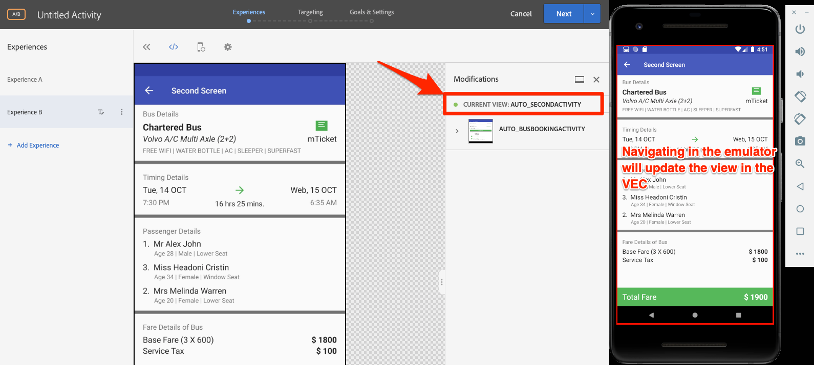

# Adicionar o Visual Experience Composer (VEC) do Adobe Target

Nesta lição, você ativará o Target Visual Experience Composer (VEC) para aplicativos móveis.

[O Adobe Target](https://docs.adobe.com/content/help/en/target/using/target-home.html) é a solução da Adobe Experience Cloud que fornece tudo o que você precisa para adaptar e personalizar a experiência de seus clientes, para que você possa maximizar a receita em sites da Web e móveis, aplicativos, redes sociais e outros canais digitais.

O Visual Experience Composer (VEC) para aplicativos móveis nativos permite criar atividades e personalizar o conteúdo de maneira autônoma, sem dependências de desenvolvimento contínuas e ciclos de lançamento de aplicativos.

Na lição [Adicionar extensões](launch-add-extensions.md), você adicionou a extensão do Target VEC à propriedade Iniciar. Na lição [Instalar o SDK](launch-install-the-mobile-sdk.md) móvel, você importou a extensão para o aplicativo de amostra. Somente algumas atualizações secundárias são necessárias para iniciar a configuração de atividades no compositor de experiência visual móvel do Target!

>[!IMPORTANT] As extensões Target e Target VEC Launch são necessárias para usar o Target VEC no aplicativo móvel.

## Objetivos de aprendizagem

No final desta lição, você poderá:

* Ativar o aplicativo de amostra para o Target VEC
* Adicionar parâmetros à solicitação do Target VEC
* Emparelhe seu dispositivo com o VEC
* Criar uma atividade usando o VEC

## Pré-requisitos

Para completar as lições desta seção, deve:

* Conclua as lições na seção [Configurar lançamento](launch-create-a-property.md) .
* Ter acesso de nível de aprovador à interface do Adobe Target

## A solicitação de carregamento do aplicativo

O Target acionará uma solicitação de "carregamento do aplicativo" quando o aplicativo for carregado pela primeira vez devido às configurações que selecionamos quando configuramos a extensão do Target VEC. Essa solicitação pré-busca todas as atividades do Target VEC que você criou para seu aplicativo.

No estúdio Android, filtre o Logcat para "Target r" para mostrar as solicitações e respostas do Target. Observe os parâmetros para o nome e a versão do aplicativo. Todas as atividades do Target VEC que você criar serão automaticamente direcionadas para essas propriedades.


## Adicionar parâmetros

Como você acabou de ver no último exercício, as medições de ciclo de vida do aplicativo são incluídas automaticamente como parâmetros na solicitação do Target VEC. Você também pode adicionar parâmetros personalizados às solicitações, globalmente ou para exibições específicas no aplicativo.

**Para adicionar parâmetros personalizados globalmente**

1. No Android Studio, abra o `DemoApplication` arquivo.
1. Importe a extensão do Target VEC adicionando `import ACPTargetVEC` abaixo da importação existente
1. Adicione o seguinte código de amostra na `onCreate()` função, antes que as extensões sejam registradas. Este código de exemplo mostra como parâmetros regulares, parâmetros de perfil, parâmetros de produto (ou entidade) e parâmetros de pedido podem ser adicionados à solicitação TargetVEC. Este exemplo usa valores estáticos, enquanto no aplicativo real você provavelmente deseja usar variáveis dinâmicas para preencher os valores. E, claro, você só gostaria de preencher os parâmetros que são relevantes para todas as exibições:

   ```java
   Map<String, String>targetParams = new HashMap<>(); //params
   targetParams.put( "param1", "value1");
   Map<String, String>taregtProfileParams = new HashMap<>(); //profile params
   taregtProfileParams.put("profilekey1","profilevalue1");
   
   TargetVEC.setGlobalRequestParameters(new TargetParameters.Builder()
            .parameters(targetParams)
            .profileParameters(taregtProfileParams)
            .product(new TargetProduct("1234", "furniture"))
            .order(new TargetOrder("12343", 123.45, Arrays.asList("100", "200")))
            .build());
   ```

1. Você pode notar erros no Android Studio, já que o código de parâmetro acima requer as seguintes importações, que você precisa adicionar ao arquivo:

   ```java
   import com.adobe.marketing.mobile.TargetOrder;
   import com.adobe.marketing.mobile.TargetProduct;
   import com.adobe.marketing.mobile.TargetParameters;
   import java.util.Arrays;
   import java.util.Map;
   import java.util.HashMap;
   ```

   

Agora que você adicionou parâmetros ao aplicativo, é hora de confirmar que eles estão sendo transmitidos na solicitação.

**Para verificar os parâmetros**

1. Salvar o projeto do Android Studio
1. Recrie o aplicativo e aguarde até que ele seja reaberto no Emulador
1. Abra o painel Logcat do Android Studio
1. Filtro para mostrar todas as declarações com "Target r"
1. Os parâmetros personalizados que você acabou de adicionar devem estar visíveis na solicitação

   

Para obter mais informações e detalhes sobre como passar parâmetros com exibições específicas, consulte [a documentação](https://docs.adobe.com/content/help/en/target/using/implement-target/mobile-apps/composer/mobile-visual-experience-composer-android.html#parameters).

## Emparelhamento do aplicativo móvel com a interface do Target

Para criar atividades de VEC na interface do Target, você deve primeiro emparelhar o Target com seu aplicativo. Esse emparelhamento é feito com o uso de deep links.

### Criação do deep link

O Android oferece suporte ao uso de links [profundos e links](https://developer.android.com/training/app-links/deep-linking) de aplicativos Android para criar URLs que vão diretamente para locais específicos no aplicativo. Você provavelmente já os usa no aplicativo. Em caso afirmativo, você pode usar sua estrutura de URL existente para emparelhar com o Target. Neste tutorial, você revisará o deep link predefinido no aplicativo Bus Books, confirmará que ele está funcionando e então o usará para emparelhar seu aplicativo com o Target VEC para aplicativos móveis.

**Para analisar a configuração do deep link**

1. No Android Studio, abra o arquivo AndroidManifest.xml
1. Observe que já existe um Filtro de intenção configurado para o esquema de deep link do aplicativo de Reserva de barramento
1. Observe que o `Host` e `Scheme` já estão definidos como `com.adobe.example.busbooking` e `http`, respectivamente. Isso significa que um url como `http://com.adobe.example.busbooking` quando aberto no Emulador deve abrir automaticamente o aplicativo de amostra

   

O próximo passo é confirmar que o esquema de deep link está funcionando

### Verificar o deep link

Agora, vamos verificar se o deep link abrirá o aplicativo no emulador. Você pode ter a sua maneira preferida de executar comandos adb, que você certamente pode usar.

**Para verificar o deep link usando adb (Mac®)**

1. Verifique se o emulador Android está em execução
1. Feche o aplicativo de Reserva de barramento se ele já estiver aberto
1. Abrir uma janela de Terminal
1. Navegue até o diretório de ferramentas de plataforma do Android: `cd Library/Android/sdk/platform-tools/`
1. Confirme se o emulador está conectado: `./adb devices`
1. Abra o shell adb: `./adb shell`
1. No teste da shell adb, o deep link: `am start -W -a android.intent.action.VIEW -d "http://com.adobe.example.busbooking" "com.adobe.busbooking"`
1. Confirme se o aplicativo de Reserva de barramento foi iniciado no emulador

   

Agora que sua estrutura de deep link está configurada, você está pronto para usar o Target VEC para configurar atividades!

## Criar uma atividade no Mobile VEC

Agora vamos criar uma atividade na interface do Target.

**Para criar uma atividade com o Target VEC**

1. Faça logon na [Adobe Experience Cloud](https://experiencecloud.adobe.com)
1. Usar o alternador de soluções para ir para o Target

   

1. Iniciar Target

   

1. Clique no botão **[!UICONTROL Criar atividade]** e selecione Teste **[!UICONTROL A/B]**
1. Selecionar aplicativo **[!UICONTROL móvel]**
1. Verifique se **[!UICONTROL Visual]** está selecionado em **[!UICONTROL Escolher Experience Composer]**
1. Clique no botão **[!UICONTROL Avançar]**

   

1. Na tela **[!UICONTROL Selecionar um aplicativo para usar]** , clique em **[!UICONTROL Adicionar novo aplicativo]**

   

1. Insira o esquema de url que você acabou de definir no campo **[!UICONTROL Inserir esquema]** de URL, por exemplo `http://com.adobe.example.busbooking/`
1. Clique em **[!UICONTROL Criar deep link]**

   

   >[!NOTE] Você tem algumas opções para enviar o deep link para o aplicativo. É possível:
   >
   >   1. Envie o link direto por email para um endereço válido e abra o link com um aplicativo de email no dispositivo
   >   1. Tirar uma foto do código QR do dispositivo Android (em nosso tutorial, o dispositivo precisaria estar vinculado ao Android Studio)
   >   1. Copie o deep link da interface do Target e envie-o para o dispositivo, como você gostaria


1. Clique na guia **[!UICONTROL Copiar e enviar link]** .
1. Clique no URL gerado (observe que clicar no URL copiará automaticamente para a área de transferência)

   

1. Abra uma janela Terminal (ou alterne para ela novamente se ainda estiver aberta)
1. Navegue até o diretório de ferramentas de plataforma do Android (talvez você já esteja aqui): `cd Library/Android/sdk/platform-tools/`
1. Confirme se o emulador está conectado: `./adb devices`
1. Abra o shell adb: `./adb shell`
1. No shell adb, substitua [YOUR_TARGET_URL_WITH_TOKEN] no seguinte comando pelo URL que você acabou de copiar para a área de transferência: `am start -W -a android.intent.action.VIEW -d "[YOUR_TARGET_URL_WITH_TOKEN]" "com.adobe.busbooking"`
1. Depois que o aplicativo for carregado, volte para a guia do navegador, onde o Target foi aberto. Você deve ver o aplicativo carregado no VEC.
1. Clique nos ativos de texto e imagem no aplicativo e você deverá ver as opções para editá-los e substituí-los!

   

   > [!TIP] Se você não vir o Mobile VEC aberto automaticamente na interface do Target depois de abrir o deep link no dispositivo móvel, veja algumas coisas para tentar:
   >
   >   1. Verifique se você está usando exatamente o mesmo URL na interface do Target e se não cortou nenhum caractere acidentalmente. Ao executar o comando no shell adb, verifique se o URL está entre aspas
      >
      >
      >   

   1. Confirme se você adicionou as dependências adicionais ao arquivo build.gradle que são exigidas pela VEC do Target. Essas dependências devem ter sido adicionadas durante a [instalação da lição do SDK móvel](https://docs.adobe.com/content/help/en/experience-cloud/implementing-in-mobile-android-apps-with-launch/configure-launch/launch-install-the-mobile-sdk.html#update-the-buildgradle-file)
      >
      >
      >   

   1. Tente limpar os dados armazenados no aplicativo detalhado na figura abaixo
      >
      >       
      


1. Faça algumas alterações na primeira tela do aplicativo
1. Agora posicione o Emulador próximo ao navegador com o VEC aberto
1. Navegue até uma tela diferente no aplicativo e observe como o VEC é atualizado com o Emulador!
1. Você pode fazer atualizações em várias exibições no aplicativo, em uma única atividade!

   

1. Você também pode adicionar visualmente métricas de rastreamento de cliques!
1. Salve e aprove sua atividade e verifique se você pode vê-la no aplicativo de amostra

O emparelhamento do dispositivo com o VEC é uma ação única. Ao criar mais atividades no futuro no mesmo dispositivo, você poderá apenas selecionar o dispositivo de uma lista, como mostrado abaixo:


>[!TIP] Se você tiver um dispositivo aberto, mas ele estiver "Indisponível" no menu de seleção, tente fechar e reabrir o aplicativo no emulador ou dispositivo.

## Criação de públicos-alvo com base nas métricas de ciclo de vida

Métricas de ciclo de vida integradas sobre o uso do aplicativo pelo visitante que são incluídas automaticamente nas chamadas feitas pelo SDK do Adobe Mobile. Você pode criar facilmente públicos-alvo no Target com base nessas métricas.

**Para criar um público-alvo**

1. Na interface do Target, clique em **Públicos-alvo** na navegação superior
1. Click the **Create Audience** button

   

1. Name the Audience `Launches < 5`
1. Click **Add Rule &gt; Custom**

   

1. Na primeira lista suspensa, selecione o parâmetro **a.Launches** . Todos os parâmetros da métrica Ciclo de vida começam com "a". prefixo. Direcionaremos o conteúdo com base no número de inicializações do aplicativo que o usuário tem, o que é uma excelente maneira de direcionar os usuários que usam o aplicativo pela primeira vez com uma experiência de usuário (FTUE) instrutiva.
1. Na próxima lista suspensa, selecione **é menor que**
1. Na terceira lista suspensa, digite **5**
1. Clique em **Salvar**

   

Observe que há uma grande variedade de opções inovadoras de criação de público-alvo no Target. Além disso, você pode enviar dados personalizados na solicitação do Target para a criação de público-alvo, usar públicos-alvo compartilhados de outras soluções da Experience Cloud, como o Audience Manager e o Analytics, e dados de CRM compartilhados com o Target usando o recurso Atributos do cliente do serviço principal de pessoas.

[Próximo "Adicionar Adobe Target" &gt;](target.md)