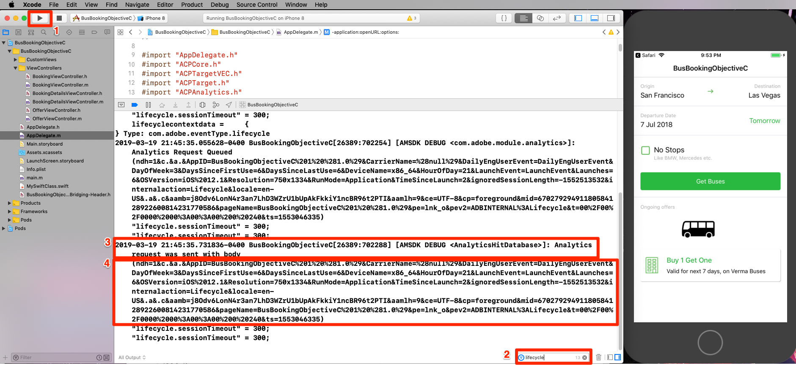

# Adicionar o Adobe Analytics

Nesta lição, você ativará o rastreamento do Adobe Analytics no aplicativo.

[O Adobe Analytics](https://docs.adobe.com/content/help/en/analytics/landing/home.html) é uma solução líder do setor que faz você ser capaz de entender seus clientes como pessoas e de orientar seus negócios com informações de inteligência de clientes.

Nas lições [Adicionar extensões](launch-add-extensions.md) e [Instalar o SDK](launch-install-the-mobile-sdk.md) móvel, você adicionou a extensão do Adobe Analytics à propriedade Iniciar e a importou para o aplicativo de amostra.  Agora, basta adicionar código para rastrear os estados e as ações no aplicativo!

## Objetivos de aprendizagem

No final desta lição, você poderá:

* Verifique se as medições de ciclo de vida estão sendo enviadas para o Adobe Analytics
* Adicione código para rastrear estados em seu aplicativo com dados adicionais
* Adicione código para rastrear ações em seu aplicativo com dados adicionais

Há muitas coisas que podem ser implementadas para o Analytics no Launch. Esta lição não é exaustiva, mas deve fornecer uma visão geral sólida das principais técnicas necessárias para a implementação em seu próprio aplicativo.

## Pré-requisitos

You should have already completed the lessons in the [Configure Launch](launch-create-a-property.md) section. Nessa seção, você adicionou a extensão do Analytics e configurou o servidor de rastreamento e as IDs do conjunto de relatórios.

## Medições de ciclo de vida e Adobe Analytics

As medições de ciclo de vida são métricas e dimensões baseadas no ambiente que podem ser facilmente ativadas em um aplicativo usando o SDK da Experience Platform Mobile. Na verdade, vocês já os adicionaram!

Você já ativou as Medições de ciclo de vida ao adicionar a extensão Core à sua propriedade e seguiu as Instruções de instalação móvel fornecidas na interface. Essas métricas e dimensões, incluindo métricas específicas do ambiente e do aplicativo, como a versão do aplicativo, o número de usuários envolvidos, a versão do SO, a separação de tempo, os dias desde a última utilização etc. pode ser muito útil na análise do aplicativo, especialmente quando você cria segmentos do Analytics a partir deles para aplicar a todos os relatórios. A lista completa de métricas está disponível na [documentação](https://docs.adobe.com/content/help/en/mobile-services/ios/metrics.html).

### Exibição da ocorrência do ciclo de vida do Analytics

Embora você possa ver as ocorrências do ciclo de vida em qualquer programa de depuração/sniffer de pacote, nós simplesmente as mostraremos no console de depuração do Xcode.

1. Crie e execute seu projeto no Xcode para que ele inicie o simulador
1. No console de depuração do Xcode, digite `lifecycle` no filtro na parte inferior para limitar o que aparece e role até a parte inferior das entradas
1. Observe a `Analytics request was sent with body` seção
1. As métricas de ciclo de vida incluem itens como AppID, CarrierName, DayOfWeek, DaysSinceFirstUse e outras métricas/dimensões listadas na [documentação](https://docs.adobe.com/content/help/en/mobile-services/ios/metrics.html)

   

## Importar a biblioteca do ACPCore

Nos próximos exercícios, você usará APIs para rastrear estados ("trackState") e ações ("trackAction") no aplicativo. Para usar essas APIs, é necessário importar a biblioteca que as contém.  No novo SDK do Experience Cloud Platform Mobile, as APIs trackState e trackAction foram movidas da biblioteca do Analytics para a biblioteca principal, possibilitando a utilização dessas APIs para fins diferentes do rastreamento do Adobe Analytics.

Neste tutorial, você só rastreará um estado, no entanto, no aplicativo real, você desejará rastrear vários estados.

**Para importar a biblioteca ACPCore**

1. Abrir o arquivo BooksViewController.m no Xcode
1. Na parte superior do arquivo, normalmente junto com outras declarações de importação, adicione `#import "ACPCore.h"`
1. Salvar
1. Agora você está pronto para usar APIs trackState ou trackAction neste arquivo

   <!---->

## Rastrear estados

No seu aplicativo, você pode ter telas de conteúdo diferentes que você está fornecendo para seus usuários. Estes são o equivalente às páginas em um site. O Adobe Analytics fornece um método para que você envie essas "ocorrências de exibição de página" e as visualize nos mesmos relatórios usados para suas propriedades da Web. Esse método é chamado "trackState".

Neste tutorial, você colocará o código de uma chamada trackState em apenas uma tela (página) no aplicativo. Na vida real, você replicará isso em todas as outras telas/estados do aplicativo. Você também explorará algumas maneiras diferentes de enviar dados (pares de chave/valor) com a ocorrência.

Abaixo está uma sintaxe e um exemplo de código da documentação que você pode copiar e colar neste tutorial ou em seu próprio aplicativo.

**Sintaxe:**

```objective-c
+ (void) trackState: (nullable NSString*) state data: (nullable NSDictionary*) data;
```

**Exemplo:**

```objective-c
[ACPCore trackState:@"state name" data:@{@"key":@"value"}];
```

### Rastrear um estado sem dados

1. Com o aplicativo de amostra aberto no Xcode, vá para BooksViewController.m e, na `viewDidLoad()` função, adicione uma chamada de método trackState
1. Defina `state name` para "Home Screen"
1. Em vez de adicionar dados extras, adicione `null` como um espaço reservado na chamada de método
1. Ou copie e cole no seguinte:

   ```objective-c
   [ACPCore trackState:@"Home Screen" data:nil];
   ```

   

>[!NOTE] Se você concluiu as lições para implementar o VEC do Target, você terá alguns códigos adicionais na função viewDidLoad() que não são mostrados nas capturas de tela deste exercício. É de esperar que isso se concentre na tarefa em questão.

**Para validar o trackState**

1. Salvar, criar e executar o projeto
1. Quando o simulador executar e abrir a tela inicial do aplicativo, exiba o console Xcode
1. Filtre o console para entradas com "início" e observe a entrada inferior que mostra que a variável `Analytics request was sent with body`
1. Observe que a variável pageName está definida como `Home Screen`, e não há outros pares de dados personalizados. Embora tecnicamente você esteja definindo um "nome de estado" e não um "nome de página", o nome do parâmetro usado é para fornecer consistência `pageName` às implementações do site.

   

### Rastrear um estado com dados

1. Volte para BooksViewController.m e, na `viewDidLoad()` função, comente (ou exclua) a chamada trackState básica (sem dados adicionados) do último exercício
1. Adicione uma nova chamada de método trackState, desta vez com dados, usando `key1` como chave e `value1` como valor
1. Deixe o formulário `state name` como "Home Screen"
1. Ou copie e cole em:

   ```objective-c
   [ACPCore trackState:@"Home Screen" data:@{@"key1":@"value1"}];
   ```

   

**Validação do trackState com dados**

1. Salvar, criar e executar o projeto novamente
1. Quando o simulador executar e abrir a tela inicial do aplicativo, exiba o console Xcode
1. Deixe o filtro como "inicial" e observe a entrada inferior que mostra que a variável `Analytics request was sent with body`
1. Agora veja que, além de pageName ser definido, você também tem o par de chave/valor enviado na ocorrência

   

>[!NOTE] Caso esteja familiarizado com "props e eVars" no Analytics, você observará que esses nomes de variáveis não estão no SDK. Todos os dados de chave/valor provenientes do SDK serão enviados como variáveis [](https://docs.adobe.com/content/help/en/analytics/implementation/javascript-implementation/variables-analytics-reporting/context-data-variables.html)contextData e, portanto, precisarão ser mapeados para props ou eVars (ou outras variáveis) usando Regras [de](https://docs.adobe.com/content/help/en/analytics/admin/admin-tools/processing-rules/processing-rules.html) processamento na interface do usuário do Analytics.

### Opções adicionais de envio de dados

Nos dois exercícios anteriores fez dois pedidos, um com dados adicionais e outro sem. No entanto, e se você quiser enviar vários pontos de dados para o Analytics com uma tela ou um estado de carregamento? Abaixo estão duas opções.

#### Opção 1: Vários pares de chave/valor

Na chamada trackState, você tem a opção de enviar vários pares de chave/valor, simplesmente separando-os por vírgula no conjunto de dados. Por exemplo:

```objective-c
[ACPCore trackState:@"Home Screen" data:@{@"key1":@"value1",@"key2":@"value2",@"key3":@"value3"}];
```

#### Opção 2: Objeto de dicionário

Você também pode definir um dicionário em seu código e enviá-lo para o trackState. É claro que, se você já tiver definido alguns objetos de dicionário em seu código e quiser enviá-los para o Analytics, essa pode ser a opção perfeita para você. Por exemplo:

```objective-c
NSDictionary *theStuff = @{@"key1": @"value1",@"key2": @"value2"};
[ACPCore trackState:@"Home Screen" data:theStuff];
```

**Crédito** extraVá em frente e tente essas duas opções no código, visualizando os resultados no console de depuração do Xcode. Você pode usar o mesmo filtro de antes e verificar os resultados para certificar-se de que as variáveis e os valores estão aparecendo

## Rastrear ações

Semelhante ao rastreamento de ações sem carregamento de página em um site, você geralmente deseja rastrear uma ação que um usuário realiza no aplicativo, por exemplo, cliques em coisas que não carregam outra tela. Isso é feito de forma semelhante ao trackState usado acima, exceto que esse método é chamado `trackAction`.

Abaixo está uma sintaxe e um exemplo de código da documentação que você pode copiar e colar neste tutorial ou em seu próprio aplicativo.

**Sintaxe:**

```objective-c
+ (void) trackAction: (nullable NSString*) action data: (nullable NSDictionary*) data;
```

**Exemplo:**

```objective-c
[ACPCore trackAction:@"action name" data:@{@"key":@"value"}];
```

### Rastrear interação com a caixa de seleção 'Sem paradas'

Neste exemplo de aplicativo de reserva de barramento, há uma caixa de seleção que permite que os usuários decidam se desejam limitar os resultados da pesquisa às opções. Você decidiu que deseja rastrear a interação com essa caixa de seleção no Adobe Analytics.


Essa caixa de seleção é controlada no arquivo BooksViewController.m no projeto de amostra. Neste exercício, você enviará uma ocorrência trackAction sempre que as pessoas marcarem ou desmarcarem a caixa.

#### Configuração do código trackAction

1. Com o projeto de amostra aberto no Xcode, vá para BooksViewController.m e localize a função "nonStopButtonToggled"
1. Na `if` declaração, a primeira seção desmarca a caixa se já estiver selecionada. Nesse cenário, você deseja enviar uma ocorrência com um valor "off", usando o seguinte código:

   ```objective-c
   [ACPCore trackAction:@"NonStop Button Interaction" data:@{@"NonStop":@"off"}];
   ```

1. Na próxima seção (a seção "else"), ela marca a caixa se ainda não estiver marcada. Nesse cenário, você deseja enviar uma ocorrência com um valor "on", usando o seguinte código:

   ```objective-c
   [ACPCore trackAction:@"NonStop Button Interaction" data:@{@"NonStop":@"on"}];
   ```

Observe as outras personalizações no código:

* Você está configurando o botão `action name` para "Interação do botão Não Parar". Esse valor preencherá o parâmetro "ação" da solicitação e o relatório/dimensão do link personalizado no Adobe Analytics
* O nome do `key` que você está usando é "NonStop". Esse é o nome principal que você pode procurar nas Regras de processamento no Admin Console do Analytics, para que você possa mapear esses valores para uma prop ou eVar.

A função agora se parece com:


#### Validação do código trackAction

1. Depois de adicionar o código, salve o projeto, execute e crie
1. Clique no ícone de lixo para limpar o console
1. Marque a caixa no simulador, observando que duas solicitações no console são exibidas. O último é o envio dos dados para o Adobe Analytics a partir do código que você acabou de adicionar.
1. Observe que os parâmetros action e pev2 estão definidos como "NonStop Button Interaction" (com espaços codificados)
1. Observe que o par de chave/valor "NonStop=on" está presente e pode ser atribuído a uma prop/eVar nas Regras de processamento
1. Observe a chave/valor "pe=lnk_o", mostrando que se trata de um hit "custom link" acionado por trackAction

   

Bom trabalho! Você concluiu a lição do Analytics. É claro que há muitas outras coisas que você pode fazer para aprimorar nossa implementação do Analytics, mas espero que isso tenha dado a você algumas das principais habilidades que você precisará para atender ao resto de suas necessidades.

## Benefícios adicionais de trackState e trackAction

Nesses últimos exercícios, você conseguiu enviar dados do aplicativo para o Adobe Analytics usando as APIs trackState e trackAction. Como o Experience Platform Mobile SDK está enraizado no Launch, há muito mais coisas que você pode fazer na interface do Launch, aproveitando o código que você acabou de adicionar.

No Launch, você pode criar Regras acionadas pelas APIs trackState e trackAction e fazer com que elas executem ações adicionais, como fazer solicitações para outras soluções da Adobe ou parceiros externos.

[Próximo "Adicionar o Adobe Audience Manager" &gt;](audience-manager.md)
