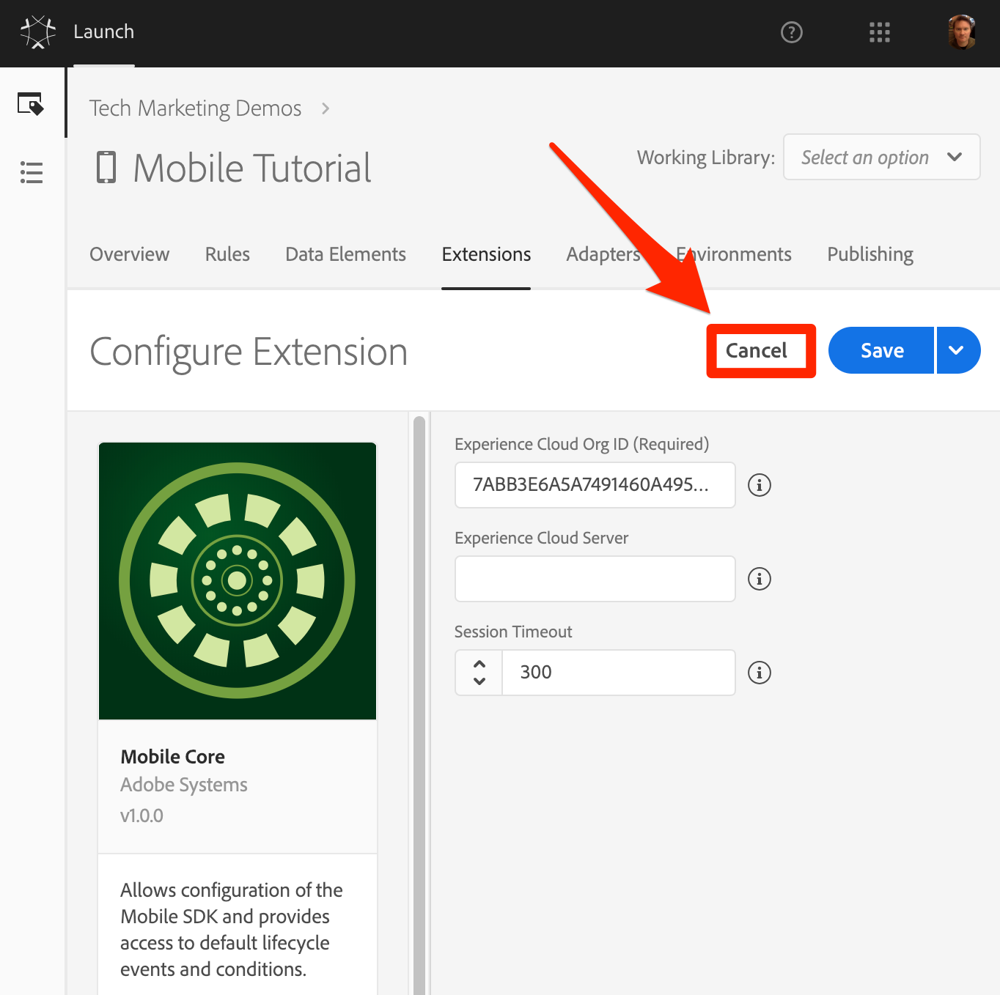
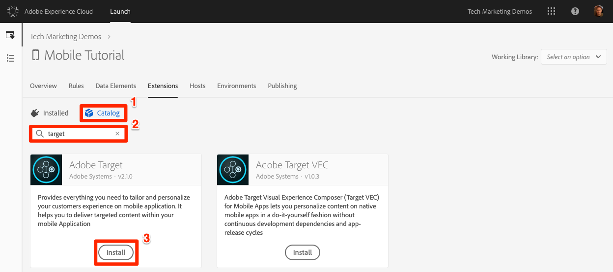
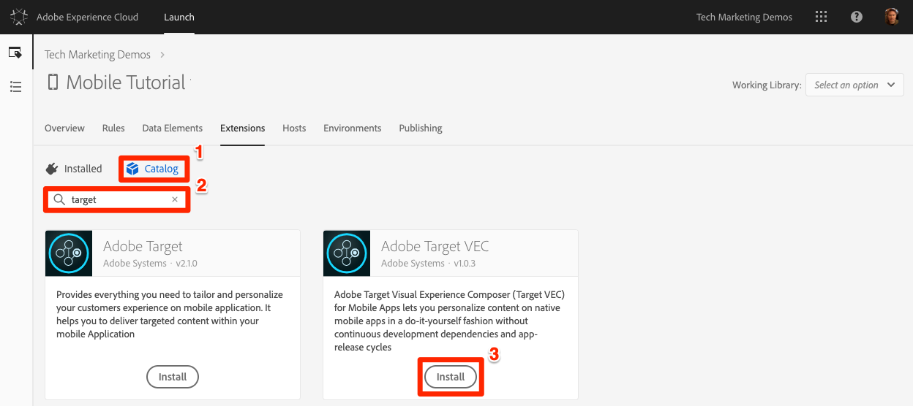

# Adicionar extensões

Nesta lição, você adicionará extensões à propriedade Launch.

O Launch é uma plataforma que permite que a Adobe e fornecedores de terceiros criem extensões para facilitar a implantação de suas soluções por meio do Launch. Uma extensão é um pacote de código que estende a interface do Launch e a funcionalidade do cliente. As extensões permitem escolher somente as partes do SDK do Adobe Experience Platform Mobile necessárias para seu aplicativo específico.  Pense no Launch como um sistema operacional e nas extensões como os aplicativos usados para realizar as tarefas.

Como você implementará as soluções da Adobe (por exemplo, Target, Analytics e Audience Manager), você adicionará as extensões necessárias para dar suporte a elas.

>[!WARNING] Adicionar e remover extensões nas propriedades do Launch móvel requer a atualização do aplicativo. Isso é diferente das propriedades do Web Launch, nas quais você pode adicionar ou remover extensões a qualquer momento, sem precisar atualizar seu site.

## Pré-requisitos

Sua conta de usuário do Launch precisa de permissão para "Gerenciar extensões" para concluir esta lição. Se você não conseguir concluir nenhuma dessas etapas porque as opções da interface do usuário não estão disponíveis para você, entre em contato com o administrador da Experience Cloud para obter acesso. For more information on Launch permissions, see [the documentation](https://docs.adobe.com/content/help/en/launch/using/reference/admin/user-permissions.html).

Você precisará dos seguintes detalhes da solução:

* Pelo menos uma ID do conjunto de relatórios do Analytics. O conjunto de relatórios deve ter os Relatórios [de aplicativo ativados](https://docs.adobe.com/content/help/en/analytics/admin/admin-tools/mobile-management.html). If you don't have a test/dev report suite that you can use for this tutorial, please [create one](https://docs.adobe.com/content/help/en/analytics/admin/manage-report-suites/new-report-suite/new-report-suite.html). Um conjunto de relatórios é suficiente para este tutorial, mas no mundo real você gostaria de usar conjuntos de relatórios diferentes para seus ambientes de desenvolvimento, armazenamento temporário e produção.

* Seu servidor de rastreamento do Analytics. Você pode recuperar seu servidor de rastreamento da implementação atual, consultor da Adobe ou representante do Atendimento ao cliente.

## Objetivos de aprendizagem

No final desta lição, você poderá:

* Adicionar extensões a uma propriedade de lançamento móvel
* Configurar a extensão do Analytics
* Configurar as extensões do Target e do Target VEC

>[!NOTE] O Adobe Audience Manager pode ser implementado por meio de uma configuração na extensão do Analytics e, portanto, não será necessário adicionar a extensão do Audience Manager neste tutorial

## Revisar as extensões pré-instaladas

1. Clique na guia **[!UICONTROL Extensões]** para acessar a página de extensões
1. Observe que o Mobile Core e as `Profile` extensões são pré-instalados em sua nova propriedade móvel
1. Clique no botão **[!UICONTROL Configurar]** na extensão Core para examinar suas configurações

   

1. A extensão Mobile Core representa o SDK principal da Adobe Experience Platform Mobile necessário para qualquer implementação de aplicativo. O núcleo contém um conjunto comum de funcionalidades e estruturas, como serviços de identidade da Experience Cloud, hub de eventos de dados, mecanismo de regras, rede reutilizável, rotinas de acesso ao disco etc., que é exigido por todas as extensões da Adobe e de terceiros.  Para obter mais informações sobre a extensão do Mobile Core, consulte [a documentação](https://aep-sdks.gitbook.io/docs/using-mobile-extensions/mobile-core).

   1. Observe que sua Experience Cloud Org ID é detectada automaticamente e preenchida previamente
   1. O campo Servidor da Experience Cloud permite especificar um terminal personalizado para solicitações do Serviço de ID de visitante. Use a configuração padrão (deixe em branco) para este tutorial.
   1. O campo Tempo limite da sessão permite especificar quando uma sessão de ciclo de vida do aplicativo deve expirar. Por padrão, o tempo limite expirará se o aplicativo estiver em segundo plano por 300 segundos. Use a configuração padrão para este tutorial.

1. Como você não alterou nenhuma das configurações, clique em **[!UICONTROL Cancelar]** para deixar a configuração da extensão

   

1. A extensão de perfil permite que o SDK armazene dados em um perfil do cliente. Não tem configurações, então não há nada para se olhar. Para obter mais informações sobre a extensão do perfil, consulte [a documentação](https://aep-sdks.gitbook.io/docs/using-mobile-extensions/profile).

## Adicionar as extensões da solução

Agora é hora de chegar à parte divertida e começar a adicionar as extensões para as soluções que você implementará neste tutorial. Ao usar Iniciar com aplicativos móveis, o aplicativo deve ser atualizado sempre que uma extensão for adicionada ou removida. Para economizar tempo depois, adicionaremos todas as extensões nesta lição. Ignore quaisquer soluções que sua empresa não tenha licenciado.

### Adicionar a extensão do Adobe Analytics

>[!NOTE] Se você não tiver uma licença para o Adobe Analytics, ignore esta seção. No momento, a extensão do Analytics para propriedades móveis é usada apenas para gerenciar configurações do SDK e não adiciona opções de interface ao Launch, como ações de Regra.

**Para adicionar a extensão**

1. Clique na guia Catálogo para ver as extensões _desinstaladas_

1. Encontre a extensão do **[!UICONTROL Adobe Analytics]** e clique em **[!UICONTROL Instalar]**

   

1. Selecione seus Report Suites **** nas listas pré-preenchidas. Esses são os Report Suites para os quais o aplicativo enviará dados. Você pode selecionar conjuntos de relatórios diferentes para seus Ambientes de desenvolvimento, armazenamento temporário e produção.
1. O servidor **[!UICONTROL de rastreamento do]** Analytics pode estar pré-preenchido ou talvez seja necessário selecioná-lo em uma lista pré-preenchida ou inseri-lo manualmente. Esse é o domínio para o qual os beacons serão enviados, normalmente no formato `yoursite.sc.omtrdc.net`.
1. Marque a caixa para **[!UICONTROL Offline Enabled (Ativado]** offline). Quando a caixa de seleção Offline Enabled (Ativado off-line) é selecionada, as ocorrências do Analytics são enfileiradas quando o dispositivo está offline e são enviadas posteriormente quando o dispositivo está novamente online. Para usar o rastreamento offline, **verifique** se o conjunto de relatórios tem um carimbo de data e hora. For more information, see the [documentation](https://docs.adobe.com/content/help/en/analytics/implementation/javascript-implementation/offline-tracking.html).
1. Marque a caixa para Encaminhamento do **[!UICONTROL Audience Manager]**. Isso enviará os dados do Analytics para o Audience Manager, de modo que você não precisará fazer uma chamada adicional do aplicativo para o Audience Manager. Nesse exercício, assumiremos que você tem o Audience Manager e, portanto, está encaminhando os dados do Analytics. Se você não tiver o Audience Manager, não marque essa caixa enquanto configura o Analytics para sua própria implementação.
1. Marque a caixa para **[!UICONTROL Backdate Previous Session Info]**
1. Clique no botão **[!UICONTROL Salvar]**

   

### Adicionar a extensão do Target

O Adobe Target tem duas extensões oficiais, a extensão do Adobe Target e a extensão do Adobe Target VEC. O Adobe Target oferece suporte a todas as APIs familiares aos usuários de nossos SDKs móveis anteriores. A extensão do Adobe Target VEC adiciona suporte ao Visual Experience Composer do Target, que permite que os profissionais de marketing criem atividades simples que alteram elementos de imagem e texto na página em uma interface What-You-See-Is-What-You-Get (WYSIWYG). Neste tutorial, você usará ambos.

>[!NOTE] Se você não tiver uma licença para o Adobe Target, ignore esta seção. No momento, a extensão do Target para propriedades móveis é usada apenas para gerenciar configurações do SDK e não adiciona opções de interface ao Launch, como ações de Regra.

**Para adicionar a extensão**

1. Clique na guia Catálogo para ver as extensões _desinstaladas_

1. Encontre a extensão do **[!UICONTROL Adobe Target]** e clique em **[!UICONTROL Instalar]**

   

1. O código **[!UICONTROL do]** cliente será preenchido previamente.
1. Deixe a ID **[!UICONTROL de ambiente]** em branco. Essa configuração é usada em conjunto com o recurso [Hosts](https://docs.adobe.com/help/en/target/using/administer/hosts.html) no Adobe Target, que permite enviar os dados para diferentes ambientes de relatório (por exemplo, Desenvolvimento, Preparação, Produção). Por padrão, os dados serão enviados para o ambiente de produção.
1. Deixe a propriedade **[!UICONTROL do espaço de trabalho]** do Target em branco. Essa configuração é usada em conjunto com o recurso Permissões  de usuário do Target Premium Enterprise.
1. Deixe o **[!UICONTROL Tempo limite]** definido como 5 segundos. Essa configuração controla quanto tempo o aplicativo deve aguardar a resposta do Target antes de exibir o conteúdo padrão.
1. Clique no botão **[!UICONTROL Salvar]**

   

### Adicionar a extensão do Target VEC

Agora que a extensão do Target foi adicionada, você pode adicionar a extensão do Target VEC.

>[!NOTE] Se você não tiver uma licença para o Adobe Target, ignore esta seção. No momento, a extensão do Target VEC para propriedades móveis é usada apenas para gerenciar configurações do SDK e não adiciona opções de interface ao Launch, como ações de Regra.

**Para adicionar a extensão**

1. Clique na guia Catálogo para ver as extensões _desinstaladas_

1. Localize a extensão **[!UICONTROL Adobe Target VEC]** e clique em **[!UICONTROL Instalar]**

   

1. Ative as campanhas **[!UICONTROL de busca]** automática do Target`ON` . Isso fará com que todas as atividades do Target sejam pré-buscadas quando o aplicativo for carregado pela primeira vez, reduzindo o número de solicitações que precisam ser feitas.
1. Deixe **[!UICONTROL Buscar Em Segundo Plano]**`OFF`. Esta configuração só aparece quando `Auto-Fetch Target Campaigns` é usada.  Sair dessa configuração `OFF` permitirá executar atividades VEC na tela inicial do aplicativo, mas também adicionará um atraso na inicialização do aplicativo para garantir que a solicitação do Target tenha sido concluída ou atingida antes da tela inicial ser exibida. Recomendamos que você deixe essa configuração `OFF` quando estiver executando atividades na tela inicial e alterne-a `ON` quando não estiver.  Essa configuração pode ser alterada a qualquer momento na interface do Launch sem atualizar seu aplicativo.
1. Clique no botão **[!UICONTROL Salvar]**

   

Pronto! Agora que você adicionou as extensões à sua propriedade, é possível adicioná-las a uma biblioteca:

[Próximo "Criar uma biblioteca" &gt;](launch-create-a-library.md)