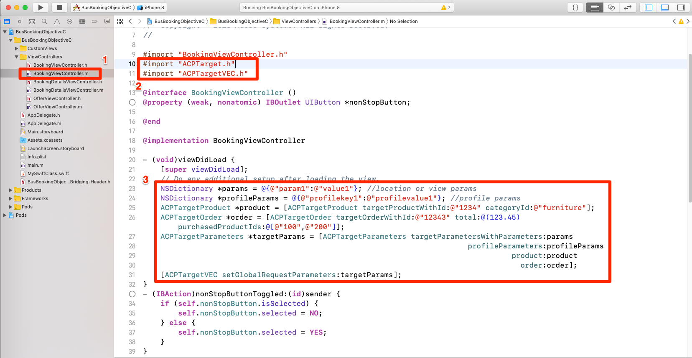
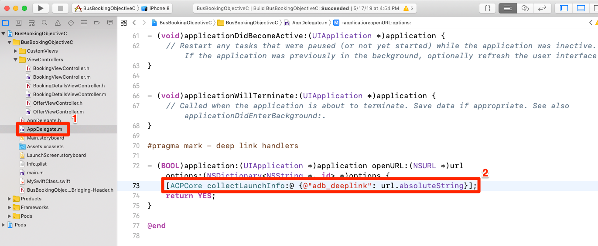
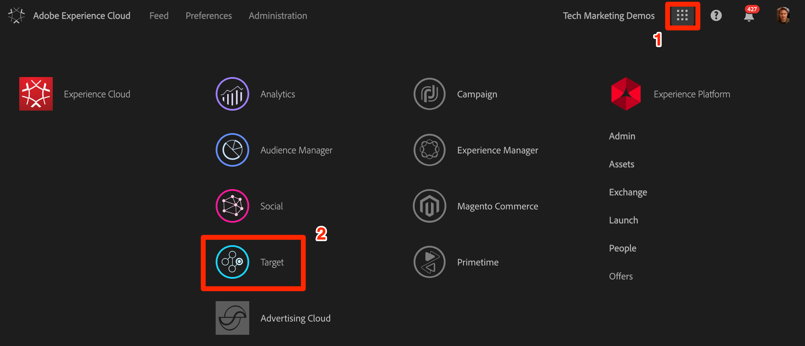
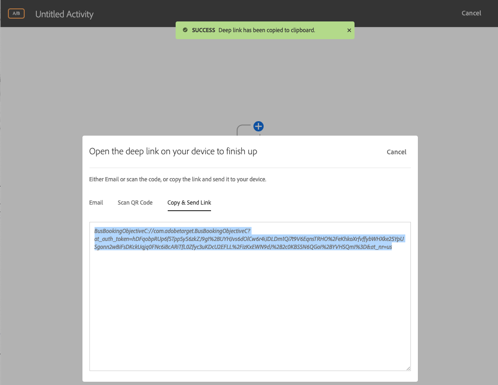
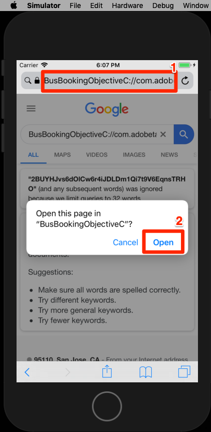
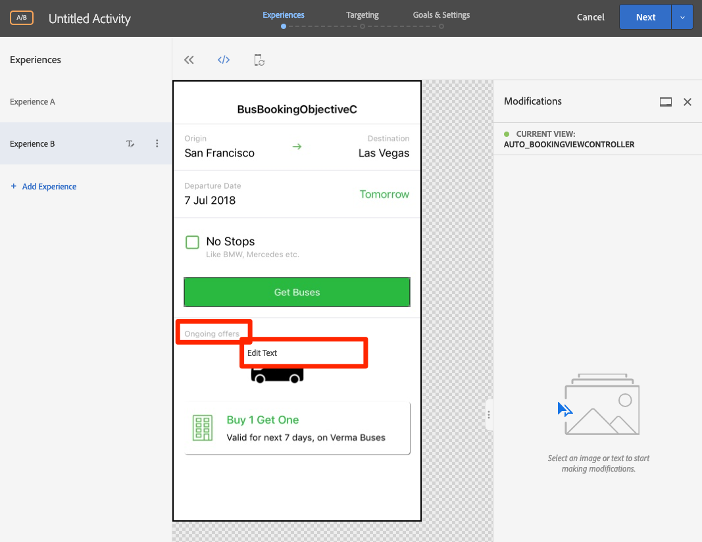

# Adicionar o Visual Experience Composer (VEC) do Adobe Target

Nesta lição, você ativará o Target Visual Experience Composer (VEC) para aplicativos móveis.

[O Adobe Target](https://docs.adobe.com/content/help/en/target/using/target-home.html) é a solução da Adobe Experience Cloud que fornece tudo o que você precisa para adaptar e personalizar a experiência de seus clientes, para que você possa maximizar a receita em sites da Web e móveis, aplicativos, redes sociais e outros canais digitais.

O Visual Experience Composer (VEC) para aplicativos móveis nativos permite criar atividades e personalizar o conteúdo de maneira autônoma, sem dependências de desenvolvimento contínuas e ciclos de lançamento de aplicativos.

Na lição [Adicionar extensões](launch-add-extensions.md), você adicionou a extensão do Target VEC à propriedade Iniciar. Na lição [Instalar o SDK](launch-install-the-mobile-sdk.md) móvel, você importou a extensão para o aplicativo de amostra. Somente algumas atualizações secundárias são necessárias para iniciar a configuração de atividades no compositor de experiência visual móvel do Target!

>[!WARNING] As extensões Target e Target VEC Launch são necessárias para usar o Target VEC no aplicativo móvel.

## Objetivos de aprendizagem

No final desta lição, você poderá:

* Ativar o aplicativo de amostra para o Target VEC
* Adicionar parâmetros à solicitação do Target VEC
* Emparelhe seu dispositivo com o VEC
* Criar uma atividade usando o VEC

## Pré-requisitos

Para completar as lições desta seção, deve:

* Conclua as lições na seção [Configurar lançamento](launch-create-a-property.md) .
* Ter acesso de nível de aprovador à interface do Adobe Target

## Adicionar parâmetros

As medições de ciclo de vida são incluídas automaticamente como parâmetros na solicitação do Target VEC. Você também pode adicionar parâmetros personalizados às solicitações.

**Para adicionar parâmetros personalizados**

1. No Xcode, abra o `BookingViewController.m` arquivo. Esse arquivo é usado pela tela Início.
1. Importar as extensões do Target e do Target VEC abaixo das importações existentes

   ```swift
   #import "ACPTarget.h"
   #import "ACPTargetVEC.h"
   ```

1. Na `viewDidLoad` função, depois da linha com `super.viewDidLoad` o código a seguir. Este código de exemplo mostra como parâmetros, parâmetros de perfil, parâmetros de produto (ou entidade) e parâmetros de pedido podem ser adicionados à solicitação TargetVEC. Este exemplo usa valores estáticos, enquanto no aplicativo real você deseja usar variáveis dinâmicas para preencher os valores. E claro, você só gostaria de preencher os parâmetros que estão relacionados à visão:

   ```objective-c
   NSDictionary *params = @{@"param1":@"value1"};
   NSDictionary *profileParams = @{@"profilekey1":@"profilevalue1"};
   ACPTargetProduct *product = [ACPTargetProduct targetProductWithId:@"1234" categoryId:@"furniture"];
   ACPTargetOrder *order = [ACPTargetOrder targetOrderWithId:@"12343" total:@(123.45) purchasedProductIds:@[@"100",@"200"]];
   ACPTargetParameters *targetParams = [ACPTargetParameters targetParametersWithParameters:params
                                                                         profileParameters:profileParams
                                                                                   product:product
                                                                                     order:order];
   [ACPTargetVEC setGlobalRequestParameters:targetParams];
   ```

   

Agora que você adicionou parâmetros ao aplicativo, é hora de confirmar que eles estão sendo transmitidos na solicitação.

**Para verificar os parâmetros**

1. Salvar o projeto Xcode
1. Recrie o aplicativo e aguarde até que ele seja reaberto no Simulador
1. Clique no painel Console do Xcode
1. Use o HTTP-F para abrir a caixa Localizar
1. Procurar `targetvec` na caixa Localizar
1. Ocorrência `Enter` para ir para a solicitação do Target e o corpo da postagem. Localize os parâmetros personalizados que você acabou de adicionar à solicitação:

   

## Emparelhamento do aplicativo móvel com a interface do Target

Para criar atividades de VEC na interface do Target, você deve primeiro emparelhar o Target com seu aplicativo. Esse emparelhamento é feito com o uso de deep links.

### Criação do esquema de deep link

O iOS é compatível com o uso de Links [](https://developer.apple.com/documentation/uikit/core_app/allowing_apps_and_websites_to_link_to_your_content) Universais e esquemas [de URL](https://developer.apple.com/documentation/uikit/core_app/allowing_apps_and_websites_to_link_to_your_content/defining_a_custom_url_scheme_for_your_app) personalizados para criar deep links para seu aplicativo. Você provavelmente já usa esquemas de URL personalizados em seu aplicativo. Em caso afirmativo, você pode usar esses links existentes para emparelhar com o Target. Para este tutorial, você deve criar um esquema de URL personalizado.

**Para registrar seu Esquema de URL**

1. No Xcode, clique duas vezes no aplicativo para abrir a tela Configurações
1. Na tela Configurações, clique na `Info` guia
1. Expandir a `URL Types` seção
1. Observe que o **[!UICONTROL Identificador]** está definido como `com.adobetarget.BusBookingObjectiveC`. Você pode usar esse identificador ou alterá-lo se desejar.
1. Observe que o Esquema **[!UICONTROL de]** URL é `BusBookingObjectiveC`. Você pode usar este esquema ou alterá-lo se quiser.
1. Verifique se **[!UICONTROL Editor]** está selecionado como a **[!UICONTROL Função]**

   

1. Se você atualizou o identificador ou esquema, clique na `General` guia para que o esquema seja salvo.  Clique novamente na guia `Info` , expanda a `URL type` seção e verifique se seu identificador ou esquema foi salvo.

A próxima etapa é adicionar um manipulador ao deep link.

**Para lidar com links profundos**

1. Abrir o `AppDelegate.m` arquivo
1. Adicione a linha `[ACPCore collectLaunchInfo:@ {@"adb_deeplink": url.absoluteString}];` à `AppDelegate:application:openURL` seção conforme a figura abaixo
   

### Verificar o deep link

Agora, quando um usuário com seu aplicativo instalado abrir um URL como `BusBookingObjectiveC://com.adobetarget.BusBookingObjectiveC` (ou qualquer esquema definido por você) no Simulador, ele abrirá seu aplicativo.

**Para verificar o esquema de deep link**

1. Salvar o projeto Xcode
1. Recrie o aplicativo
1. No Simulador, abra o Safari
1. Insira o url `BusBookingObjectiveC://com.adobetarget.BusBookingObjectiveC` (ou qualquer esquema definido) na barra de endereços. Se tiver dificuldades, consulte a seção Dica abaixo.
1. Você deve receber um aviso com um modal para "Abrir esta página em "BusBookObjetiveC". Se tiver dificuldades, consulte a seção Dica abaixo.
1. Clique em `Open`
1. Isso deve abrir o aplicativo de Reserva de barramento

   > [!TIP] Se você não tiver sucesso ao copiar e colar o URL da sua área de trabalho para o simulador, geralmente por um destes dois motivos:
   >
   >   1. **O URL copiado da interface do Target não é colado no Simulador** . Isso acontece quando as áreas de transferência Desktop e Simulador não são sincronizadas.  Se isso acontecer, tente desligar e ativar a configuração `Automatically Sync Pasteboard` no Simulador e copiar/colar novamente:
      >
      >      
      
      >
      >   
   1. **Colando o URL na página** de resultados do Google Search Tente reparar o URL do deep link na barra de endereços e acessando `Enter`. Talvez você precise repetir isso algumas vezes.


   

Agora que sua estrutura de deep link está configurada, você está pronto para usar o Target VEC para configurar atividades!

## Criar uma atividade no Mobile VEC

Agora vamos criar uma atividade na interface do usuário do Target.

**Para criar uma atividade com o Target VEC**

1. Faça logon na [Adobe Experience Cloud](https://experiencecloud.adobe.com)
1. Usar o alternador de soluções para ir para o Target

   

1. Iniciar Target

   

1. Clique no botão **[!UICONTROL Criar atividade]** e selecione Teste **[!UICONTROL A/B]**
1. Selecionar aplicativo **[!UICONTROL móvel]**
1. Verifique se **[!UICONTROL Visual]** está selecionado em **[!UICONTROL Escolher Experience Composer]**
1. Clique no botão **[!UICONTROL Avançar]**

   

1. Na tela **[!UICONTROL Selecionar um aplicativo para usar]** , clique em **[!UICONTROL Adicionar novo aplicativo]**

   

1. Insira o esquema de url que você acabou de definir no campo **[!UICONTROL Inserir esquema]** de URL, por exemplo `BusBookingObjectiveC://com.adobetarget.BusBookingObjectiveC`
1. Clique em **[!UICONTROL Criar deep link]**

   

   >[!NOTE] Você tem algumas opções para enviar o deep link para o aplicativo. É possível:
   >
   >   1. Tirar uma foto do código QR do dispositivo iOS (em nosso tutorial, o dispositivo precisaria estar vinculado ao Xcode)
   >   1. Copie o deep link da interface do Target e envie-o para o dispositivo, como você gostaria
   >   1. Envie o link direto por email para um endereço válido e abra o link com um aplicativo de email no dispositivo


1. Clique na guia **[!UICONTROL Copiar e enviar link]** .
1. Clique em qualquer lugar no link para copiar automaticamente o link para a área de transferência

   

1. Voltar ao Simulador
1. Abra o Safari no simulador
1. Colar o URL do deep link na barra de endereços
1. Clique no `Open` botão para abrir o aplicativo

   > [!TIP] Se você não tiver sucesso ao copiar e colar o URL da sua área de trabalho para o simulador, geralmente por um destes dois motivos:
   >
   >   1. **O URL copiado da interface do Target não é colado no Simulador** . Isso acontece quando as áreas de transferência Desktop e Simulador não são sincronizadas.  Se isso acontecer, tente desligar e ativar a configuração `Automatically Sync Pasteboard` no Simulador e copiar/colar novamente:
      >
      >      
      
      >
      >   
   1. **Colando o URL na página** de resultados do Google Search Tente reparar o URL do deep link na barra de endereços e acessando `Enter`. Talvez você precise repetir isso algumas vezes.


   

1. Depois que o aplicativo for carregado, volte para a guia do navegador, onde o Target foi aberto. Você deve ver o aplicativo carregado no VEC.
1. Clique nos ativos de texto e imagem no aplicativo e você deverá ver as opções para editá-los e substituí-los!

   

1. Faça algumas alterações na primeira tela do aplicativo
1. Agora posicione o Simulador ao lado do navegador com o VEC aberto
1. Navegue até uma tela diferente no aplicativo e observe como o VEC é atualizado com o Simulador!
1. Você pode fazer atualizações em várias exibições no aplicativo, em uma única atividade!
   
1. Você também pode adicionar visualmente métricas de rastreamento de cliques e usar a integração A4T com o Analytics!
1. Salve e aprove sua atividade e verifique se você pode vê-la no aplicativo de amostra

O emparelhamento do dispositivo com o VEC é uma ação única. Ao criar mais atividades no futuro no mesmo dispositivo, você poderá apenas selecionar o dispositivo de uma lista, como mostrado abaixo:


>[!TIP] Se você tiver um dispositivo aberto, mas ele estiver "Não disponível" no menu de seleção, coloque o aplicativo em segundo plano, retornando à tela inicial e movendo-o de volta para o primeiro plano para torná-lo "Disponível" novamente.

## Criação de públicos-alvo com base nas métricas de ciclo de vida

Métricas de ciclo de vida integradas sobre o uso do aplicativo pelo visitante que são incluídas automaticamente nas chamadas feitas pelo SDK do Adobe Mobile. Você pode criar facilmente públicos-alvo no Target com base nessas métricas.

**Para criar um público-alvo**

1. Na interface do Target, clique em **Públicos-alvo** na navegação superior
1. Click the **Create Audience** button

   

1. Name the Audience `Launches < 5`
1. Click **Add Rule &gt; Custom**

   

1. Na primeira lista suspensa, selecione o parâmetro **a.Launches** . Todos os parâmetros da métrica Ciclo de vida começam com "a". prefixo. Direcionaremos o conteúdo com base no número de inicializações do aplicativo que o usuário tem, o que é uma excelente maneira de direcionar os usuários que usam o aplicativo pela primeira vez com uma experiência de usuário (FTUE) instrutiva.
1. Na próxima lista suspensa, selecione **é menor que**
1. Na terceira lista suspensa, digite **5**
1. Clique em **Salvar**

   

Observe que há uma grande variedade de opções inovadoras de criação de público-alvo no Target. Além disso, você pode enviar dados personalizados na solicitação do Target para a criação de público-alvo, usar públicos-alvo compartilhados de outras soluções da Experience Cloud, como o Audience Manager e o Analytics, e dados de CRM compartilhados com o Target usando o recurso Atributos do cliente do serviço principal de pessoas.

[Próximo "Adicionar Adobe Target" &gt;](target.md)