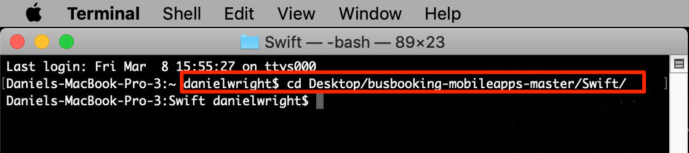
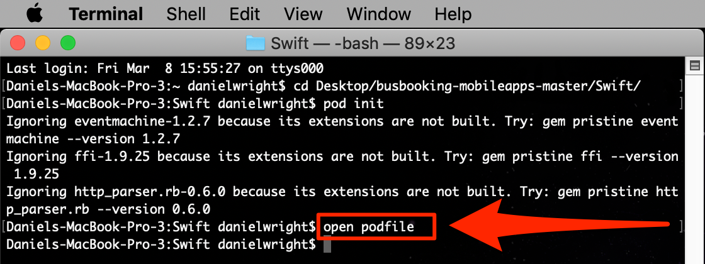
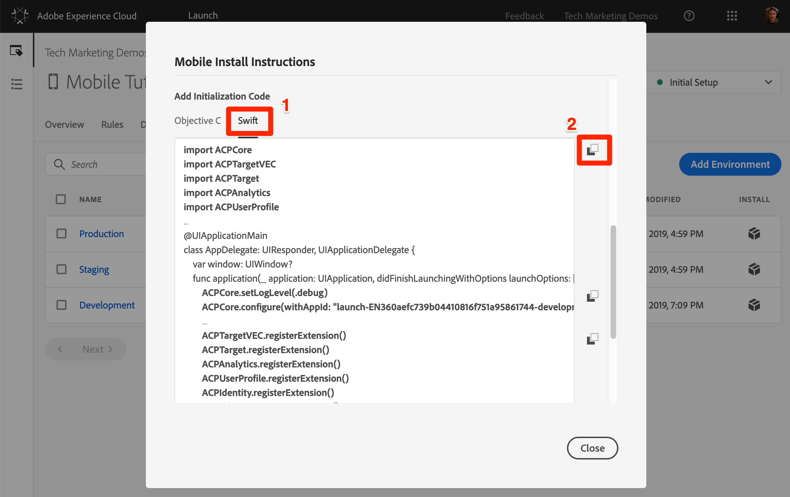
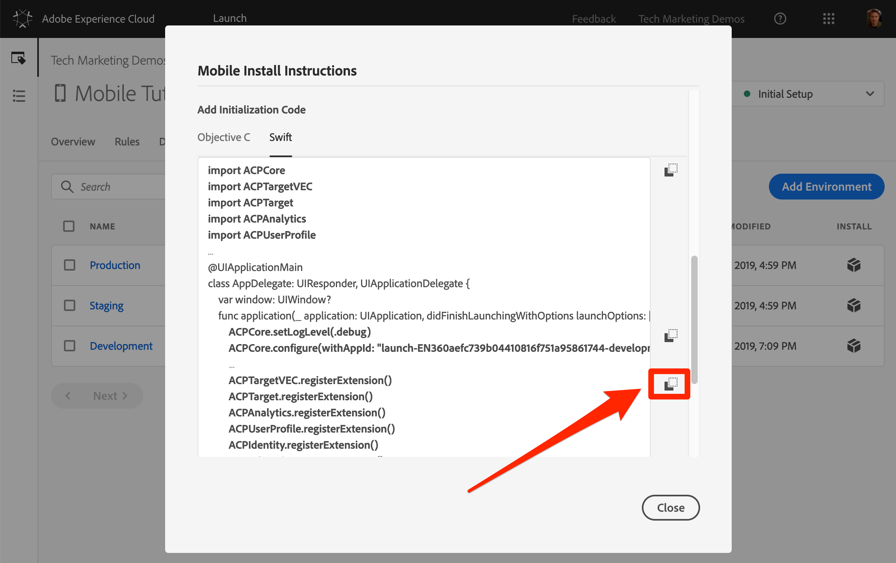
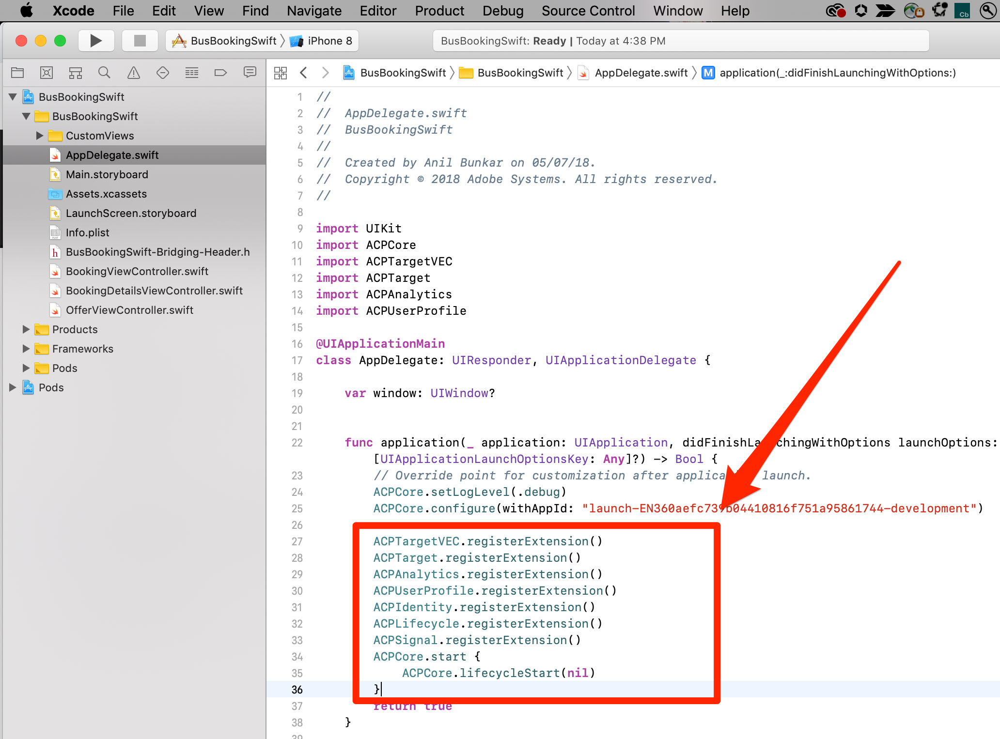
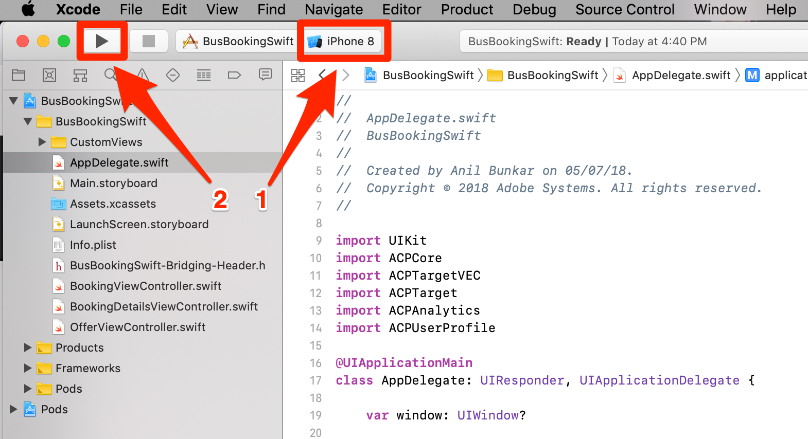

# Instalar o SDK do Mobile

Nesta lição, você implementará o SDK móvel com as extensões e configurações correspondentes ao ambiente de Desenvolvimento da propriedade Launch.

## Objetivos de aprendizagem

No final desta lição, você poderá:

* Obtenha as instruções de instalação para sua propriedade Mobile Launch
* Entender a diferença entre um ambiente de desenvolvimento, de armazenamento temporário e de produção
* Criar e editar o Podfile
* Importe o SDK móvel para o arquivo AppDelegate
* Verificar se o SDK foi implementado com êxito

## Obtenha as instruções de instalação

As Instruções de instalação para propriedades do Launch móvel são uma coleção de trechos de código que você executa no terminal ou adiciona a locais específicos no aplicativo móvel.

Clique na `Environments` guia na navegação superior para ir para a página de ambientes. Observe que os ambientes de desenvolvimento, armazenamento temporário e produção foram pré-criados para você. Eles correspondem aos ambientes típicos no processo de desenvolvimento e lançamento do código. O código é primeiramente escrito por um desenvolvedor em um ambiente de desenvolvimento. Quando eles concluem o trabalho, eles o enviam para um ambiente de armazenamento temporário para que o controle de qualidade e outras equipes analisem. Assim que o controle de qualidade e outras equipes estiverem satisfeitas, o código será publicado no ambiente de produção, que é o ambiente voltado ao público que seus visitantes experimentam ao baixar seu aplicativo.

O Launch permite ambientes de desenvolvimento adicionais, o que é útil em grandes organizações nas quais vários desenvolvedores estão trabalhando em projetos diferentes ao mesmo tempo.

Desenvolvimento, armazenamento temporário e produção são os únicos ambientes necessários para concluir o tutorial.


Na linha **[!UICONTROL Desenvolvimento]** , clique no ícone Instalar ícone  para abrir o modal do código incorporado.


Vamos passar pelas instruções passo a passo.

## Crie o Podfile e instale os pods

Se você já tiver usado o Launch em sites, uma das primeiras coisas que você observará é que há muito mais informações neste modal do que nas propriedades da Web.

O SDK do Adobe Mobile para iOS usa os CocoaPods para gerenciar dependências entre seus vários componentes. Se você ainda não tiver [CocoaPods](https://cocoapods.org/) instalados em seu ambiente de desenvolvimento, siga as instruções de instalação em seu site. Além disso, se você ainda não tiver baixado o aplicativo [de Reserva de](https://github.com/Adobe-Marketing-Cloud/busbooking-mobileapps)barramento, salve-o no computador local e extraia o arquivo zip no desktop.

**Para criar o Podfile**

1. Abra o `Terminal` aplicativo no Mac®

1. Navegue até a pasta do projeto na qual você salvou o aplicativo Bus Book Swift (por exemplo, `cd Desktop/busbooking-mobileapps-master/Swift/`)

   

1. Na interface do Launch, altere o sistema operacional para `iOS`

1. Copie a primeira instrução do iOS `pod init`, clicando no ícone 

   

1. No aplicativo Terminal, execute o `pod init` comando e aguarde até que ele seja concluído

   

1. No aplicativo Terminal, abra o arquivo podfile com o `open podfile` comando

   

1. Seu computador pode abrir uma caixa de diálogo perguntando com qual aplicativo você deseja abrir o arquivo de podre. Escolha qualquer editor de texto, como `TextEdit`

1. Na interface Iniciar, copie a lista de dependências clicando no ícone  . Observe como há uma linha correspondente a cada uma das extensões adicionadas na lição anterior. Cada extensão tem seu próprio conjunto de códigos, que se baseia na extensão do Mobile Core e só pode ser adicionada ou removida com uma atualização de aplicativo:

   

1. No editor de texto, cole as dependências da área de transferência logo após a linha `# Pods for BusBookingSwift`

1. Salve as atualizações no arquivo de podres no editor de texto

   

1. Agora você pode fechar seu editor de texto

1. Na interface do Launch, copie a próxima instrução iOS `pod repo update`, clicando no ícone 

   

1. No aplicativo Terminal, execute o `pod repo update` comando e aguarde até que ele seja concluído (isso pode levar alguns minutos)

   

1. Na interface do Launch, copie a próxima instrução iOS `pod install`, clicando no ícone 

   

1. No aplicativo Terminal, execute o `pod install` comando e aguarde até que ele seja concluído

   

1. Agora você pode fechar sua janela Terminal

1. Abra uma janela do Finder, navegue até a pasta na qual você salvou o aplicativo de Reserva de barramento e confirme se o arquivo BusBooksSwift.xcworkspace, o arquivo Podfile.lock e a pasta Pods foram criados

   

## Atualizar o AppDelegate

Agora é hora de atualizar o aplicativo para importar o SDK

1. Abrir o `BusBookingSwift.xcworkspace` arquivo no Xcode
1. Abrir o `AppDelegate.swift` arquivo

   

1. Na interface do Launch, role até a seção **[!UICONTROL Adicionar código]** de inicialização e escolha **[!UICONTROL Swift]** como o idioma do iOS que você está usando.
1. Copie as instruções de importação clicando no primeiro ícone  na seção **[!UICONTROL Adicionar código]** de inicialização:

   

1. No Xcode, cole essas declarações de importação no `AppDelegate.swift` arquivo após a importação para o `UIKit`

   

1. Na interface Iniciar, copie as duas linhas relacionadas à extensão Principal, clicando no segundo ícone  na seção **[!UICONTROL Adicionar código]** de inicialização. A primeira linha ativa as instruções de registro do console (as opções disponíveis são "debug", "verbose", "warning" e "error"). A segunda linha aponta para o identificador exclusivo do ambiente de inicialização. Isso é importante, pois você precisará atualizar esse valor quando estivermos prontos para implantar o aplicativo no ambiente de produção.

   

1. No Xcode, cole essas instruções principais no arquivo AppDelegate na parte superior do `application(_:didFinishLaunchingWithOptions:)` método:

   

1. Na interface Iniciar, copie as declarações de extensão clicando no terceiro ícone  na seção [!UICONTROL Adicionar código] de inicialização:

   

1. No Xcode, cole essas declarações de extensão no arquivo AppDelegate antes da `return true` linha do `application(_:didFinishLaunchingWithOptions:)` método:

   

>[!NOTE] As Instruções de instalação móvel fornecidas na interface de inicialização incluem as instruções de importação e registro para as extensões de identidade, ciclo de vida e sinal, bem como a inicialização das métricas de ciclo de vida. Essas extensões são consideradas parte da extensão Mobile Core. Se você não quiser usar essas extensões no aplicativo, não precisará importar, registrar ou implementar outro código associado a essas extensões.
>
> Além disso, há opções adicionais de implementação que devem ser consideradas ao usar essas extensões (por exemplo, você pode pausar/reiniciar a coleta Ciclo de vida quando o usuário colocar em segundo plano/primeiro plano o aplicativo). Você pode ler mais sobre isso na documentação [da extensão do Mobile Core](https://aep-sdks.gitbook.io/docs/using-mobile-extensions/mobile-core)

## Verificar a implementação

1. Salvar seu projeto Xcode
1. Execute o aplicativo e inicie-o no Simulador. Se você não tiver nenhum dispositivo simulador configurado, configure um agora, certificando-se de configurar um dispositivo executando o iOS 10+. Gostamos de usar um simulador do iPhone 8 porque é fácil clicar no `Home` botão com um mouse.

   

1. Aguarde o Simulador iniciar e abra totalmente o aplicativo na tela de reserva (isso pode levar alguns minutos)

   

1. Confirme se as chamadas estão sendo feitas nos servidores da Adobe no Xcode Console

   

Estes são exemplos de algumas chamadas específicas que você pode procurar:

1. **Chamadas para recuperar a configuração** do Launch (filtrar o console para `adobedtm.com`). Observe as configurações de extensão inseridas na lição anterior. Embora a adição da extensão exija uma atualização para o aplicativo, essas configurações podem ser gerenciadas externamente no Launch e alteradas a qualquer momento:

   ```swift
   2019-01-15 12:11:44.518220-0500 BusDemoSwift[52399:5056293] [AMSDK DEBUG <RulesDownloader>]: Successfully downloaded Rules from 'https://assets.adobedtm.com/launch-EN360aefc739b04410816f751a95861744-development-rules.zip'
   
   {"target.propertyToken":"","target.timeout":5,"global.privacy":"optedin","analytics.backdatePreviousSessionInfo":true,"analytics.offlineEnabled":true,"build.environment":"dev","rules.url":"https://assets.adobedtm.com/launch-EN360aefc739b04410816f751a95861744-development-rules.zip","target.clientCode":"techmarketingdemos","experienceCloud.org":"7ABB3E6A5A7491460A495D61@AdobeOrg","target.autoFetch":true,"target.fetchBackground":true,"lifecycle.sessionTimeout":300,"target.environmentId":"busbookingapp","analytics.server":"tmd.sc.omtrdc.net","analytics.rsids":"tmd-mobile-dev1","analytics.batchLimit":0,"property.id":"PRb4881271498b4f2cbaf67d38a8f3891a","global.ssl":true,"analytics.aamForwardingEnabled":true}
   ```

1. **Solicitação ao Serviço** de identidade (filtrar o console para `demdex.net`) Neste exemplo, a ID (`d_mid`)já foi definida e está sendo reportada novamente)

   ```swift
   2019-01-15 12:11:45.164590-0500 BusDemoSwift[52399:5056322] [AMSDK DEBUG <com.adobe.module.identity>]:
   
   Sending request (https://dpm.demdex.net/id?d_rtbd=json&d_ver=2&d_orgid=7ABB3E6A5A7491460A495D61@AdobeOrg&d_mid=17179986463578698626041670574784107777&d_blob=j8Odv6LonN4r3an7LhD3WZrU1bUpAkFkkiY1ncBR96t2PTI&dcs_region=9)
   ```

1. **Resposta do Serviço** de identidade (filtre seu console para `ID Service`). Observe como o `mid` valor corresponde ao `d_mid` valor na solicitação acima:

   ```swift
   2019-01-15 12:11:45.681821-0500 BusDemoSwift[52399:5056322] [AMSDK DEBUG <com.adobe.module.identity>]:
   
   ID Service - Got ID Response (mid: 17179986463578698626041670574784107777, blob: j8Odv6LonN4r3an7LhD3WZrU1bUpAkFkkiY1ncBR96t2PTI, hint: 9, ttl: "604800000 ms")
   ```

1. **Solicitação** do Analytics (filtre seu console para `Analytics request`)

   ```swift
   2019-01-15 12:11:45.828465-0500 BusDemoSwift[52399:5056336] [AMSDK DEBUG <AnalyticsHitDatabase>]: Analytics request was sent with body
   
   (ndh=1&c.&a.&AppID=BusDemoSwift%201%20%281.0%29&CarrierName=%28null%29&DayOfWeek=3&DaysSinceFirstUse=0&DaysSinceLastUse=0&DeviceName=x86_64&HourOfDay=12&LaunchEvent=LaunchEvent&Launches=3&OSVersion=iOS%2012.1&Resolution=828x1792&RunMode=Application&TimeSinceLaunch=0&ignoredSessionLength=-1547572244&internalaction=Lifecycle&locale=en-US&.a&.c&aamb=j8Odv6LonN4r3an7LhD3WZrU1bUpAkFkkiY1ncBR96t2PTI&aamlh=9&ce=UTF-8&cp=foreground&mid=17179986463578698626041670574784107777&pageName=BusDemoSwift%201%20%281.0%29&pe=lnk_o&pev2=ADBINTERNAL%3ALifecycle&t=00%2F00%2F0000%2000%3A00%3A00%200%20300&ts=1547572305)
   ```

Parabéns, você adicionou o SDK a um aplicativo móvel!

[Próximo "Adicionar o Adobe Experience Platform Identity Service" &gt;](id-service.md)