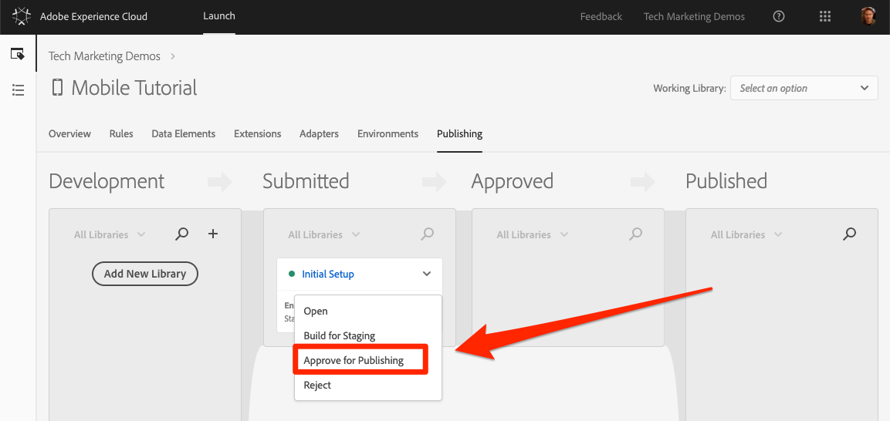
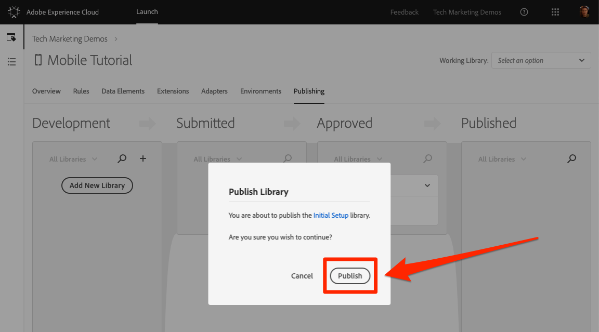
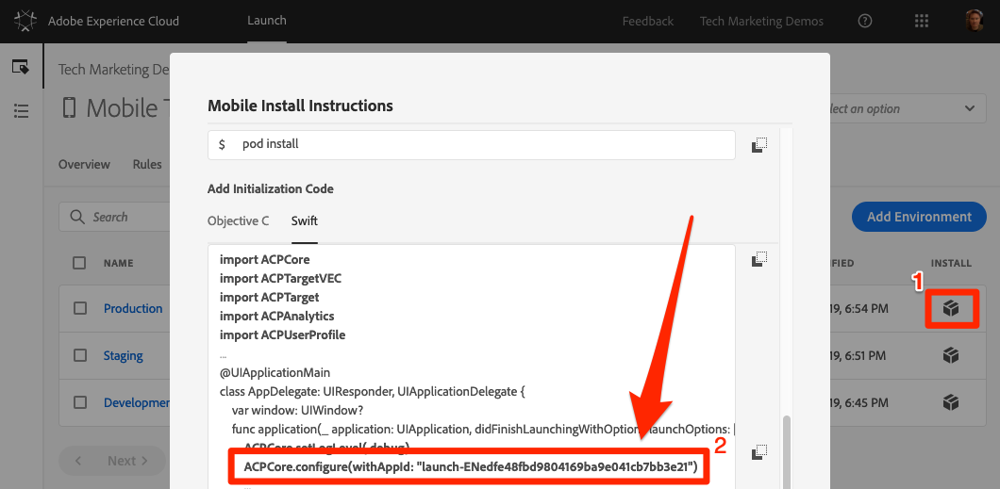

# Publicar sua propriedade de inicialização

Agora que você implementou algumas das principais soluções da Adobe Experience Cloud em seu ambiente de desenvolvimento, é hora de aprender o fluxo de trabalho de publicação.

## Pré-requisitos

Sua conta de usuário do Launch precisa de permissão para "Aprovar" e "Publicar" para concluir esta lição. Se você não conseguir concluir nenhuma dessas etapas porque as opções da interface do usuário não estão disponíveis para você, entre em contato com o administrador da Experience Cloud para obter acesso. For more information on Launch permissions, see [the documentation](https://docs.adobe.com/content/help/en/launch/using/reference/admin/user-permissions.html).

## Objetivos de aprendizagem

No final desta lição, você poderá:

1. Publicar uma biblioteca de desenvolvimento no ambiente de armazenamento temporário
1. Atualize seu aplicativo para carregar diferentes ambientes do Launch
1. Publicar uma biblioteca de armazenamento temporário no ambiente de produção

## Publicar no ambiente de armazenamento temporário

Agora que você criou e validou sua biblioteca no ambiente de desenvolvimento, é hora de publicá-la no armazenamento temporário.

1. Go to the **[!UICONTROL Publishing]** page

1. Abra a lista suspensa ao lado da biblioteca e selecione **[!UICONTROL Enviar para aprovação]**

   

1. Clique no botão **[!UICONTROL Enviar]** na caixa de diálogo:

   

1. Sua biblioteca agora aparecerá na coluna [!UICONTROL Enviado] em um estado não construído:

1. Abra a lista suspensa e selecione **[!UICONTROL Criar para armazenamento temporário]**:

   
1. Quando o ícone com o ponto verde é exibido, a biblioteca pode ser visualizada no ambiente de Armazenamento temporário.

Em um cenário da vida real, a próxima etapa do processo normalmente deve ser a validação das alterações por parte da sua equipe de controle de qualidade na biblioteca de Armazenamento temporário.

**Para validar as alterações na biblioteca de preparo**

1. Na propriedade Launch, abra a página [!UICONTROL Ambientes]

1. Na linha [!UICONTROL Preparação] , clique no ícone Instalar

    Instalar para abrir o modal
   

Se você usar uma área de trabalho diferente para seu aplicativo de preparo, precisará verificar se essa área de trabalho tem todas as atualizações de Pods e aplicativos que você fez neste tutorial. Neste ponto, a única diferença nas instruções de instalação do seu ambiente de desenvolvimento é a referência de inicialização na Configuração principal, como realçado na captura de tela acima. Você precisaria atualizar a linha correspondente no arquivo AppDelegate.swift e recriar o aplicativo.

Na vida real, uma vez que sua equipe de controle de qualidade tenha feito logoff revisando as mudanças no ambiente de preparo temporário, é hora de publicar na produção.

## Publicar na produção

1. Go to the [!UICONTROL Publishing] page

1. Na lista suspensa, clique em **[!UICONTROL Aprovar para publicação]**:

   

1. Clique no botão **[!UICONTROL Aprovar]** na caixa de diálogo:

   

1. A biblioteca agora aparecerá na coluna [!UICONTROL Aprovado] no estado não construído (ponto amarelo):

1. Abra a lista suspensa e selecione **[!UICONTROL Criar e publicar na produção]**:

   

1. Clique em **[!UICONTROL Publicar]** na caixa de diálogo:

   

1. A biblioteca será exibida na coluna [!UICONTROL Publicado] :

   

Novamente, observe que o ambiente de Produção usa uma referência de Inicialização na Configuração principal, como realçado na captura de tela abaixo.  Se você usar uma área de trabalho diferente para seu aplicativo de preparo, precisará verificar se essa área de trabalho tem todas as atualizações de Pods e aplicativos que você fez neste tutorial.

>[!WARNING] Na próxima vez que você fizer alterações na configuração do Launch, será necessário criar uma nova Biblioteca no ambiente de Desenvolvimento. Lembre-se de que a adição e remoção de extensões exigirá atualizações no próprio aplicativo. Tenha cuidado ao manter os ambientes do Launch e o código do aplicativo sincronizados entre si para evitar problemas.

É isso! Você concluiu o tutorial e publicou sua primeira propriedade móvel no Launch!