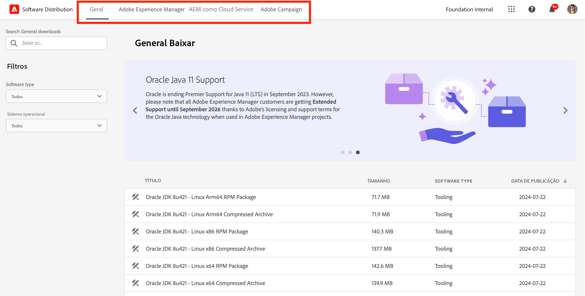
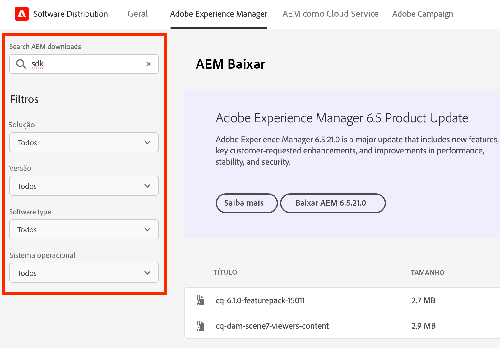
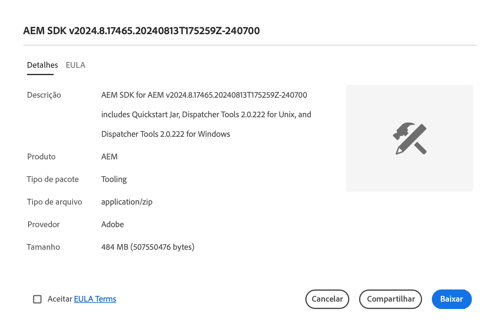

# Distribuição do software

Saiba como usar a Distribuição de software para baixar o software da Adobe Experience Cloud.

## Introdução

A Distribuição de software oferece uma experiência eficiente para encontrar e baixar o software Adobe Experience Cloud. Pacotes de software aprovados do Adobe e pacotes de empresas parceiras estão disponíveis para os seguintes produtos:

1. **Adobe Experience Manager** - Tudo relacionado ao serviço e manutenção, segurança, ferramentas e muito mais - para todas as versões de AEM com suporte
1. **Adobe Experience Manager as a [!UICONTROL Cloud Service]** - [!UICONTROL SDK da nuvem do AEM], ferramentas de migração da [!UICONTROL nuvem do AEM] e muito mais
1. **Adobe Campaign** - Todas as [!DNL Campaign] versões atuais do instalador e ferramentas relacionadas
1. **Geral** - Ferramentas de uso geral, incluindo [!DNL Oracle] JDKs para clientes do Adobe

O uso da Distribuição de software é simples como:

1. [Acesso à Distribuição de software](#accessing)
1. [Seleção do produto](#selecting)
1. [Encontrar o download](#finding)
1. [Download do software](#downloading)

## Acesso à Distribuição de software {#accessing}

Para acessar a Distribuição de Software, vá para [`https://experience.adobe.com/downloads`](https://experience.adobe.com/downloads) e entre na [!UICONTROL Distribuição de Software] com sua Adobe ID.

## Seleção do produto {#selecting}

A interface de Distribuição de software é organizada por produto, conforme mostrado no menu.

Você acessa a guia **Geral**, onde pode encontrar downloads de software de uso geral.

Toque ou clique no produto no menu para o qual deseja baixar o software. Somente os produtos licenciados por sua organização estão disponíveis para download.

## Localizando o download {#finding}

Após selecionar a guia do produto desejado, você verá todos os downloads relacionados. Use os filtros de pesquisa no painel esquerdo para localizar rapidamente o download. As opções de filtro variam de acordo com o produto.

## Download do software {#downloading}

Ao tocar ou clicar em um download exibido, uma caixa de diálogo é aberta e fornece mais informações sobre o download. Por exemplo, você pode ver uma descrição, o nome do provedor e o EULA.

Você deve aceitar o EULA selecionando **Aceitar Termos do EULA** para habilitar o botão **Baixar**.

Você também pode compartilhar um link para esse download específico tocando ou clicando em **Compartilhar** para copiar a URL.

## Compartilhamento de pacotes {#package-share}

Em junho de 2020, a [!UICONTROL Distribuição de software] substituiu o [!UICONTROL Compartilhamento de pacotes] para AEM e o [!DNL Neolane] para [!DNL Campaign]. Uma interface de usuário intuitiva, pesquisa simplificada e velocidade de download muito melhor tornam o download de pacotes de software para produtos Experience Cloud uma experiência melhor com o uso da Distribuição de software.

>[!IMPORTANT]
>
>As credenciais de logon do [!UICONTROL Compartilhamento de Pacotes] ou [!DNL Neolane] não funcionarão para a [!UICONTROL Distribuição de Software], que fornece recursos para entrar com os padrões de segurança para todo o Adobe. Se você não souber sua Adobe ID, entre em contato com um administrador de suporte em sua organização.

>[!NOTE]
>
>A [!UICONTROL Distribuição de software] aceita apenas downloads de navegadores. Ao usar o [!UICONTROL Gerenciador de pacotes] do AEM para novas instalações, é recomendável baixar o pacote em uma pasta local e instalá-lo a partir dessa pasta.
