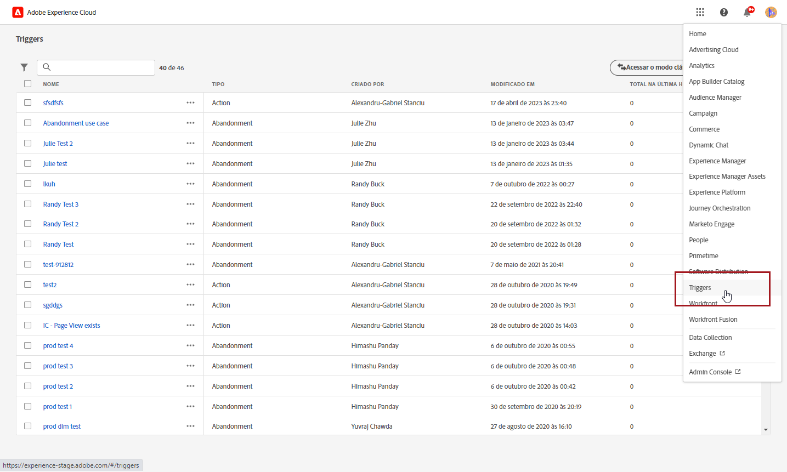
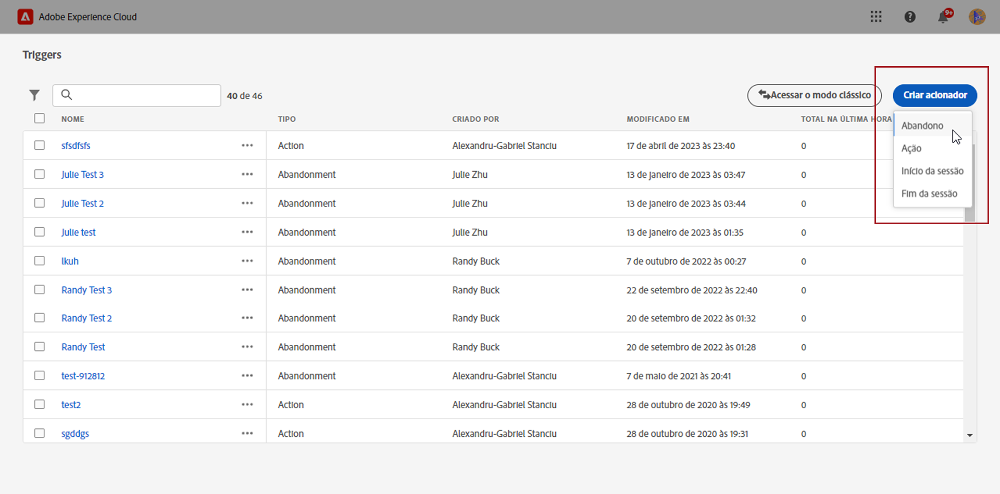
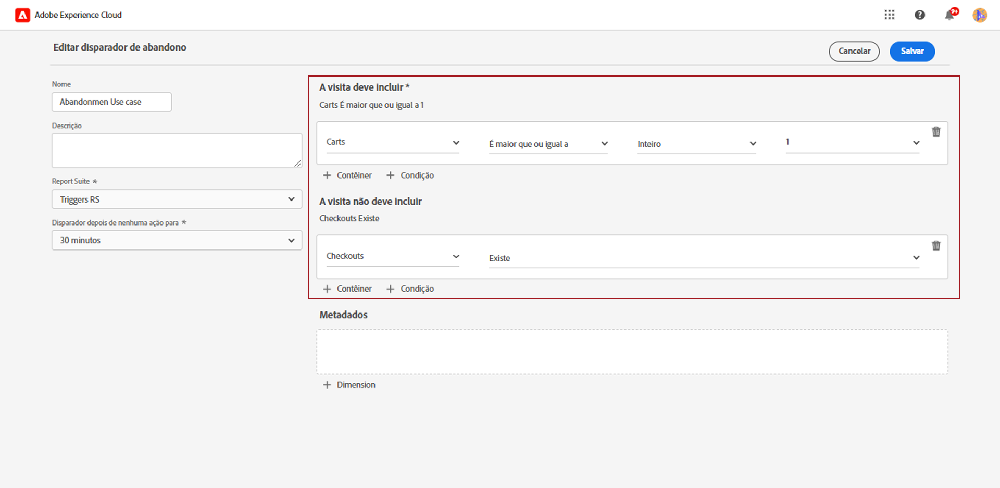
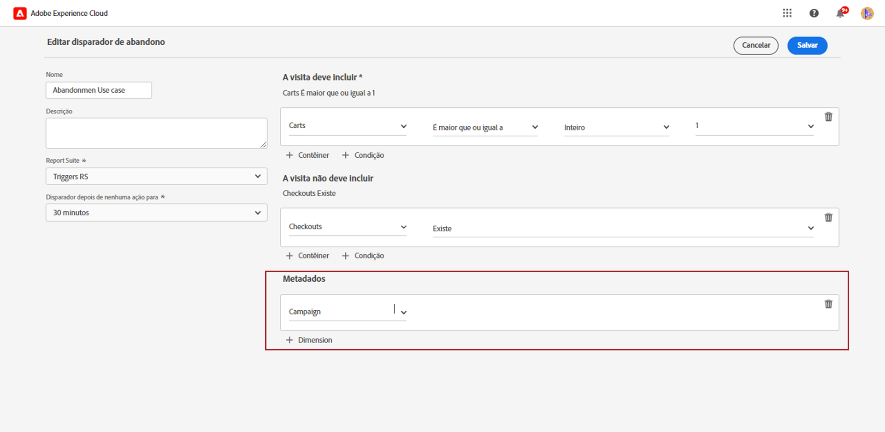
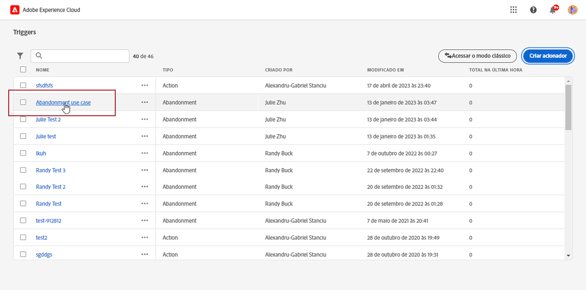
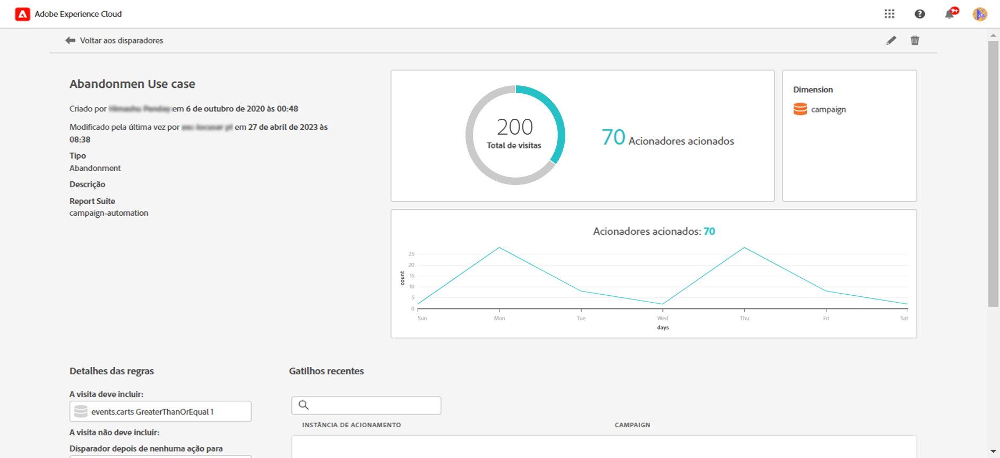

# Criar um acionador da Experience Cloud {#create-triggers}

>[!AVAILABILITY]
>
>A nova interface do Adobe Experience Cloud Triggers será implantada progressivamente para todos os clientes. Para obter mais informações, entre em contato com o seu representante da Adobe.

Crie um acionador e configure as condições para ele. Por exemplo, você pode especificar o critério das regras para um acionador durante uma visita. Alguns exemplos são métricas, como Abandono de carrinho, ou dimensões, como o nome do produto. O disparador é executado quando as regras são cumpridas.

>[!NOTE]
>
> A nova interface dos acionadores da Experience Cloud oferece uma experiência intuitiva para gerenciar comportamentos do consumidor e personalizar experiências do usuário. Para voltar à interface anterior, clique no botão **[!UICONTROL Ir para o modo clássico]**.

1. Na Experience Cloud, selecione o menu do alternador de soluções e, em seguida, clique em **[!UICONTROL Acionadores]**.

   

1. Na página inicial Acionador, clique em **[!UICONTROL Criar acionador]** e, em seguida, especifique o tipo de acionador.

   Há três tipos de acionadores disponíveis:

   * **[!UICONTROL Abandono]**: permite criar um acionador que é disparado quando um visitante visualiza um produto, mas não adiciona nada ao carrinho.

   * **[!UICONTROL Ação:]** permite criar acionadores, por exemplo, para serem disparados depois de inscrições em informativos, assinaturas de emails ou aplicações de cartões de crédito (confirmações). Se você for um varejista, crie um acionador para um visitante que se inscreve em um programa de fidelidade. Em mídia e entretenimento, crie acionadores para visitantes que assistem a um certo programa que talvez você queira que respondam a uma pesquisa.

   * **[!UICONTROL Início e término de sessão:]** cria um acionador para os eventos de início e de término de sessão.

   

1. Adicione um **[!UICONTROL Nome]** e uma **[!UICONTROL Descrição]** ao acionador.

1. Selecione o **[!UICONTROL Conjunto de relatórios]** do Analytics usado nesse acionador. Esta configuração identifica os dados de relatório que serão usados.

   [Saiba mais sobre Conjuntos de relatórios](https://experienceleague.adobe.com/docs/analytics/admin/admin-tools/manage-report-suites/c-new-report-suite/t-create-a-report-suite.html?lang=pt-BR){target="_blank"}.

1. Escolha o período de validade **[!UICONTROL Disparar após inatividade de]**.

1. Nas categorias **[!UICONTROL A visita deve incluir]** e **[!UICONTROL A visita não deve incluir]**, é possível definir critérios ou comportamentos de visitante que você deseja ou não que ocorram. É possível especificar operadores lógicos **E** ou **Ou** dentro de ou entre condições, dependendo dos critérios especificados.

   Por exemplo, as regras para o acionador de um simples abandono de carrinho de compras podem ser:

   * **[!UICONTROL A visita deve incluir]**: `Carts (metric) Is greater or equal to 1` para incluir visitantes com pelo menos um item em seus carrinhos.
   * **[!UICONTROL A visita não deve incluir]**: `Checkout (metric) Exists.` para remover visitantes que compraram os itens em seus carrinhos.

   

1. Clique em **[!UICONTROL Container]** para estabelecer e salvar regras, condições ou filtros que definem um acionador. Para que os eventos aconteçam ao mesmo tempo, você deve colocá-los no mesmo container.

   Cada container é processado independentemente no nível da ocorrência, o que significa que se dois containers forem unidos com um operador **[!UICONTROL E]**, as regras só se qualificarão quando duas ocorrências atenderem aos requisitos.

1. No campo **[!UICONTROL Metadados]**, clique em **[!UICONTROL + Dimensão]** para escolher uma dimensão específica do Campaign ou variáveis relevantes para o comportamento de um visitante.

   

1. Clique em **[!UICONTROL Salvar]**.

1. Selecione o **[!UICONTROL Acionador]** recém-criado na lista para acessar seu relatório detalhado.

   

1. Na visualização detalhada do acionador, é possível acessar os relatórios sobre quantos acionadores foram disparados. Se necessário, você pode editar o acionador utilizando o ícone de lápis.

   
