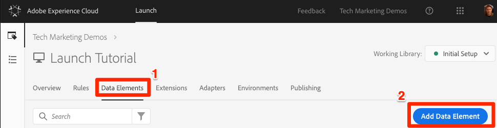
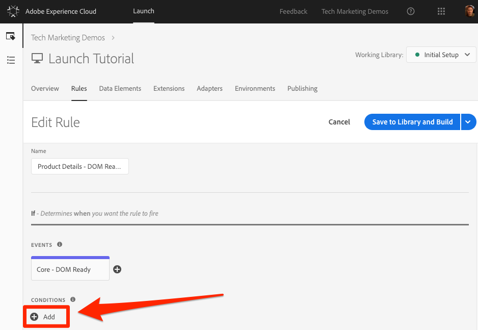
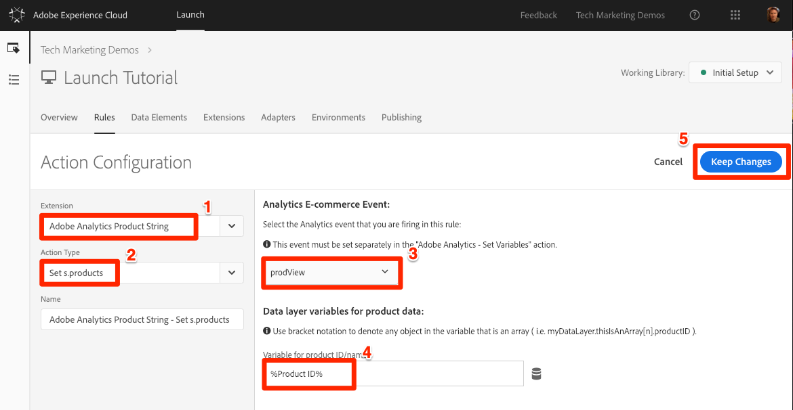
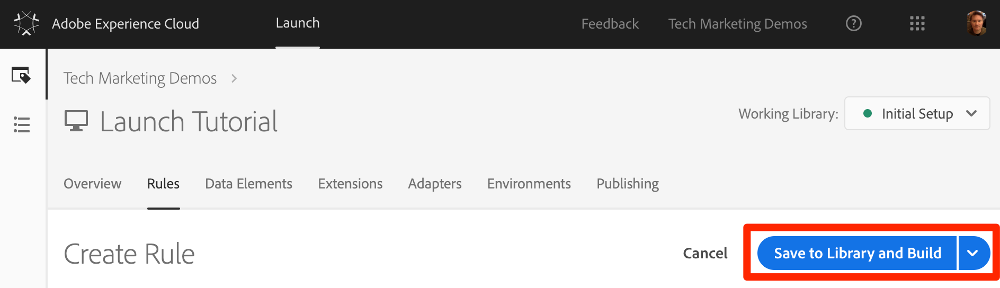
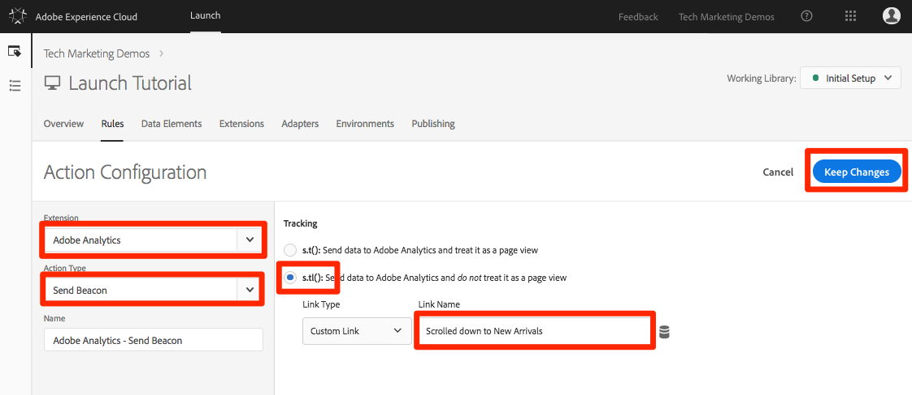
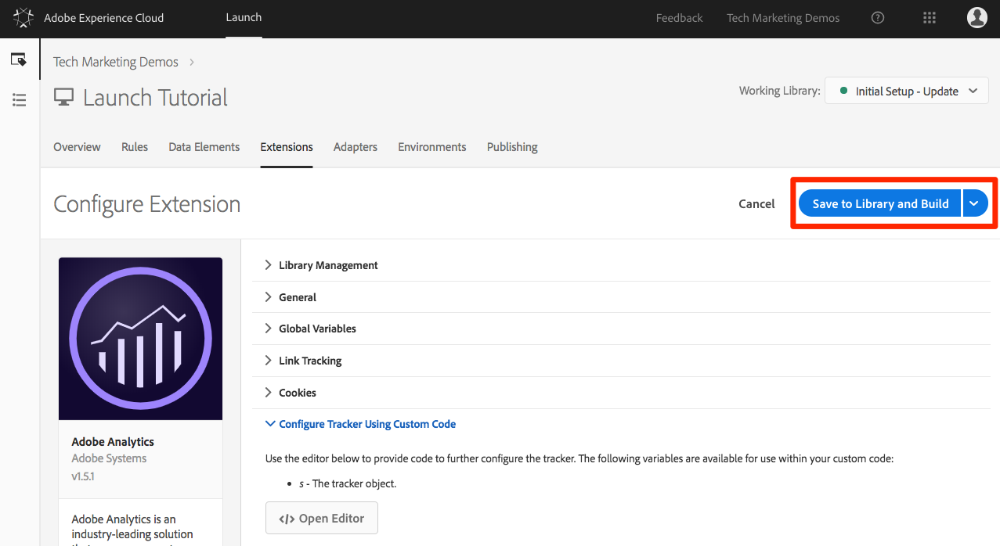

# Adicionar o Adobe Analytics

Nesta lição, você implementará a extensão [do](https://docs.adobe.com/content/help/en/launch/using/extensions-ref/adobe-extension/analytics-extension/overview.html) Adobe Analytics e criará regras para enviar dados ao Adobe Analytics.

[O Adobe Analytics](https://docs.adobe.com/content/help/en/analytics/landing/home.html) é uma solução líder do setor que faz você ser capaz de entender seus clientes como pessoas e de orientar seus negócios com informações de inteligência de clientes.

## Objetivos de aprendizagem

No final desta lição, você poderá:

1. Adicionar a extensão do Adobe Analytics
1. Definir variáveis globais usando a extensão
1. Adicionar o sinal de visualização de página
1. Adicionar mais variáveis usando regras
1. Adicionar rastreamento de cliques e outros sinais baseados em eventos
1. Adicionar plug-ins do Analytics

Há muitas coisas que podem ser implementadas para o Analytics no Launch. Esta lição não é exaustiva, mas deve fornecer uma visão geral sólida das principais técnicas necessárias para implementar em seu próprio site.

## Pré-requisitos

You should have already completed the lessons in [Configure Launch](launch.md) and [Add the Identity Service](id-service.md).

Além disso, você precisará de pelo menos uma ID do conjunto de relatórios e seu servidor de rastreamento. Se você não tiver um conjunto de relatórios de teste/desenvolvimento que possa usar para este tutorial, crie um. Se não tiver certeza sobre como fazer isso, consulte [a documentação](https://docs.adobe.com/content/help/en/analytics/admin/manage-report-suites/new-report-suite/new-report-suite.html). Você pode recuperar seu servidor de rastreamento da implementação atual, consultor da Adobe ou representante do Atendimento ao cliente.

## Adicionar a extensão do Analytics

A extensão do Analytics consiste em duas partes principais:

1. A configuração da extensão, que gerencia as principais configurações da biblioteca AppMeasurement.js e pode definir variáveis globais
1. Ações de regras responsáveis pelos itens a seguir:
   1. Definir variáveis
   1. Limpar variáveis
   1. Enviar o beacon do Analytics

**Para adicionar a extensão do Analytics**

1. Ir para **[!UICONTROL Extensões &gt; Catálogo]**
1. Localize a extensão do Adobe Analytics
1. Clique em **[!UICONTROL Instalar]**

   

1. Em Gerenciamento [!UICONTROL de biblioteca &gt; Conjuntos]de relatórios, digite as IDs do conjunto de relatórios que você deseja usar com cada ambiente de inicialização. Observe que ao digitar na caixa, você verá uma lista pré-preenchida de todos os seus conjuntos de relatórios. (Não há problema em usar um conjunto de relatórios para todos os ambientes neste tutorial, mas na vida real você deseja usar conjuntos de relatórios separados, como mostrado na imagem abaixo)

   

   >[!TIP] Recomendamos usar a opção  Gerenciar a biblioteca como a configuração Gerenciamento  da biblioteca, pois facilita muito a atualização da `AppMeasurement.js` biblioteca.

1. Em [!UICONTROL Geral &gt; Servidor]de rastreamento, insira o servidor de rastreamento, por exemplo, "`tmd.sc.omtrdc.net`." Insira seu servidor de rastreamento SSL se o site suporta `https://`

   

1. Na seção [!UICONTROL Variáveis]globais, defina a variável Nome [!UICONTROL da] página usando seu elemento `Page Name` de dados. Clique no ícone  `Page Name` dados para abrir o modal e escolher o elemento de dados da página)

1. Clique em **[!UICONTROL Salvar na biblioteca e construir]**

   

>[!NOTE] As variáveis globais podem ser definidas na configuração da extensão ou nas ações de regras. Be aware that when setting variables in the extension configuration, the data layer must be defined *before* the Launch embed codes.

## Enviar o beacon de exibição de página

Agora, você criará uma regra para acionar o beacon do Analytics, que enviará a variável Nome [!UICONTROL da] página definida na configuração da extensão.

You have already created an "All Pages - Library Loaded" rule in the [Add a Data Element, a Rule and a Library](launch-data-elements-rules.md) lesson of this tutorial, which is triggered on every page when the Launch library loads. Você também *pode* usar essa regra para o Analytics, mas essa configuração exige que todos os atributos da camada de dados usados no beacon do Analytics sejam definidos antes dos códigos incorporados do Launch. Para permitir mais flexibilidade com a coleta de dados, você criará uma nova regra "todas as páginas" acionada no DOM Ready para acionar o beacon do Analytics.

**Para enviar o beacon de exibição de página**

1. Vá para a seção **[!UICONTROL Regras]** na navegação superior e clique em **[!UICONTROL Adicionar regra]**

   

1. Atribua um nome à regra `All Pages - DOM Ready`
1. Click **[!UICONTROL Events &gt; Add]** to open the `Event Configuration` screen

   

1. Selecione Tipo de **[!UICONTROL evento &gt; DOM Ready (Pronto]** DOM) (Observe que a ordem da regra é "50")
1. Click **[!UICONTROL Keep Changes]**
   

1. Under Actions, click the  to add a new action

   

1. Selecione **[!UICONTROL Extensão &gt; Adobe Analytics]**

1. Selecione Tipo de **[!UICONTROL ação &gt; Enviar beacon]**

1. Deixar rastreamento configurado como `s.t()`. Note that if you wanted to make an `s.tl()` call in a click-event rule you could do that using the Send Beacon action, as well.

1. Clique no botão **[!UICONTROL Manter alterações]**

   

1. Clique em **[!UICONTROL Salvar na biblioteca e construir]**

   

### Validar o beacon de exibição de página

Agora que você criou uma regra para enviar um beacon do Analytics, é possível visualizar a solicitação no Depurador da Experience Cloud.

1. Open the [Luma site](https://luma.enablementadobe.com/content/luma/us/en.html) in your Chrome browser
1. Clique no ícone Depurador  para abrir o **[!UICONTROL Adobe Experience Cloud Debugger]**
1. Make sure the Debugger is mapping the Launch property to *your* Development environment, as described in the [earlier lesson](launch-switch-environments.md)

   

1. Clique para abrir a guia Analytics
1. Expanda o nome do conjunto de relatórios para mostrar todas as solicitações feitas a ele
1. Confirme se a solicitação foi acionada com a variável e o valor do Nome da página

   

>[!NOTE] Se o Nome da página não estiver sendo exibido para você, refaça as etapas desta página para garantir que você não tenha perdido nada.

## Adicionar variáveis com regras

When you configured the Analytics Extension, you populated the `pageName` variable in the extension configuration. Esse é um bom local para preencher outras variáveis globais, como eVars e props, desde que o valor esteja disponível na página antes que o código de incorporação do Launch seja carregado.

Um local mais flexível para definir variáveis, bem como eventos, está nas regras que usam a `Set Variables` ação. As regras permitem que você defina diferentes variáveis e eventos do Analytics sob diferentes condições. For example, you could set the `prodView` only on product detail pages and the `purchase` event only on order confirmation pages. Esta seção ensinará como definir variáveis usando regras.

### Caso de uso

As Páginas de detalhes do produto (PDP) são pontos importantes para a coleção de dados em sites de varejo. Geralmente, você deseja que o Analytics registre que uma visualização de produto ocorreu e que produto foi visualizado. Isso é útil para entender quais produtos são populares entre seus clientes. Em um site de mídia, páginas de artigo ou vídeo podem usar técnicas de rastreamento semelhantes às que você usará nesta seção.  When you load a Product Detail Page, you might want to put that value into a "Page Type" `eVar`, as well as set some events and the product id. Isto permitir-nos-á ver o seguinte na nossa análise:

1. Quantas vezes as páginas de detalhes do produto são carregadas
1. Quais produtos específicos são visualizados e quantas vezes
1. Como outros fatores (campanhas, pesquisa etc.) afetam quantas PDPs são carregadas

### Criar elemento de dados para o Tipo da página

Primeiro, é necessário identificar quais páginas são as páginas de Detalhes do produto. Você fará isso com um Elemento de dados.

**Para criar o elemento de dados para o tipo de página**

1. Clique em Elementos **[!UICONTROL de dados]** na navegação superior
1. Clique em **[!UICONTROL Adicionar elemento de dados]**

   

1. Nomeie o elemento de dados `Page Type`
1. Selecionar tipo de elemento **[!UICONTROL de dados &gt; Variável JavaScript]**
1. Use `digitalData.page.category.type` como a variável `JavaScript variable name`
1. Check the `Clean text` and `Force Lower Case` options
1. Clique em **[!UICONTROL Salvar na biblioteca e construir]**

   

### Criar elemento de dados para a ID do produto

Em seguida, você coletará a ID do produto da página Detalhes do produto atual com um Elemento de dados

**Para criar o elemento de dados para a ID do produto**

1. Clique em Elementos **[!UICONTROL de dados]** na navegação superior
1. Clique em **[!UICONTROL Adicionar elemento de dados]**

   

1. Nomeie o elemento de dados `Product Id`
1. Selecionar tipo de elemento **[!UICONTROL de dados &gt; Variável JavaScript]**
1. Use `digitalData.product.0.productInfo.sku` como a variável `JavaScript variable name`
1. Check the `Force lowercase value` option
1. Check the `Clean text` option
1. Clique em **[!UICONTROL Salvar na biblioteca e construir]**

   

### Adicionar a extensão da string de produtos do Adobe Analytics

If you are already familiar with Adobe Analytics implementations, you are probably familiar with the [products variable](https://docs.adobe.com/content/help/en/analytics/components/variables/dimensions-reports/reports-products.html). A variável products tem uma sintaxe muito específica e é usada de maneiras ligeiramente diferentes dependendo do contexto. Para ajudar a facilitar o preenchimento da variável products no Launch, três extensões adicionais já foram criadas no mercado de extensão do Launch! Nesta seção, você adicionará uma extensão criada pela Adobe Consulting para uso na página Detalhes do produto.

**Para adicionar a`Adobe Analytics Product String`extensão**

1. Vá para a página [!UICONTROL Extensões &gt; Catálogo]
1. Localize a `Adobe Analytics Product String` extensão pelos Serviços de consultoria da Adobe e clique em **[!UICONTROL Instalar]**
   
1. Reserve um momento para ler as instruções
1. Clique em **[!UICONTROL Salvar na biblioteca e construir]**

   

### Crie a regra para as Páginas de detalhes do produto

Agora, você usará seus novos elementos de dados e sua extensão para criar a regra da página Detalhes do produto. Para essa funcionalidade, você criará outra regra de carregamento de página, acionada pelo DOM Ready. However, you will use a condition so that it only fires on the Product Detail pages and the order setting so that it fires _before_ the rule that sends the beacon.

**Para criar a regra da página Detalhes do produto**

1. Vá para a seção **[!UICONTROL Regras]** na navegação superior e clique em **[!UICONTROL Adicionar regra]**

   

1. Atribua um nome à regra `Product Details - DOM Ready - 40`
1. Click **[!UICONTROL Events &gt; Add]** to open the `Event Configuration` screen

   

1. Selecionar tipo de **[!UICONTROL evento &gt; DOM Ready]**
1. Set the **[!UICONTROL Order]** to 40, so that the rule will run *before* the rule containing the Analytics &gt; Send Beacon action
1. Click **[!UICONTROL Keep Changes]**
   

1. Em **[!UICONTROL Condições]**, clique no ícone  `Condition Configuration` tela
   

   1. Selecione Tipo de **[!UICONTROL condição &gt; Comparação de valor]**
   1. Use the data element picker, choose `Page Type` in the first field
   1. Selecione **[!UICONTROL Contém]** na lista suspensa operador de comparação
   1. No próximo tipo de campo `product-page` (essa é a parte exclusiva do valor do tipo de página extraído da camada de dados em PDPs)
   1. Click **[!UICONTROL Keep Changes]**

      

1. Under Actions, click the  to add a new action

   

1. Selecione **[!UICONTROL Extensão &gt; Adobe Analytics]**
1. Selecionar tipo de **[!UICONTROL ação &gt; Definir variáveis]**
1. Selecione **[!UICONTROL eVar1 &gt; Definir como]** e insira `product detail page`
1. Set **[!UICONTROL event1]**, leaving the optional values blank
1. Em Eventos, clique no botão **[!UICONTROL Adicionar outro]**
1. Set the **[!UICONTROL prodView]** event, leaving the optional values blank
1. Click **[!UICONTROL Keep Changes]**

   

1. Under Actions, click the  to add a new action

   

1. Selecionar **[!UICONTROL extensão &gt; String de produto do Adobe Analytics]**
1. Selecione Tipo de **[!UICONTROL ação &gt; Definir s.products]**

1. Na seção Evento **[!UICONTROL de comércio eletrônico do]** Analytics, selecione **[!UICONTROL prodView]**

1. Na seção Variáveis da camada **[!UICONTROL de dados para dados]** do produto, use o seletor de Elementos de dados para escolher o elemento `Product Id` de dados

1. Click **[!UICONTROL Keep Changes]**

   

1. Clique em **[!UICONTROL Salvar na biblioteca e construir]**

   

### Validar os dados da página de detalhes do produto

Você acabou de criar uma regra que define variáveis antes do beacon ser enviado. Agora você pode ver os novos dados sendo enviados na ocorrência no Depurador da Experience Cloud.

**Para validar os dados da página Detalhes do produto**

1. Open the [Luma site](https://luma.enablementadobe.com/content/luma/us/en.html) in your Chrome browser
1. Navegue até qualquer página de detalhes do produto
1. Clique no ícone Depurador  para abrir o **[!UICONTROL Adobe Experience Cloud Debugger]**
1. Clique na guia Análises
1. Expandir seu conjunto de relatórios
1. Notice the Product Detail Variables that are now in the debugger, namely that `eVar1` has been set to "product detail page", that the `Events` variable has been set to "event1" and "prodView", that the products variable is set with the product id of the product you are viewing, and that your Page Name is still set by the Analytics extension

   

## Enviar um beacon de rastreamento de link

Quando uma página é carregada, você normalmente aciona um sinal de carregamento de página usando a função `s.t()`. This automatically increments a `page view` metric for the page listed in the `pageName` variable.

No entanto, às vezes você não quer incrementar as exibições de página no site, porque a ação que está acontecendo é "menor" (ou talvez diferente) do que uma exibição de página. In this case, you will use the `s.tl()` function, which is commonly referred to as a "track link" request. Embora seja referido como uma solicitação de rastreamento de link, ela não precisa ser acionada por um clique em links. It can be triggered by *any* of the events that are available to you in the Launch rule builder, including your own custom JavaScript.

Neste tutorial, você acionará uma `s.tl()` chamada usando um dos mais interessantes eventos JavaScript, um `Enters Viewport` evento.

### O caso de uso

Neste caso de uso, você quer saber se as pessoas estão rolando para baixo em nossa página inicial Luma o suficiente para ver a seção *Novas chegadas* de nossa página. Há alguma discórdia interna em nossa empresa sobre se as pessoas estão ou não vendo essa seção, portanto, você deseja usar o Analytics para determinar a verdade.

### Criar a regra ao iniciar

1. Vá para a seção **[!UICONTROL Regras]** na navegação superior e clique em **[!UICONTROL Adicionar regra]**
   
1. Atribua um nome à regra `Homepage - New Arrivals enters Viewport`
1. Click **[!UICONTROL Events &gt; Add]** to open the `Event Configuration` screen

   

1. Selecione Tipo **[!UICONTROL de evento &gt; Enters Viewport]**. Isso exibirá um campo onde você precisa entrar no seletor de CSS que identificará o item na sua página que deve acionar a regra quando ela entrar na exibição no navegador.
1. Volte para a página inicial do Luma e role para baixo até a seção New Arrival (Novos concorrentes).
1. Clique com o botão direito do mouse no espaço entre o título "NEW ARRIVALS" e os itens dessa seção e selecione `Inspect` no menu exibido com o clique no botão direito do mouse. Isso vai te aproximar do que você quer.
1. Bem ao redor, possivelmente logo abaixo da seção selecionada, você está procurando por uma div com `class="we-productgrid aem-GridColumn aem-GridColumn--default--12"`. Localize este elemento.
1. Clique com o botão direito do mouse nesse elemento e selecione **[!UICONTROL Copiar &gt; Copiar seletor]**

   

1. Volte para Iniciar e cole esse valor da área de transferência no campo rotulado `Elements matching the CSS selector`.
   1. Em uma nota lateral, é você que decide como identificar os seletores de CSS. Esse método é um pouco frágil, pois determinadas alterações na página podem quebrar esse seletor. Considere isso ao usar qualquer seletor de CSS no Launch.
1. Click **[!UICONTROL Keep Changes]**
   

1. Em Condições, clique no  de Mais para adicionar uma nova condição
1. Selecione Tipo de **[!UICONTROL condição &gt; Comparação de valor]**
1. Use the data element picker, choose `Page Name` in the first field
1. Selecione **[!UICONTROL Igual]** na lista suspensa operador de comparação
1. No próximo tipo de campo `content:we-retail:us:en` (este é o nome da página inicial, conforme extraído da camada de dados - queremos que essa regra seja executada apenas na página inicial)
1. Click **[!UICONTROL Keep Changes]**

   

1. Under Actions, click the  to add a new action
1. Selecione **[!UICONTROL Extensão &gt; Adobe Analytics]**
1. Selecionar tipo de **[!UICONTROL ação &gt; Definir variáveis]**
1. Set `eVar3` to `Home Page - New Arrivals`
1. Set `prop3` to `Home Page - New Arrivals`
1. Set the `Events` variable to `event3`
1. Click **[!UICONTROL Keep Changes]**

   

1. Under Actions, click the  to add another new action

   

1. Selecione **[!UICONTROL Extensão &gt; Adobe Analytics]**
1. Selecione Tipo de **[!UICONTROL ação &gt; Enviar beacon]**
1. Choose the **[!UICONTROL s.tl()]** tracking option
1. No campo Nome **[!UICONTROL do]** link, digite `Scrolled down to New Arrivals`. Esse valor será colocado no relatório Links personalizados no Analytics.
1. Click **[!UICONTROL Keep Changes]**

   

1. Clique em **[!UICONTROL Salvar na biblioteca e construir]**

   

### Validar o beacon Track Link

Agora, você deverá certificar-se de que essa ocorrência seja aplicada quando rolar para baixo até a seção Novas chegadas da Página inicial do nosso site. Quando você carrega a página inicial pela primeira vez, a solicitação não deve ser feita, mas à medida que você percorre e a seção aparece, a ocorrência deve disparar com nossos novos valores.

1. Abra o site [](https://luma.enablementadobe.com/content/luma/us/en.html) Luma no navegador Chrome e verifique se você está na parte superior da página inicial.
1. Clique no ícone **[!UICONTROL do]** depurador  para abrir o [!UICONTROL Adobe Experience Cloud Debugger]
1. Clique na guia Análises
1. Expandir a ocorrência do conjunto de relatórios
1. Observe a ocorrência de exibição de página normal para a página inicial com o nome da página, etc. (mas nada na eVar3 ou prop3).

   

1. Deixando o Depurador aberto, role para baixo no seu site até visualizar a seção Novas chegadas
1. Visualize o Depurador novamente e outra ocorrência do Analytics deve ter sido exibida. Essa ocorrência deve ter os parâmetros associados à ocorrência s.tl() que você configurou, a saber:
   1. `LinkType = "link_o"` (isso significa que a ocorrência é um link personalizado, não uma ocorrência de exibição de página)
   1. `LinkName = "Scrolled down to New Arrivals"`
   1. `prop3 = "Home Page - New Arrivals"`
   1. `eVar3 = "Home Page - New Arrivals"`
   1. `Events = "event3"`

      

## Adicionar um plug-in

Um plug-in é um código JavaScript que pode ser adicionado à sua implementação para executar uma função específica que não é incorporada ao produto. Os plug-ins podem ser criados por você, por outros clientes/parceiros da Adobe ou pela Adobe Consulting.

Para implementar plug-ins, há basicamente três etapas:

1. Inclua a função doPlugins, onde o plug-in será referenciado
1. Adicione o código da função principal para o plug-in
1. Inclua o código que chama a função, define variáveis etc.

### Tornar o objeto do Analytics globalmente acessível

Se você vai adicionar a função doPlugins (abaixo) e usar plug-ins, é necessário marcar uma caixa para disponibilizar o objeto "s" do Analytics globalmente na implementação do Analytics.

1. Ir para **[!UICONTROL Extensões &gt; Instalado]**

1. Na extensão do Adobe Analytics, clique em **[!UICONTROL Configurar]**

   

1. Em Gerenciamento **** de biblioteca, selecione a caixa rotulada `Make tracker globally accessible`. Como você pode ver na bolha de ajuda, isso fará com que o rastreador seja escopo globalmente em window.s, o que será importante como você se refere no JavaScript do cliente.

### Incluindo a função doPlugins

Para adicionar plug-ins, é necessário adicionar uma função chamada doPlugins. Essa função não é adicionada por padrão, mas uma vez adicionada, é gerenciada pela biblioteca do AppMeasurement e é chamada por último quando uma ocorrência é enviada para o Adobe Analytics. Portanto, você pode usar essa função para executar um JavaScript para configurar variáveis mais facilmente configuráveis dessa forma.

1. Ainda na extensão do Analytics, role para baixo e expanda a seção intitulada `Configure Tracker Using Custom Code.`
1. Click **[!UICONTROL Open Editor]**
1. Cole o código a seguir no editor de códigos:

   ```javascript
   /* Plugin Config */
   s.usePlugins=true
   s.doPlugins=function(s) {
   /* Add calls to plugins here */
   }
   ```

1. Mantenha essa janela aberta para a próxima etapa

### Adicionar código de função para o plug-in

Na verdade, você chamará dois plug-ins neste código, mas um deles está integrado à biblioteca do AppMeasurement, portanto, para aquele que você não precisa adicionar a função para chamar. No entanto, para o segundo, é necessário adicionar o código de função também. Essa função é chamada getValOnce().

### O plug-in getValOnce()

A finalidade desse plug-in é evitar que os valores sejam erroneamente duplicados no código quando um visitante atualiza uma página ou usa o botão Voltar do navegador para voltar para uma página onde um valor foi definido. Nesta lição, você a usará para impedir que o `clickthrough` evento seja duplicado.

O código desse plug-in está disponível na [documentação do Analytics](https://docs.adobe.com/content/help/en/analytics/implementation/javascript-implementation/plugins/getvalonce.html), mas também foi incluído aqui para facilitar a cópia/colagem.

1. Copie o código a seguir

   ```javascript
   /*
   * Plugin: getValOnce_v1.11
   */
   s.getValOnce=new Function("v","c","e","t",""
   +"var s=this,a=new Date,v=v?v:'',c=c?c:'s_gvo',e=e?e:0,i=t=='m'?6000"
   +"0:86400000,k=s.c_r(c);if(v){a.setTime(a.getTime()+e*i);s.c_w(c,v,e"
   +"==0?0:a);}return v==k?'':v");
   ```

1. Cole-o na janela de código na extensão do Analytics (se ainda não estiver aberta, abra-a novamente de acordo com a etapa anterior), **completamente abaixo** da função doPlugins (não dentro dela).

   

Agora você pode chamar esse plug-in de dentro de doPlugins.

### Como chamar plug-ins de dentro do doPlugins

Agora que o código está lá e pode ser referenciado, você pode fazer chamadas para plug-ins na função doPlugins.

Primeiro, você chamará um plug-in que foi incorporado à biblioteca do AppMeasurement e, portanto, é conhecido como "utilitário". It is referred to as `s.Util.getQueryParam`, because it is part of the s object, is a built-in utility, and will grab values (based on a parameter) from the query string in the URL.

1. Copie o código a seguir:

   ```javascript
   s.campaign = s.Util.getQueryParam("cid");
   ```

1. Cole-o na função doPlugins. This will look for a parameter called `cid` in the current page URL and place it into the s.campaign variable.
1. Agora, chame a função getValOnce copiando o seguinte código e colando-o logo abaixo da chamada para getQueryParam:

   ```javascript
   s.campaign=s.getValOnce(s.campaign,'s_cmp',30);
   ```

   Esse código garantirá que o mesmo valor não seja enviado mais de uma vez consecutiva por 30 dias (consulte a documentação para saber como personalizar esse código de acordo com suas necessidades).

   

1. Salve a janela do código
1. Clique em **[!UICONTROL Salvar na biblioteca e construir]**

   

### Validar os plug-ins

Agora você pode verificar se os plug-ins estão funcionando.

**Para validar os plug-ins**

1. Open the [Luma site](https://luma.enablementadobe.com/content/luma/us/en.html) in your Chrome browser
1. Clique no ícone Depurador  para abrir o **[!UICONTROL Adobe Experience Cloud Debugger]**
1. Clique na guia Análises
1. Expandir seu conjunto de relatórios
1. Observe que a ocorrência do Analytics não tem uma variável de Campanha
1. Leaving the Debugger open, go back to the Luma site and add  `?cid=1234` to the URL and hit Enter to refresh the page with that query string included

   

1. Check the Debugger and confirm that there is a second Analytics request with a Campaign variable set to `1234`

   

1. Volte e atualize a página Luma novamente, com a string de consulta ainda no URL
1. Verifique a próxima ocorrência no Depurador e a variável Campaign **não** deve estar presente, pois o plug-in getValOnce garantiu que ela não seja duplicada e pareça que outra pessoa veio do código de rastreamento da campanha.

   

1. BONUS: You can test this over and over by changing the value of the `cid` parameter in the query string. The Campaign variable should only be there if it is the **first** time you run the page with the value. If you are not seeing the Campaign value in the debugger, simply change the value of the `cid` in the query string of the URL, hit enter, and you should see it again in the debugger.

   >[!NOTE] Na verdade, há algumas maneiras diferentes de capturar um parâmetro da string de consulta do URL, incluindo na configuração de extensão do Analytics. No entanto, nessas outras opções de não-plug-in, elas não fornecem a capacidade de interromper a duplicação desnecessária, como você fez aqui com o plug-in getValOnce. Este é o método favorito do autor, mas você deve determinar qual método funciona melhor para você e suas necessidades.

Bom trabalho! Você concluiu a lição do Analytics. É claro que há muitas outras coisas que você pode fazer para aprimorar nossa implementação do Analytics, mas espero que isso tenha dado a você algumas das principais habilidades que você precisará para atender ao resto de suas necessidades.

[Próximo "Adicionar o Adobe Audience Manager" &gt;](audience-manager.md)
