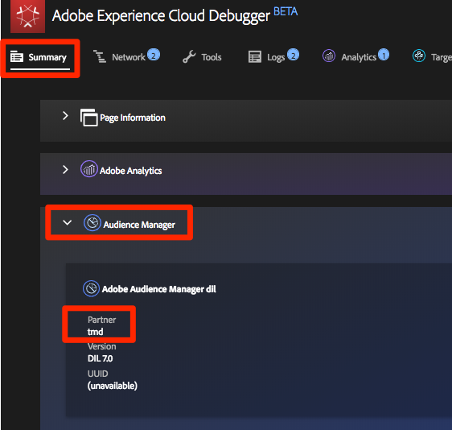

# Adicionar o Adobe Audience Manager

Esta lição o guiará pelas etapas para ativar o Adobe Audience Manager usando o encaminhamento pelo lado do servidor.

[O Adobe Audience Manager](https://docs.adobe.com/content/help/en/audience-manager/user-guide/aam-home.html) (AAM) fornece serviços líderes do setor para o gerenciamento de dados de público-alvo online, fornecendo aos anunciantes e editores digitais as ferramentas necessárias para controlar e aproveitar seus ativos de dados para ajudar a impulsionar o sucesso das vendas.

## Objetivos de aprendizagem

No final desta lição, você poderá:

1. Descrever as duas principais maneiras de implementar o Audience Manager em um site
1. Adicionar o Audience Manager usando o encaminhamento pelo lado do servidor do beacon do Analytics
1. Validar a implementação do Audience Manager

## Pré-requisitos

Para concluir esta lição, será necessário:

1. Para concluir as lições em [Configurar lançamento](launch.md), [Adicionar o Adobe Analytics](analytics.md)e [Adicionar o serviço](id-service.md)de identidade.

1. Acesso do administrador ao Adobe Analytics para que você possa ativar o encaminhamento pelo lado do servidor para o conjunto de relatórios que está usando para este tutorial. Como alternativa, você pode solicitar que um administrador na sua organização faça isso seguindo as instruções abaixo.

1. Seu "Subdomínio do Audience Manager" (também conhecido como "Nome do parceiro" "ID do parceiro" ou "Subdomínio do parceiro"). Se você já tiver o Audience Manager implementado em seu site real, a maneira mais fácil de obtê-lo é acessar seu site e abrir o Depurador. O subdomínio está disponível na guia Resumo, na seção Audience Manager:

   

Se você ainda não tiver o Audience Manager implementado, siga estas instruções para [obter seu Subdomínio](https://docs.adobe.com/content/help/en/audience-manager-learn/tutorials/web-implementation/how-to-identify-your-partner-id-or-subdomain.html)do Audience Manager.

## Opções de implementação

Há duas maneiras de implementar o Audience Manager em um site:

* **Encaminhamento pelo lado do servidor (SSF)**— para clientes com o Adobe Analytics, essa é a maneira mais fácil e recomendada de implementar. O Adobe Analytics encaminha dados para o AAM no backend da Adobe, permitindo menos uma solicitação na página. Isso também habilita os principais recursos de integração e está em conformidade com nossas práticas recomendadas para implementação e implantação do código do Audience Manager.

* **DIL** do cliente — Essa abordagem é para clientes que não têm o Adobe Analytics. O código DIL (Data Integration Library Code, o código de configuração JavaScript do AAM) envia dados diretamente da página da Web para o Audience Manager.

Como você já implantou o Adobe Analytics neste tutorial, você implantará o Audience Manager usando o encaminhamento pelo lado do servidor. For a complete description and requirements list for Server-Side forwarding, please review the [documentation](https://docs.adobe.com/content/help/en/analytics/admin/admin-tools/server-side-forwarding/ssf.html), so that you are familiar with how it works, what is required, and how to validate.

## Ativar encaminhamento pelo lado do servidor

Há duas etapas principais para fazer uma implementação do SSF:

1. Ativar um "switch" no Admin Console do Analytics para encaminhar dados do Analytics para o Audience Manager *por conjunto* de relatórios.
1. Colocar o código no lugar, que é feito por meio do Launch. Para que isso funcione corretamente, será necessário ter a extensão do Adobe Experience Platform Identity Service instalada, bem como a extensão do Analytics (na verdade, você *não* precisará da extensão AAM, descrita abaixo).

### Ativar o encaminhamento pelo lado do servidor no Admin Console do Analytics

Uma configuração no Admin Console do Adobe Analytics é necessária para iniciar o encaminhamento de dados do Adobe Analytics para o Adobe Audience Manager. Como pode demorar até quatro horas para começar a encaminhar os dados, você deve fazer essa etapa primeiro.

#### Para ativar o SSF no Admin Console do Analytics

1. Faça logon no Analytics por meio da interface do usuário da Experience Cloud. Se você não tiver acesso de Administrador ao Analytics, precisará conversar com seu administrador da Experience Cloud ou do Analytics para atribuir acesso ou concluir essas etapas para você.

   

1. Na navegação superior do Analytics, escolha **[!UICONTROL Admin &gt; Report Suites]** e, na lista, selecione (selecione várias vezes) os conjuntos de relatórios que deseja encaminhar para o Audience Manager.

   

1. Na tela Report Suites e com os report suites selecionados, escolha **[!UICONTROL Editar configurações &gt; Geral &gt; Encaminhamento]** pelo lado do servidor.

   

   >[!WARNING] Conforme dito acima, será necessário ter privilégios de administrador para ver este item de menu.

1. Uma vez na página Encaminhamento pelo lado do servidor, leia as informações e marque a caixa para **[!UICONTROL Ativar o Encaminhamento]** pelo lado do servidor para os conjuntos de relatórios.

1. Clique em **[!UICONTROL Salvar]**

   

>[!NOTE] Como o SSF precisa ser habilitado por conjunto de relatórios, não se esqueça de repetir essa etapa para seus conjuntos de relatórios reais ao implantar o SSF no conjunto de relatórios do site.
>
>Além disso, se a opção SSF estiver acinzentada, será necessário "mapear os conjuntos de relatórios para sua organização da Experience Cloud para ativar a opção. Isso é explicado [na documentação](https://docs.adobe.com/content/help/en/core-services/interface/about-core-services/report-suite-mapping.html).

Uma vez concluída essa etapa e se você tiver o Adobe Experience Platform Identity Service ativado, os dados serão encaminhados do Analytics para o AAM. No entanto, para concluir o processo para que a resposta volte corretamente do AAM para a página (e também para o Analytics por meio do recurso Audience Analytics), você também deve concluir a etapa a seguir no Launch. Não se preocupe, é super fácil.

### Ativar encaminhamento pelo lado do servidor no Launch

Esta é a segunda de duas etapas para habilitar o SSF. Você já inverteu o switch no Admin Console do Analytics e agora precisa apenas adicionar o código, o que o Launch funcionará se você simplesmente marcar a caixa correta.

>[!NOTE] Para implementar o encaminhamento pelo lado do servidor dos dados do Analytics no AAM, editaremos/configuraremos a extensão do Analytics no Launch, **não** a extensão do AAM. A extensão AAM é usada exclusivamente para implementações DIL do lado do cliente, para aqueles que não têm o Adobe Analytics. Portanto, as etapas a seguir estão corretas quando o enviam para a extensão do Analytics para configurar isso.

#### Para ativar o SSF no Launch

1. Vá até **[!UICONTROL Extensões &gt; Instalado]** e clique para configurar a extensão do Analytics.

   

1. Expandir a `Adobe Audience Manager` seção

1. Marque a caixa para compartilhar Dados do Analytics **[!UICONTROL automaticamente com o Audience Manager]**. Isso adicionará o "Módulo" (código) do Audience Manager à `AppMeasurement.js` implementação do Analytics.

1. Adicione seu "Subdomínio do Audience Manager" (também conhecido como "Nome do parceiro", "ID do parceiro" ou "Subdomínio do parceiro"). Siga estas instruções para [obter o Subdomínio](https://docs.adobe.com/content/help/en/audience-manager-learn/tutorials/web-implementation/how-to-identify-your-partner-id-or-subdomain.html)do Audience Manager.

1. Clique em **[!UICONTROL Salvar na biblioteca e construir]**

   

O código de encaminhamento pelo lado do servidor foi implementado!

### Validar o encaminhamento pelo lado do servidor

A principal maneira de validar se o encaminhamento pelo lado do servidor está ativo e em execução é observar a resposta a qualquer uma das ocorrências do Adobe Analytics. Chegaremos a isso em um minuto. Entretanto, vamos verificar outras coisas que nos podem ajudar a ter a certeza de que estão a funcionar como queremos.

#### Verifique se o código está sendo carregado corretamente

O código que o Adobe Launch instala para lidar com o encaminhamento e, especialmente, a resposta do AAM para a página, é chamado de "Módulo" do Audience Manager. Podemos usar o Experience Cloud Debugger para garantir que ele foi carregado.

1. Abra o site Luma
1. Clique no ícone do depurador no navegador para abrir o depurador da Experience Cloud
1. Permanecendo na guia Resumo, role até a seção Análises
1. Verify that **AudienceManagement** is listed under the Modules section

   

#### Verifique a ID do parceiro no depurador

Em seguida, também podemos verificar se o depurador está coletando a "ID do parceiro" correta (subdomínio do parceiro AKA etc.) do código.

1. Ainda no depurador e ainda na guia Resumo, role para baixo até a seção Audience Manager
1. Verifique sua ID/subdomínio do parceiro em "Parceiro"

   

>[!WARNING] Você pode notar que a seção Audience Manager do depurador se refere à "DIL", que é a "Biblioteca de integração de dados", e geralmente se refere a uma implementação do lado do cliente, em oposição à abordagem do lado do servidor que implementamos aqui. A verdade é que o "Módulo" do AAM (usado nesta abordagem SSF) usa muito do mesmo código da biblioteca DIL do lado do cliente e, portanto, esse depurador está reportando como tal. Se você tiver seguido as etapas neste tutorial e os outros itens nesta seção de validação estiverem corretos, você pode ter certeza de que o encaminhamento pelo lado do servidor está funcionando.

#### Verificar a solicitação e a resposta do Analytics

Ok, este é o maior. Se você não estiver fazendo o encaminhamento de dados pelo lado do servidor do Analytics para o Audience Manager, não haverá resposta ao beacon do Analytics (além de um pixel 2x2). No entanto, se você estiver executando o SSF, há itens que você pode verificar na solicitação e resposta do Analytics que informarão que ele está funcionando corretamente.
Infelizmente, no momento, o depurador da Experience Cloud não suporta a exibição da resposta aos beacons. Portanto, você deve usar outro depurador/sniffer de pacote, como Charles Proxy ou as Ferramentas do desenvolvedor do navegador.

1. Abra as Ferramentas do desenvolvedor em seu navegador e vá para a guia Rede
1. No campo de filtro, digite `b/ss` o que limitará o que você vê às solicitações do Adobe Analytics
1. Atualize a página para ver a solicitação do Analytics

   

1. No beacon do Analytics (solicitação), procure um parâmetro "callback". Será definido como algo assim: `s_c_il[1].doPostbacks`

   

1. Você terá uma resposta ao beacon do Analytics. Ele conterá referências ao doPostbacks, como chamado na solicitação, e mais importante, ele deve ter um objeto "stuff". É aqui que as IDs de segmento do AAM serão enviadas de volta ao navegador. Se você tiver o objeto "stuff", o SSF está funcionando!

   

>[!WARNING] Cuidado com o falso "sucesso" - se houver uma resposta, e tudo parece estar funcionando, **certifique** -se de que você tenha esse objeto "coisa". Caso contrário, você poderá ver uma mensagem na resposta que diz "status": "SUCESSO". Por mais louco que isso pareça, isso é prova de que **NÃO** está funcionando corretamente. Caso veja isso, significa que você concluiu essa segunda etapa (o código no Launch), mas o encaminhamento no Admin Console do Analytics (primeira etapa desta seção) ainda não foi concluído. Nesse caso, é necessário verificar se o SSF foi ativado no Admin Console do Analytics. Se você tem, e ainda não passaram 4 horas, seja paciente.

[Próximos "Integrações da Experience Cloud" &gt;](integrations.md)