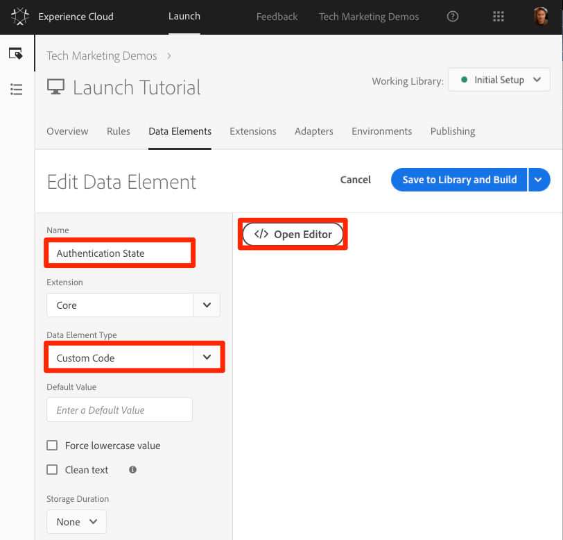

# Adicionar o Adobe Experience Platform Identity Service

Esta lição guiará você pelas etapas necessárias para implementar a extensão [do serviço de identidade da plataforma](https://docs.adobe.com/content/help/en/launch/using/extensions-ref/adobe-extension/id-service-extension/overview.html) Adobe Experience Platform e enviar as IDs do cliente.

O Serviço [de identidade da plataforma](https://docs.adobe.com/content/help/en/id-service/using/home.html) Adobe Experience define uma ID de visitante comum em todas as soluções da Adobe para potencializar os recursos da Experience Cloud, como o compartilhamento de público-alvo entre as soluções.  Você também pode enviar suas próprias IDs de cliente ao Serviço para permitir a definição de metas e integrações entre dispositivos com seu sistema de Gerenciamento de Relacionamento com o Cliente (CRM).

## Objetivos de aprendizagem

No final desta lição, você poderá:

* Adicionar a extensão do Serviço de Identidade
* Criar um elemento de dados para coletar suas IDs de cliente
* Crie uma regra que use a ação "Definir IDs do cliente" para enviar as IDs do cliente para a Adobe
* Use o recurso de solicitação de regra para sequenciar regras que são acionadas no mesmo evento

## Pré-requisitos

You should have already completed the lessons in the [Configure Launch](launch.md) section.

## Adicionar a extensão do serviço de identidade

Como esta é a primeira extensão que você está adicionando, esta é uma rápida visão geral das extensões. As extensões são um dos principais recursos do Launch. Uma extensão é uma integração criada pela Adobe, um parceiro da Adobe ou qualquer cliente da Adobe que adicione opções novas e infinitas para as tags que você pode implantar em seu site. Se você considerar o Launch como um sistema operacional, as extensões serão os aplicativos que você instala, de modo que o Launch possa fazer o que você precisa.

**Para adicionar a Extensão do Serviço de Identidade**

1. In the top navigation, click **[!UICONTROL Extensions]**

1. Clique em **[!UICONTROL Catálogo]** para acessar a página Catálogo de extensões

   

1. Observe a variedade de extensões disponíveis no Catálogo

1. No filtro na parte superior, digite "id" para filtrar o catálogo

1. No cartão do Adobe Experience Platform Identity Service, clique em **[!UICONTROL Instalar]**

   

1. Observe que a ID de empresa da Experience Cloud foi detectada automaticamente para você.

1. Deixe todas as configurações padrão e clique em **[!UICONTROL Salvar na biblioteca e na criação]**

   

>[!NOTE] Cada versão da extensão do Serviço de identidade vem com uma versão específica do VisitorAPI.js, que é anotada na descrição da extensão. Atualize a versão VisitorAPI.js atualizando a extensão do Serviço de identidade.

### Validar a extensão

A extensão do Serviço de Identidade é uma das poucas extensões do Launch que fazem uma solicitação sem precisar usar uma ação de regra. A extensão fará automaticamente uma solicitação ao Serviço de identidade no primeiro carregamento de página da primeira visita a um site. Depois que a ID for solicitada, ela será armazenada em um cookie primário começando com "AMCV_".

**Para validar a extensão do Serviço de Identidade**

1. Open the [Luma site](https://luma.enablementadobe.com/content/luma/us/en.html)

1. Make sure the Debugger is mapping the Launch property to *your* Development environment, as described in the [earlier lesson](launch-switch-environments.md).

1. Na guia Resumo do Depurador, a seção Iniciar deve indicar que a extensão do Adobe Experience Platform Identity Service está implementada.

1. Além disso, na guia Resumo, a seção Serviço de identidade deve ser preenchida com a mesma ID organizacional que estava na tela de configuração da extensão na interface do Launch:

   

1. A solicitação inicial para recuperar a ID do visitante pode aparecer na guia Serviço de identidade do Depurador. Contudo, ela já pode ter sido solicitada, portanto, não se preocupe se você não vê-la:
   

1. Depois da solicitação inicial para buscar a ID do visitante, a ID é armazenada em um cookie cujo nome começa com `AMCV_`. Você pode confirmar que o cookie foi configurado ao fazer o procedimento a seguir:
   1. Abra as Ferramentas do desenvolvedor do seu navegador
   1. Go to the `Application` tab
   1. Expand `Cookies` on the left side
   1. Click on the domain `https://luma.enablementadobe.com`
   1. Procure o cookie AMCV_ no lado direito. Você pode ver vários desde que carregaram o site Luma usando a propriedade Launch codificada, bem como mapeada para a sua.
      

Pronto! Você adicionou sua primeira extensão! Para obter mais detalhes sobre as opções de configuração do Serviço de identidade, consulte [a documentação](https://docs.adobe.com/content/help/en/id-service/using/id-service-api/configurations/function-vars.html).

## Enviar IDs do cliente

Em seguida, você enviará uma ID [do](https://docs.adobe.com/content/help/en/id-service/using/reference/authenticated-state.html) cliente ao Serviço de identidade. This will allow you to [integrate your CRM](https://docs.adobe.com/content/help/en/core-services/interface/customer-attributes/attributes.html) with the Experience Cloud as well as track visitors across devices.

In the earlier lesson, [Add Data Elements, Rules, and Libraries](launch-data-elements-rules.md) you created a data element and used it in a rule. Agora, você usará essas mesmas técnicas para enviar uma ID do cliente quando o visitante for autenticado.

### Criar elementos de dados para IDs do cliente

Comece criando dois elementos de dados:

1. `Authentication State`—para capturar se o visitante está ou não conectado
1. `Email (Hashed)`—para capturar a versão com hash do endereço de email (usado como a ID do cliente) da camada de dados

**Para criar o elemento de dados para o Estado de autenticação**

1. Clique em Elementos **[!UICONTROL de dados]** na navegação superior
1. Clique no botão **[!UICONTROL Adicionar elemento]** de dados

   

1. Nomeie o elemento de dados `Authentication State`
1. Para o Tipo **[!UICONTROL de elemento de]** dados, selecione Código **[!UICONTROL personalizado]**
1. Clique no botão **[!UICONTROL Abrir editor]**

   

1. Na janela [!UICONTROL Editar código] , use o seguinte código para retornar valores de "conectado" ou "desconectado" com base em um atributo na camada de dados do site Luma:

   ```javascript
   if (digitalData.user[0].profile[0].attributes.loggedIn)
       return "logged in"
   else
       return "logged out"
   ```

1. Click **[!UICONTROL Save]** to save the custom code

   

1. Deixe todas as outras configurações em seus valores padrão
1. Clique em **[!UICONTROL Salvar na biblioteca e construir]** para salvar o elemento de dados e retornar à página de elementos de dados

   

Ao saber o estado de autenticação do usuário, você sabe quando uma ID do cliente deve existir na página para enviar ao Serviço de identidade. A próxima etapa é criar um elemento de dados para a própria ID do cliente. No site de demonstração Luma, você usará a versão com hash do endereço de email do visitante.

**Para adicionar o elemento de dados para o email com hash**

1. Clique no botão **[!UICONTROL Adicionar elemento]** de dados

   

1. Nomeie o elemento de dados `Email (Hashed)`
1. Para o Tipo **[!UICONTROL de elemento de]** dados, selecione Variável **[!UICONTROL JavaScript]**
1. Como nome **[!UICONTROL da variável]** JavaScript, use o seguinte ponteiro para obter uma variável na camada de dados do site Luma: `digitalData.user.0.profile.0.attributes.username`
1. Deixe todas as outras configurações em seus valores padrão
1. Clique em **[!UICONTROL Salvar na biblioteca e em Criar]** para salvar o elemento de dados

   

### Adicionar uma regra para enviar as IDs do cliente

O Adobe Experience Platform Identity Service transmite as IDs do cliente em regras usando uma ação chamada "Definir IDs do cliente".  Agora, você criará uma regra para acionar essa ação quando o visitante for autenticado.

**Para criar uma regra para enviar as IDs do cliente**

1. In the top navigation, click **[!UICONTROL Rules]**
1. Clique em **[!UICONTROL Adicionar regra]** para abrir o Construtor de regras

   

1. Atribua um nome à regra `All Pages - Library Loaded - Authenticated - 10`

   >[!TIP] Essa convenção de nomenclatura indica que você está acionando essa regra na parte superior de todas as páginas quando o usuário for autenticado e ela terá uma ordem de "10". Usar uma convenção de nomenclatura como essa — em vez de nomeá-la para as soluções acionadas nas ações — permitirá minimizar o número geral de regras necessárias para sua implementação.

1. Under **[!UICONTROL Events]** click **[!UICONTROL Add]**

   

   1. For the **[!UICONTROL Event Type]** select **[!UICONTROL Library Loaded (Page Top)]**
   1. For the  **[!UICONTROL Order]** enter `10`. A ordem controla a sequência de regras acionadas pelo mesmo evento. Regras com uma ordem mais baixa serão acionadas antes de regras com uma ordem mais alta. In this case, you want to set the customer ID before you fire the Target request, which you will do in the next lesson with a rule with an order of `50` .
   1. Clique no botão **[!UICONTROL Manter alterações]** para retornar ao Construtor de regras
   

1. Em **[!UICONTROL Condições]** , clique em **[!UICONTROL Adicionar]**

   

   1. Para o Tipo **[!UICONTROL de]** condição, selecione Comparação **[!UICONTROL de valores]**
   1. Click the  icon to open the Data Element modal

      

   1. No Modal do elemento de dados, clique em Estado **[!UICONTROL de]** autenticação e, em seguida, clique em **[!UICONTROL Selecionar]**

      

1. Make sure `Equals` is the operator
1. Digite "conectado" no campo de texto, fazendo com que a regra seja acionada sempre que o "Estado de autenticação" do elemento de dados tiver um valor de "conectado"

1. Click **[!UICONTROL Keep Changes]**

   

1. Em **[!UICONTROL Ações]** , clique em **[!UICONTROL Adicionar]**

   

   1. Para a **[!UICONTROL extensão]** , selecione **[!UICONTROL Adobe Experience Platform Identity Service]**
   1. Para o Tipo **[!UICONTROL de]** ação, selecione **[!UICONTROL Definir IDs do cliente]**
   1. Para obter o Código **[!UICONTROL de]** integração, digite `crm_id`
   1. Para **[!UICONTROL Valor]** , insira abrir o seletor de Elemento de Dados e selecione o `Email (Hashed)`
   1. Para o Estado **[!UICONTROL de autenticação]** , selecione **[!UICONTROL Autenticado]**
   1. Click the **[!UICONTROL Keep Changes]** button to save the action and return to the Rule Builder

      

1. Clique no botão **[!UICONTROL Salvar na biblioteca e construir]** para salvar a regra

   

Agora você criou uma regra que enviará a ID do cliente como uma variável `crm_id` quando o visitante for Autenticado. Como você especificou a Ordem como `10` esta regra será acionada antes de sua `All Pages - Library Loaded` regra ser criada na lição [Adicionar elementos de dados, regras e bibliotecas](launch-data-elements-rules.md) que usa o valor padrão da Ordem de `50`.

### Validar as IDs do cliente

Para validar seu trabalho, você fará logon no site Luma para confirmar o comportamento da nova regra.

**Para acessar o site Luma**

1. Open the [Luma site](https://luma.enablementadobe.com/content/luma/us/en.html)

1. Make sure the Debugger is mapping the Launch property to *your* Development environment, as described in the [earlier lesson](launch-switch-environments.md)

   

1. Clique no link **[!UICONTROL LOGIN]** no canto superior direito do site Luma

   

1. Digite `test@adobe.com` como nome de usuário
1. Digite `test` como senha
1. Clique no botão **[!UICONTROL LOGIN (LOGIN)]**

   

1. Retorne à Página inicial

Agora, confirme se a ID do cliente foi enviada para o Serviço usando a extensão do Depurador.

**Para validar se o serviço de identidade está transmitindo a ID do cliente**

1. Verifique se a guia do site Luma está em foco
1. No Depurador, vá para a guia Adobe Experience Platform Identity Service
1. Expandir a ID da organização
1. Click on the cell with the `Customer ID - crm_id` value
1. In the modal, note the customer id value and that the `AUTHENTICATED` state is reflected:

   

1. Observe que você pode confirmar o valor do email com hash exibindo o código fonte da página Luma e observando a propriedade username. Deve corresponder ao valor que você vê no Depurador:

   

### Dicas adicionais de validação

O Launch também tem recursos avançados de registro no console. Para ativá-los, vá para a guia **[!UICONTROL Ferramentas]** no Depurador e ative a opção **[!UICONTROL Iniciar log]** do console.


Isso ativará o registro do console no console do navegador e na guia Logs do Depurador. Você deve ver o registro de todas as regras criadas até agora! Observe que novas entradas de log são adicionadas à parte superior da lista, portanto, sua regra "Todas as páginas - Biblioteca carregada - Autenticada - 10" deve ser acionada antes da regra "Todas as páginas - Biblioteca carregada" e aparecer abaixo dela no Registro de console do Depurador:


[Próximo "Adicionar Adobe Target" &gt;](target.md)
