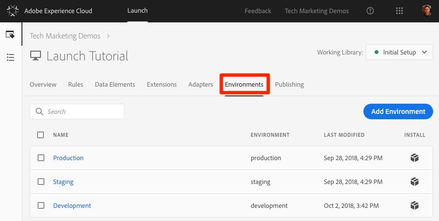

# Adicionar o código incorporado do Launch

Nesta lição, você implementará o código incorporado assíncrono do ambiente de Desenvolvimento da propriedade Launch. Ao longo do caminho, você aprenderá sobre dois conceitos principais de Launch — Environments e Embed Codes (Launch — Ambientes e códigos incorporados).

## Objetivos de aprendizagem

No final desta lição, você poderá:

* Obter o código incorporado para sua propriedade Launch
* Entender a diferença entre um ambiente de desenvolvimento, de armazenamento temporário e de produção
* Adicionar um código incorporado Launch a um documento html
* Explain the optimal location of the Launch embed code in relation to other code in the `<head>` of an html document

## Copie o código incorporado

The embed code is a `<script>` tag that you put on your webpages to load and execute the logic you build in Launch. Se você carregar a biblioteca de forma assíncrona, o navegador continuará carregando a página, recuperará a biblioteca de inicialização e a executará em paralelo. Nesse caso, há apenas um código incorporado, que você insere no `<head>`. (When Launch is deployed synchronously, there are two embed codes, one which you put in the `<head>` and another which you put before the `</body>`).

Na tela Visão geral da propriedade, clique na guia `Environments` para ir até a página de ambientes. Observe que os ambientes de desenvolvimento, armazenamento temporário e produção foram pré-criados para você.



Ambientes de desenvolvimento, armazenamento temporário e produção correspondem aos ambientes típicos no desenvolvimento de código e no processo de lançamento. O código é primeiramente escrito por um desenvolvedor em um ambiente de desenvolvimento. Quando eles concluem o trabalho, eles o enviam para um ambiente de armazenamento temporário para que o controle de qualidade e outras equipes analisem. Assim que o controle de qualidade e outras equipes estiverem satisfeitas, o código será publicado no ambiente de produção, que é o ambiente voltado ao público que seus visitantes experimentam ao acessar seu site.

O Launch permite ambientes de desenvolvimento adicionais, o que é útil em grandes organizações nas quais vários desenvolvedores estão trabalhando em projetos diferentes ao mesmo tempo.

Esses são os únicos ambientes de que precisamos para concluir o tutorial. Os ambientes permitem que você tenha diferentes versões de funcionamento das bibliotecas do Launch hospedadas em URLs diferentes, para que você possa adicionar novos recursos com segurança e disponibilizá-los aos usuários certos (por exemplo, desenvolvedores, engenheiros de controle de qualidade, público etc.) na hora certa.

Agora vamos copiar o código incorporado:

1. In the **[!UICONTROL Development]** row, click the Install icon  to open the modal.

1. Observe que o Launch assumirá como padrão os códigos incorporados assíncronos

1. Clique no ícone Copiar ícone  o código incorporado para a área de transferência.

1. Click **[!UICONTROL Close]** to close the modal.

   

## Implement the Embed Code in the `<head>` of the Sample HTML Page

The embed code should be implemented in the `<head>` element of all HTML pages that will share the property. You might have one or several template files which control the `<head>` globally across the site, making it a straightforward process to add Launch.

Caso ainda não tenha feito, baixe [a página](https://www.enablementadobe.com/multi/web/basic-sample.html) html de amostra (clique com o botão direito do mouse neste link e clique em "Salvar link como") e abra-a em um editor de código. [O Brackets](http://brackets.io/) é um editor gratuito e de código aberto, se necessário.

Substitua o código incorporado existente na linha 34 ou ao redor dela pelo código existente na área de transferência e salve a página. Agora, abra a página em um navegador da Web. If you are loading the page using the `file://` protocol, you will need to add "https:" at the beginning of the embed code URL in your code editor). As linhas 33-36 de sua página de exemplo podem parecer mais ou menos com isso:

```html
    <!--Launch Header Embed Code: REPLACE LINE 39 WITH THE EMBED CODE FROM YOUR OWN DEVELOPMENT ENVIRONMENT-->
    <script src="https://assets.adobedtm.com/launch-ENa21cfed3f06f4ddf9690de8077b39e81-development.min.js" async></script>
    <!--/Launch Header Embed Code-->
```

Abra as ferramentas do desenvolvedor do navegador da Web e vá para a guia Rede. At this point you should see a 404 error for the Launch environment URL:


O erro 404 é esperado porque você ainda não criou uma biblioteca neste ambiente de inicialização. Você fará isso na próxima aula. Se aparecer uma mensagem de "falha" em vez de um erro 404, você provavelmente esqueceu de adicionar o protocolo `https://` no código incorporado. Novamente, você só precisará especificar o protocolo `https://` se estiver carregando a página de exemplo usando o protocolo `file://`. Faça essa alteração e recarregue a página até que o erro 404 apareça.

## Práticas recomendadas de implementação de lançamento

Vamos examinar algumas das práticas recomendadas de implementação do Launch que são demonstradas na página de amostra:

* **Camada de dados**:

   * We *strongly* recommend creating a digital data layer on your site containing all of the attributes needed to populate variables in Analytics, Target, and other marketing solutions. Essa página de exemplo contém apenas uma camada de dados muito simples, mas uma camada de dados real pode conter muitos mais detalhes sobre a página, como o visitante, os detalhes do carrinho de compras etc. For more info on data layers, please see [Customer Experience Digital Data Layer 1.0](https://www.w3.org/2013/12/ceddl-201312.pdf)

   * Defina sua camada de dados antes do código incorporado Iniciar, para maximizar o que você pode fazer no Target, Atributos do cliente e Analytics.

* **Bibliotecas** auxiliares do JavaScript: Se você já tiver uma biblioteca como o JQuery implementada no `<head>` de suas páginas, carregue-a antes do Launch para aproveitar sua sintaxe no Launch e Target

* **Documento** HTML5: O documento HTML5 é necessário para o Target

* **Preconnect (pré-conexão) e dns-prefetch (pré-busca de DNS)**: use o preconnect e o dns-prefetch para melhorar o tempo de carregamento da página. Consulte também: [https://w3c.github.io/resource-hints/](https://w3c.github.io/resource-hints/)

* **ocultar previamente o trecho para implementações** assíncronas do Target: Você aprenderá mais sobre isso na lição do Target, mas quando o Target for implantado por meio de códigos incorporados assíncronos do Launch, você deverá codificar um trecho pré-ocultado em suas páginas antes dos códigos incorporados do Launch para gerenciar a oscilação de conteúdo

Aqui está um resumo da aparência das práticas recomendadas na ordem sugerida. Observe que existem alguns espaços reservados para detalhes específicos da conta:

```html
<!doctype html>
<html lang="en">
<head>
    <title>Basic Demo</title>
    <!--Preconnect and DNS-Prefetch to improve page load time. REPLACE "techmarketingdemos" WITH YOUR OWN AAM PARTNER ID, TARGET CLIENT CODE, AND ANALYTICS TRACKING SERVER-->
    <link rel="preconnect" href="//dpm.demdex.net">
    <link rel="preconnect" href="//fast.techmarketingdemos.demdex.net">
    <link rel="preconnect" href="//techmarketingdemos.demdex.net">
    <link rel="preconnect" href="//cm.everesttech.net">
    <link rel="preconnect" href="//techmarketingdemos.tt.omtrdc.net">
    <link rel="preconnect" href="//techmarketingdemos.sc.omtrdc.net">
    <link rel="dns-prefetch" href="//dpm.demdex.net">
    <link rel="dns-prefetch" href="//fast.techmarketingdemos.demdex.net">
    <link rel="dns-prefetch" href="//techmarketingdemos.demdex.net">
    <link rel="dns-prefetch" href="//cm.everesttech.net">
    <link rel="dns-prefetch" href="//techmarketingdemos.tt.omtrdc.net">
    <link rel="dns-prefetch" href="//techmarketingdemos.sc.omtrdc.net">
    <!--/Preconnect and DNS-Prefetch-->
    <!--Data Layer to enable rich data collection and targeting-->
    <script>
    var digitalData = {
        "page": {
            "pageInfo" : {
                "pageName": "Home"
                }
            }
    };
    </script>
    <!--/Data Layer-->
    <!--jQuery or other helper libraries-->
    <script src="https://code.jquery.com/jquery-3.3.1.min.js"></script>
    <!--/jQuery-->
    <!--prehiding snippet for Adobe Target with asynchronous Launch deployment-->
    <script>
        (function(g,b,d,f){(function(a,c,d){if(a){var e=b.createElement("style");e.id=c;e.innerHTML=d;a.appendChild(e)}})(b.getElementsByTagName("head")[0],"at-body-style",d);setTimeout(function(){var a=b.getElementsByTagName("head")[0];if(a){var c=b.getElementById("at-body-style");c&&a.removeChild(c)}},f)})(window,document,"body {opacity: 0 !important}",3E3);
    </script>
    <!--/prehiding snippet for Adobe Target with asynchronous Launch deployment-->
    <!--Launch Header Embed Code: REPLACE LINE 39 WITH THE INSTALL CODE FROM YOUR OWN DEVELOPMENT ENVIRONMENT-->
    <script src="//assets.adobedtm.com/launch-EN93497c30fdf0424eb678d5f4ffac66dc.min.js" async></script>
    <!--/Launch Header Embed Code-->
</head>
<body>
    <h1>Launch by Adobe: Basic Demo</h1>
    <p>This is a very simple page to demonstrate basic concepts of Launch by Adobe</p>
</body>
</html>
```

Agora você sabe como adicionar o código incorporado do Launch ao seu site!

[Próximo "Adicionar um elemento de dados, uma regra e uma biblioteca" &gt;](launch-data-elements-rules.md)