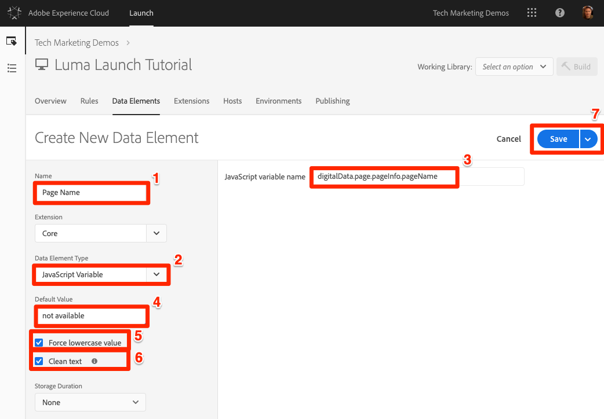
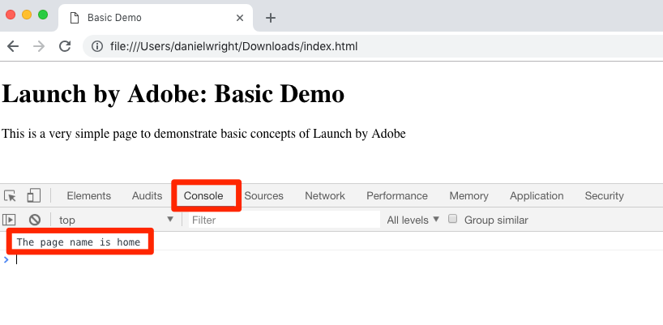

# Adicionar um elemento de dados, uma regra e uma biblioteca

Nesta lição, você criará seu primeiro Elemento de dados, Regra e Biblioteca.

Elementos de dados e regras são os elementos básicos do Launch. Os Elementos de dados armazenam os atributos que você deseja enviar para suas soluções de marketing e publicidade, enquanto as Regras acionam as solicitações para essas soluções nas condições certas.  As bibliotecas são os arquivos JavaScript que são carregados na página para fazer todo o trabalho. Nesta lição, você usará todos os três para fazer com que nossa página de amostra faça algo.

## Objetivos de aprendizagem

No final desta lição, você poderá:

* Criar um elemento de dados
* Criar uma regra
* Criar uma biblioteca
* Adicionar alterações a uma biblioteca
* Validar se a biblioteca está sendo carregada no navegador web
* Use o recurso "Biblioteca de trabalho" para trabalhar com mais eficiência

## Criar um elemento de dados para o nome da página

Os elementos de dados são a versão do Launch de uma camada de dados. Eles podem armazenar valores de seu próprio objeto de camada de dados, cookies, objetos de armazenamento local, parâmetros de sequência de caracteres de consulta, elementos de página, meta tags etc. Neste exercício, você criará um elemento de dados para Nome da página, que será usado posteriormente nas implementações do Target e Analytics.

**Para criar um elemento de dados**

1. Na navegação superior, clique em Elementos **[!UICONTROL de dados]**

1. Como você ainda não criou nenhum elemento de dados nesta propriedade, um breve vídeo é exibido com informações adicionais sobre esse tópico. Assista a este vídeo se desejar.

1. Click the **[!UICONTROL Create New Data Element]** button:

   

1. Name the data element, e.g. `Page Name`

1. Use the [!UICONTROL JavaScript Variable] Data Element type to point to a value in your sample page's data layer: `digitalData.page.pageInfo.pageName`

1. Use "`not available`" as the [!UICONTROL Default Value]. The [!UICONTROL Default Value] tells Launch what value to use for the data element if your JavaScript Variable specified above is not found.

1. Marque as caixas **[!UICONTROL Forçar valor minúsculo]** e **[!UICONTROL Texto limpo]** para padronizar o caso e remover espaços irrelevantes

1. Deixe **[!UICONTROL Nenhum]** como a configuração Duração **[!UICONTROL do]** armazenamento, pois esse valor normalmente será diferente em cada página

1. Clique no botão **[!UICONTROL Salvar]** para salvar o elemento de dados

   de dados Nome da página.

>[!NOTE]**** Migradores do DTM: Novos tipos de elementos de dados foram adicionados ao Launch, que não existia no DTM. Alguns dos novos tipos de elementos de dados incluem Armazenamento local, Armazenamento da sessão, Informações da página e Número aleatório
<!-- -->
>[!NOTE]Os recursos do elemento de dados _podem ser estendidos com Extensões_. Por exemplo, a extensão ContextHub permite que você adicione elementos de dados usando recursos da extensão.

## Criar uma regra

Em seguida, você usará esse elemento de dados em uma regra simples. As regras são um dos recursos mais avançados do Launch e permitem que você especifique o que deve ocorrer quando o visitante interagir com seu site. Quando os critérios descritos em suas regras forem atendidos, a regra acionará a ação especificada.

Você criará uma regra que gera o valor do elemento de dados Nome da página para o console do navegador.

**Para criar uma regra**

1. In the top navigation, click **[!UICONTROL Rules]**

1. Como você ainda não criou nenhuma regra nesta propriedade, um breve vídeo é exibido com informações adicionais sobre o tópico. Assista a este vídeo se desejar.

1. Click the **[!UICONTROL Create New Rule]** button:

   

1. Name the Rule `All Pages - Library Loaded`. Essa convenção de nomenclatura indica onde e quando a regra será acionada, facilitando a identificação e a reutilização da propriedade Launch.

1. Em Eventos, clique em **[!UICONTROL Adicionar]**. O evento informa ao Launch quando a regra deve ser acionada e pode ser muitas coisas, incluindo um carregamento de página, um clique, um evento JavaScript personalizado etc.

   

   1. Como Tipo de evento, selecione **[!UICONTROL Biblioteca carregada (Parte superior da página)]**. Observe que ao selecionar o Tipo de evento, a opção Iniciar pré-preenche um nome para o evento usando sua seleção. Observe também que a ordem padrão do evento é 50. O pedido é um recurso poderoso no Launch que oferece controle preciso sobre a sequência de ações quando você tem várias regras que são acionadas pelo mesmo evento. Você usará esse recurso posteriormente no tutorial.

   1. Clique no botão **[!UICONTROL Manter alterações]**
   

1. Como essa regra deve ser acionada em todas as páginas, deixe **[!UICONTROL Condições]** em branco. Se você abrir a modal Condições, verá que as condições podem adicionar restrições e exclusões com base em uma grande variedade de opções, incluindo URLs, valores de elemento de dados, intervalos de datas e muito mais.

1. Under Actions, click **[!UICONTROL Add]**

1. Selecione Tipo de **[!UICONTROL ação &gt; Código]** personalizado, que neste ponto é a única opção. Posteriormente no tutorial, à medida que você adiciona extensões, mais opções serão disponibilizadas.

1. Selecione **[!UICONTROL &lt;/&gt; Abrir editor]** para abrir o editor de código

   

1. Adicione o seguinte ao editor de código. Esse código exibirá o valor do elemento de dados Nome da página no console do navegador para que você possa confirmar se está funcionando:

   ```javascript
   console.log('The page name is '+_satellite.getVar('Page Name'));
   ```

1. Salvar o editor de código

   

1. On the Action configuration screen click **[!UICONTROL Keep Changes]**

1. Click **[!UICONTROL Save]** to save the rule

>[!NOTE]**** Migradores do DTM: No Launch, as regras são necessárias para acionar a maioria dos pixels de marketing. Por exemplo, para acionar o beacon do Adobe Analytics, é necessário usar uma regra para instruir o Launch a fazê-lo.
>
> O Construtor de regras foi drasticamente reprojetado e reconstruído no Launch.
> Algumas das alterações principais são:
>
> * Há apenas um construtor de regras. Os tipos de regras do DTM como "Final da página", "Clique" e "Chamada direta" são apenas tipos de eventos no Construtor de regras. Isso facilita a atualização de uma regra, caso precise alterar o acionador de, digamos, um evento pronto para DOM para um evento personalizado.
> * Existe um novo tipo de evento "Código personalizado"
> * As extensões podem adicionar novos tipos de evento ao construtor de regras. Por exemplo, a extensão do Target poderia eventualmente adicionar suporte incorporado para os [eventos personalizados at.js](https://docs.adobe.com/content/help/en/target/using/implement-target/client-side/functions-overview/atjs-custom-events.html), portanto, o código personalizado não seria necessário para usar esse recurso.
> * As extensões podem adicionar novas ações ao Construtor de regras, reduzindo problemas ao descontinuar a dependência do código personalizado. Você usará muitas dessas ações de extensão neste Tutorial.
> * As regras são necessárias para acionar solicitações associadas à maioria das ferramentas de marketing. Isso exigirá um ajuste da mentalidade, especialmente para coisas como a configuração de IDs do cliente, o acionamento de beacons do Analytics e o acionamento de solicitações do Target.


## Salvar suas alterações em uma biblioteca

Depois de configurar uma coleção de extensões, elementos de dados e regras na interface do Launch, é necessário disponibilizar esses recursos e lógica em um conjunto de códigos JavaScript que podem ser implantados em seu site para que as tags de marketing sejam acionadas quando os visitantes chegarem ao site. Uma biblioteca é o conjunto de códigos JavaScript que fará isso.

Em uma aula anterior, você implementou o código incorporado de seu ambiente de desenvolvimento na página de exemplo. Quando você carregou a página de amostra, um erro 404 foi retornado para o URL do código incorporado porque uma biblioteca de inicialização ainda não foi criada e atribuída ao ambiente. Agora você colocará seu novo elemento de dados e regra em uma biblioteca para que sua página de amostra possa fazer algo.

**Para adicionar e criar uma biblioteca**

1. Go to the [!UICONTROL Publishing] tab

1. Click **[!UICONTROL Add New Library]**

   

1. Nomeie a biblioteca como "Configuração inicial"

1. Selecione **[!UICONTROL Ambiente &gt; Desenvolvimento]**

1. Clique em **[!UICONTROL Adicionar todos os recursos alterados]**

   

1. Observe que depois de clicar em **[!UICONTROL Adicionar todos os recursos]** alterados, o Launch resume as alterações que você acabou de fazer.

1. Clique em **[!UICONTROL Salvar e criar para desenvolvimento]**

   

Após alguns momentos, o ponto de status ficará verde, indicando que a biblioteca foi construída com êxito.


## Validar seu trabalho

Agora, valide se sua regra está funcionando como esperado.

Recarregue sua página de exemplo. Se você observar a guia Developer Tools -&gt; Network (Ferramentas do desenvolvedor -&gt; Rede), verá agora uma resposta 200 para sua biblioteca de inicialização!


Se você observar o Console de ferramentas do desenvolvedor -&gt;, verá o texto "O nome da página é inicial"



Parabéns, você criou seu primeiro elemento e regra de dados e criou sua primeira biblioteca de inicialização!

## Usar o recurso Biblioteca de trabalho

Ao fazer muitas alterações no Launch, é inconveniente ter que ir para a guia Publicação, adicionar alterações e criar a biblioteca sempre que quiser ver o resultado.  Agora que você criou a biblioteca "Configuração inicial", é possível usar um recurso chamado "Biblioteca de trabalho" para salvar rapidamente suas alterações e recriar a biblioteca em uma única etapa.

Faça uma pequena alteração na regra "Todas as páginas - Biblioteca carregada". Na navegação superior, clique em **[!UICONTROL Regras]** e, em seguida, clique na `All Pages - Library Loaded` regra para abri-la.


Na `Edit Rule` página, clique na lista suspensa Biblioteca ***[!UICONTROL de]*** trabalho e selecione sua `Initial Setup` biblioteca.


Depois de selecionar a biblioteca, você deve ver que o botão **[!UICONTROL Salvar]** agora assume o padrão **[!UICONTROL Salvar na biblioteca e Criar]**. Ao fazer uma alteração no Launch, você pode usar essa opção para adicionar automaticamente a alteração diretamente à sua biblioteca de trabalho e recriá-la.

Teste-o. Abra a ação Código personalizado e adicione dois pontos depois do texto "O nome da página é" para que o bloco de código inteiro leia:

```javascript
console.log('The page name is: '+_satellite.getVar('Page Name'));
```

Salve o código, mantenha as alterações na ação e clique no botão **[!UICONTROL Salvar na biblioteca e construir]** .


Aguarde até que o ponto verde reapareça ao lado da lista suspensa Biblioteca [!UICONTROL de] trabalho. Agora, recarregue sua página de amostra e você deverá ver sua alteração refletida na mensagem do console (talvez seja necessário limpar o cache do navegador e recarregar para ver a alteração na página):


Essa é uma maneira muito mais rápida de trabalhar e você usará essa abordagem para o restante do tutorial.

[Próximo "Alternar ambientes com o Experience Cloud Debugger" &gt;](launch-switch-environments.md)
