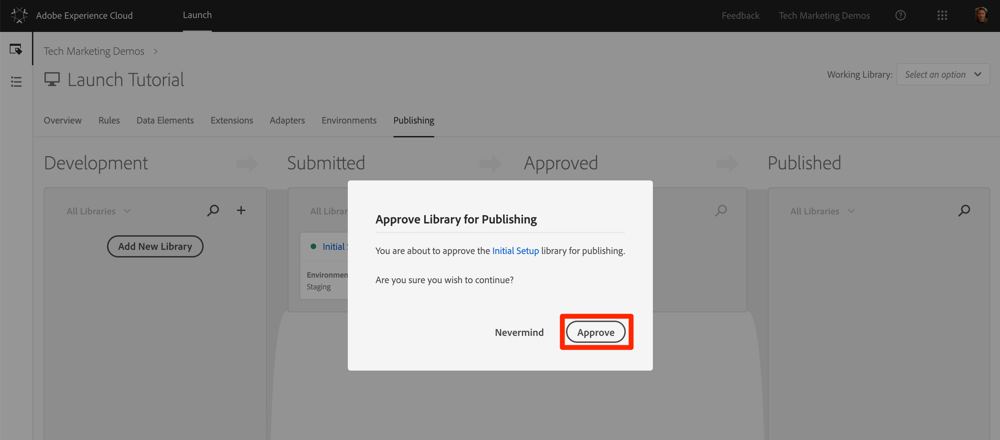

# Publicar sua propriedade de inicialização

Agora que você implementou algumas das principais soluções da Adobe Experience Cloud em seu ambiente de desenvolvimento, é hora de aprender o fluxo de trabalho de publicação.

## Objetivos de aprendizagem

No final desta lição, você poderá:

1. Publicar uma biblioteca de desenvolvimento no ambiente de armazenamento temporário
1. Mapeie uma biblioteca de preparo para seu site de produção usando o Depurador
1. Publicar uma biblioteca de armazenamento temporário no ambiente de produção

## Publicar no ambiente de armazenamento temporário

Agora que você criou e validou sua biblioteca no ambiente de desenvolvimento, é hora de publicá-la no armazenamento temporário.

1. Go to the **[!UICONTROL Publishing]** page

1. Abra a lista suspensa ao lado da biblioteca e selecione **[!UICONTROL Enviar para aprovação]**

   

1. Clique no botão **[!UICONTROL Enviar]** na caixa de diálogo:

   

1. Sua biblioteca agora aparecerá na coluna [!UICONTROL Enviado] em um estado não construído:

1. Abra a lista suspensa e selecione **[!UICONTROL Criar para armazenamento temporário]**:

   

1. Quando o ícone com o ponto verde é exibido, a biblioteca pode ser visualizada no ambiente de Armazenamento temporário.

Em um cenário da vida real, a próxima etapa do processo normalmente deve ser a validação das alterações por parte da sua equipe de controle de qualidade na biblioteca de Armazenamento temporário. Eles podem fazer isso usando o Depurador.

**Para validar as alterações na biblioteca de preparo**

1. Na propriedade Launch, abra a página [!UICONTROL Ambientes]

1. Na linha [!UICONTROL Preparo] , clique no ícone Instalar ícone  para abrir o modal

   

1. Clique no ícone Copiar ícone  para copiar o código incorporado para a área de transferência

1. Click **[!UICONTROL Close]** to close the modal

   

1. Open the [Luma demo site](https://luma.enablementadobe.com/content/luma/us/en.html) in your Chrome browser

1. Abra a extensão [do](https://chrome.google.com/webstore/detail/adobe-experience-cloud-de/ocdmogmohccmeicdhlhhgepeaijenapj) Experience Cloud Debugger clicando no ícone 

   

1. Vá para a guia Ferramentas

1. Clique no botão **[!UICONTROL Adobe Launch &gt; Inserir dinamicamente Launch &gt; Incorporar código]** para abrir o campo de entrada de texto (no momento, pode ter o URL do código incorporado Desenvolvimento):

   

1. Colar o código incorporado Preparado que está na área de transferência

1. Clique no ícone do disco para salvar

   

1. Recarregue e verifique a guia Resumo do Depurador. Na seção Iniciar, agora você deve ver sua Propriedade de armazenamento temporário sendo implementada, mostrando seu nome de propriedade (ou seja, "Iniciar tutorial" ou qualquer coisa que você nomeou sua propriedade)!

   

Na vida real, uma vez que sua equipe de controle de qualidade tenha feito logoff revisando as mudanças no ambiente de preparo temporário, é hora de publicar na produção.

## Publicar na produção

1. Go to the [!UICONTROL Publishing] page

1. Na lista suspensa, clique em **[!UICONTROL Aprovar para publicação]**:

   

1. Clique no botão **[!UICONTROL Aprovar]** na caixa de diálogo:

   

1. A biblioteca agora aparecerá na coluna [!UICONTROL Aprovado] no estado não construído (ponto amarelo):

1. Abra a lista suspensa e selecione **[!UICONTROL **Criar e publicar na produção]**:

   

1. Clique em **[!UICONTROL Publicar]** na caixa de diálogo:

   

1. A biblioteca será exibida na coluna [!UICONTROL Publicado] :

   

É isso! Você concluiu o tutorial e publicou sua primeira propriedade no Launch!