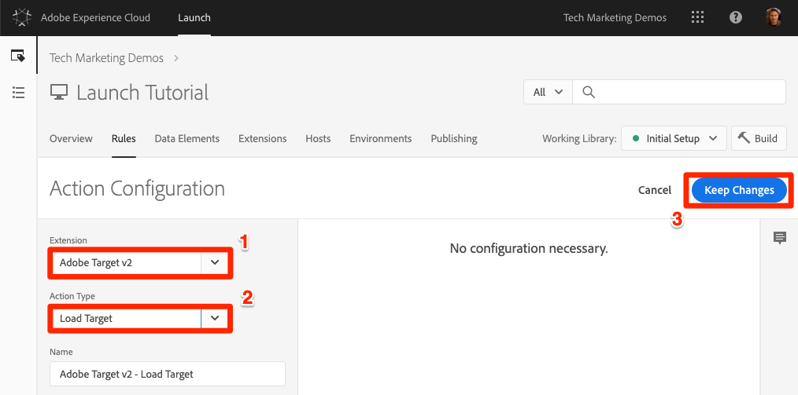
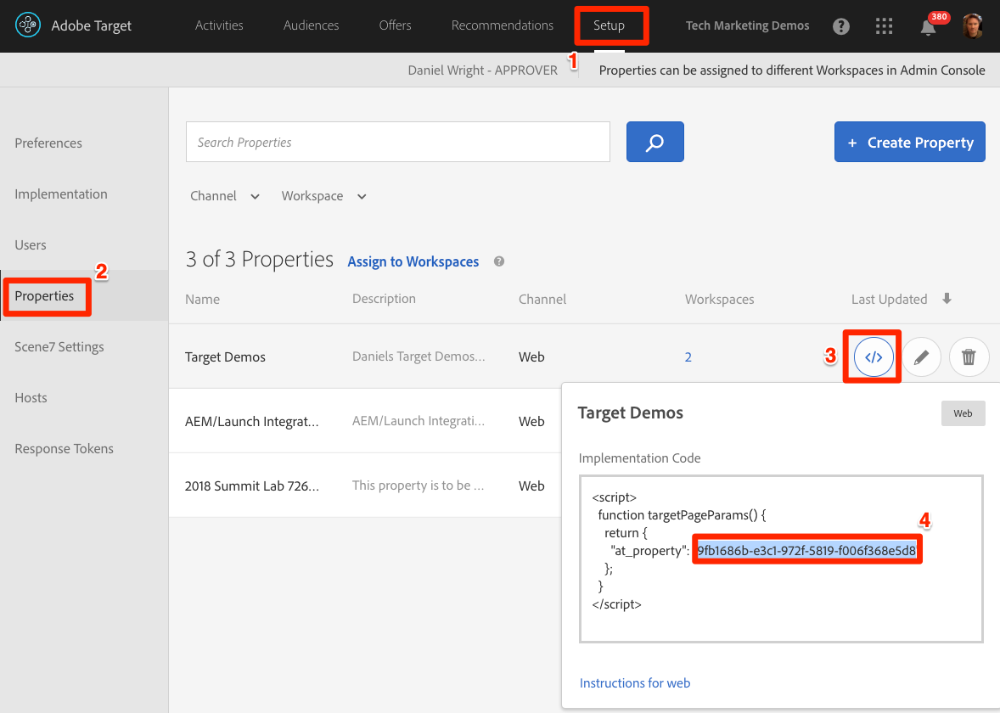

# Adicionar Adobe Target

Nesta lição, implementaremos a extensão [do](https://docs.adobe.com/content/help/en/launch/using/extensions-ref/adobe-extension/target-extension/overview.html) Adobe Target com uma solicitação de carregamento de página e parâmetros personalizados.

[O Adobe Target](https://docs.adobe.com/content/help/en/target/using/target-home.html) é a solução da Adobe Marketing Cloud que fornece tudo o que você precisa para adaptar e personalizar a experiência de seus clientes, para que você possa maximizar a receita em sites da Web e móveis, aplicativos, redes sociais e outros canais digitais.

## Objetivos de aprendizagem

No final desta lição, você poderá:

* Adicione o trecho de pré-ocultação usado para gerenciar oscilações ao usar o Target com códigos incorporados de Inicialização assíncronos
* Adicionar a extensão do Target v2
* Acionar a solicitação de carregamento da página (anteriormente chamada de "mbox global")
* Adicionar parâmetros à solicitação de carregamento de página
* Explique como os parâmetros de perfil e entidade podem ser adicionados à solicitação de carregamento de página
* Disparar a solicitação de confirmação da ordem com os parâmetros necessários
* Explica como adicionar configurações avançadas, como Cabeçalho de biblioteca e Código do rodapé da biblioteca
* Validar uma implementação do Target

## Pré-requisitos

To complete the lessons in this section, you must first complete the lessons in [Configure Launch](launch.md) and [Add the Identity Service](id-service.md).

## Adicionar o trecho de pré-ocultação do Target

Antes de começarmos, precisamos fazer uma pequena atualização nos códigos incorporados do Launch. Quando os códigos incorporados do Launch são carregados de forma assíncrona, a página pode terminar de renderizar antes que a biblioteca do Target seja totalmente carregada e tenha executado sua troca de conteúdo. Isso pode levar ao que é conhecido como "oscilação", onde o conteúdo padrão é exibido brevemente antes de ser substituído pelo conteúdo personalizado especificado pelo Target. Se você quiser evitar essa oscilação, recomendamos codificar um trecho especial de pré-ocultação imediatamente antes dos códigos incorporados assíncronos do Launch.

Isso já foi feito no site Luma, mas vamos continuar e fazer isso na página de amostra para que você entenda a implementação. Copie as linhas de código a seguir:

```html
<script>
    //prehiding snippet for Adobe Target with asynchronous Launch deployment
    (function(g,b,d,f){(function(a,c,d){if(a){var e=b.createElement("style");e.id=c;e.innerHTML=d;a.appendChild(e)}})(b.getElementsByTagName("head")[0],"at-body-style",d);setTimeout(function(){var a=b.getElementsByTagName("head")[0];if(a){var c=b.getElementById("at-body-style");c&&a.removeChild(c)}},f)})(window,document,"body {opacity: 0 !important}",3E3);
</script>
```

Abra a página de amostra e cole-a logo antes do código incorporado do Launch, como mostrado abaixo (não se preocupe se os números de linha forem diferentes):
Passe o

Recarregue sua página de exemplo. Você observará que a página ficará oculta por três segundos antes de ser exibida. Esse comportamento é temporário e desaparecerá depois que você implantar o Target. Esse comportamento de pré-ocultação é controlado por duas configurações no final do snippet, que podem ser personalizadas, mas geralmente são as melhores deixadas nas configurações padrão:

* `body {opacity: 0 !important}` especifica a definição css a ser usada para a pré-ocultação até que o Target seja carregado. Por padrão, todo o corpo ficará oculto. Se você tiver uma estrutura DOM consistente com um elemento de contêiner facilmente identificável que envolve todo o conteúdo abaixo de sua navegação, por exemplo, e nunca quiser testar ou personalizar sua navegação, você poderá usar essa configuração para limitar a pré-ocultação a esse elemento de contêiner.
* `3E3` que especifica a configuração de tempo limite para a pré-ocultação. Por padrão, se o Target não for carregado em três segundos, a página será exibida. Esse cenário deverá ser extremamente raro.

For more details and to obtain the un-minified pre-hiding snippet, please see [the Adobe Target extension with an asynchronous deployment&#x200B;](https://docs.adobe.com/content/help/en/launch/using/extensions-ref/adobe-extension/target-extension/overview.html#adobe-target-extension-with-an-asynchronous-deployment).

## Adicionar a extensão de destino

A extensão do Adobe Target suporta implementações do lado do cliente usando o JavaScript SDK do Target para a Web moderna, o at.js. Customers still using Target's older library, mbox.js, [should upgrade to at.js 2.x](https://docs.adobe.com/content/help/en/target/using/implement-target/client-side/mbox-implement/migrate-mbox/target-atjs-implementation.html) in order to use Launch.

A extensão do Target v2 consiste em duas partes principais:

1. A configuração da extensão, que gerencia as principais configurações da biblioteca
1. Ações de regras responsáveis pelos itens a seguir:
   1. Carregar destino (at.js 2.x)
   1. Adicionar parâmetros às solicitações de carregamento de página
   1. Adicionar params a todas as solicitações
   1. Acionar solicitação de carregamento de página

Neste primeiro exercício, adicionaremos a extensão e observaremos as configurações. Em exercícios posteriores, utilizaremos as ações.

**Para adicionar a extensão**

1. Ir para **[!UICONTROL Extensões &gt; Catálogo]**
1. Digite `target` o filtro para localizar rapidamente as extensões do Adobe Target. Há duas extensões: Adobe Target e Adobe Target v2. Este tutorial usará a versão v2 da extensão que usa a versão mais recente do at.js (atualmente 2.x), ideal para sites tradicionais e aplicativos de página única (SPA).
1. Clique em **[!UICONTROL Instalar]**

   

1. Quando você adiciona a extensão, ela importará muitas, mas não todas as suas configurações do at.js da interface do Target, como mostrado abaixo. Uma configuração que não será importada é o Tempo limite, que sempre terá 3000 ms após a adição da extensão. No tutorial, mantenha as configurações padrão. Observe que, no lado esquerdo, será exibida a versão at.js fornecida com a versão atual da extensão.

1. Clique em **[!UICONTROL Salvar na biblioteca e construir]**

   

Neste ponto, o Target não está fazendo nada, então não há nada para validar.

>[!NOTE] Cada versão da extensão do Target vem com uma versão específica do at.js, que está listada na descrição da extensão. Atualize a versão do at.js atualizando a extensão do Target.

## Carregar o Target e acionar a solicitação de carregamento de página

Os profissionais de marketing usam o Target para controlar a experiência do visitante na página ao testar e direcionar conteúdo. Devido a essa importante função na exibição da página, você deve carregar o Target o mais cedo possível para minimizar o impacto na visibilidade da página. Nesta seção, carregaremos a biblioteca JavaScript do Target, o at.js, e acionaremos a solicitação de carregamento da página (chamada de "mbox global" em versões anteriores do at.js).

Você pode usar a `All Pages - Library Loaded` regra criada na lição "[Adicionar elementos de dados, regras e bibliotecas](launch-data-elements-rules.md)" para implementar o Target, pois ele já é acionado o mais cedo possível em cargas de página.

**Para carregar o destino**

1. Vá para as **[!UICONTROL Regras]** no início da navegação e clique em `All Pages - Library Loaded` para abrir o editor de regras

   

1. Under Actions, click the  to add a new action

   

1. Selecione **[!UICONTROL Extensão &gt; Adobe Target v2]**

1. Selecionar tipo de **[!UICONTROL ação &gt; Carregar destino]**

1. Click **[!UICONTROL Keep Changes]**

   

Com a `Load Target` ação adicionada, o at.js será carregado na página. No entanto, nenhuma solicitação do Target será acionada até que a ação seja adicionada. `Fire Page Load Request`

**Para acionar a solicitação de carregamento de página**

1. Em Ações, clique no ícone  clique novamente para adicionar outra ação

   

1. Selecione **[!UICONTROL Extensão &gt; Adobe Target v2]**

1. Selecione Tipo de **[!UICONTROL ação &gt; Solicitação de carregamento de página de acionamento]**

1. Há algumas configurações disponíveis para a solicitação de carregamento de página relacionadas à ocultação ou não da página e do seletor de CSS para uso na pré-ocultação. Essas configurações funcionam em conjunto com o trecho pré-ocultado codificado na página. Mantenha as configurações padrão.

1. Click **[!UICONTROL Keep Changes]**

   

1. A nova ação é adicionada em sequência após a `Load Target` ação e as ações serão executadas nessa ordem. Você pode arrastar e soltar as ações para reorganizar a ordem, mas nesse cenário, `Load Target` precisa estar antes `Fire Page Load Request`.

1. Clique em **[!UICONTROL Salvar na biblioteca e construir]**

   

### Validar a solicitação de carregamento de página

Agora que você adicionou a extensão do Target v2 e acionou as ações `Load Target` e `Fire Page Load Request` , deve haver uma solicitação de carregamento de página feita em todas as páginas em que a propriedade Launch é usada.

**Para validar as ações Carregar meta e Carregar página, solicite**

1. Recarregue sua página de exemplo. Você não deve mais ver um atraso de três segundos antes da página estar visível. If you are loading the sample page using the `file://` protocol, you should do this step in Firefox or Safari browsers since Chrome will not fire a Target request when using the `file://` protocol.

1. Open the [Luma site](https://luma.enablementadobe.com/content/luma/us/en.html)

1. Make sure the Debugger is mapping the Launch property to *your* Development environment, as described in the [earlier lesson](launch-switch-environments.md)

   

1. Vá para a guia Resumo do Depurador

1. In the `Launch` section, confirm that `Target` appears under the `Extensions` heading

1. Na `Target` seção, confirme se a versão da biblioteca do at.js é exibida

   

1. Finalmente, vá para a `Target` guia, expanda o código do cliente e confirme se a solicitação de carregamento da página é exibida:

   

Parabéns! Você implementou o Target!

## Adicionar parâmetros

Passar parâmetros na solicitação do Target adiciona recursos avançados às suas atividades de definição de metas, teste e personalização. A extensão Launch fornece duas ações para passar pelos parâmetros:

1. `Add Params to Page Load Request`, que adiciona parâmetros às solicitações de carregamento de página (equivalente ao método [targetPageParams()](https://docs.adobe.com/content/help/en/target/using/implement-target/client-side/functions-overview/cmp-atjs-functions.html) )

1. `Add Params to All Requests`, que adiciona parâmetros em todas as solicitações do Target, por exemplo, a solicitação de carregamento da página mais solicitações adicionais feitas de ações de Código personalizado ou codificadas no site (equivalente ao método [targetPageParamsAll()](https://docs.adobe.com/content/help/en/target/using/implement-target/client-side/functions-overview/cmp-atjs-functions.html) )

These actions can be used *before* the `Load Target` action and can set different parameters on different pages based on your rule configurations. Use o recurso de ordenação de regras que você usou ao definir IDs do cliente com o Serviço de identidade para definir parâmetros adicionais no `Library Loaded` evento antes da regra disparar a solicitação de carregamento de página.
>[!TIP] Como a maioria das implementações usa a solicitação de carregamento de página para a entrega da atividade, geralmente é suficiente apenas usar a `Add Params to Page Load Requests` ação.

### Parâmetros de solicitação (mbox)

Parâmetros são usados para passar dados personalizados para o Target, enriquecendo seus recursos de personalização. Eles são ideais para atributos que mudam frequentemente durante uma sessão de navegação, como nome da página, modelo etc. e não persistam.

Vamos adicionar o elemento de `Page Name` dados que criamos anteriormente na lição [Adicionar elementos de dados, regras e bibliotecas](launch-data-elements-rules.md) como parâmetro de solicitação.

**Para adicionar o parâmetro de solicitação**

1. Vá para as **[!UICONTROL Regras]** no início da navegação e clique em `All Pages - Library Loaded` para abrir o editor de regras.

   

1. Under Actions, click the  to add a new action

   

1. Selecione **[!UICONTROL Extensão &gt; Adobe Target v2]**

1. Selecione Tipo de **[!UICONTROL ação &gt; Adicionar parâmetros à solicitação de carregamento de página]**

1. Digite `pageName` o **[!UICONTROL nome]**

1. Click the  to open the data element modal

1. Clique no elemento de `Page Name` dados

1. Clique no botão **[!UICONTROL Selecionar]**

   

1. Click **[!UICONTROL Keep Changes]**

   

1. Clique e arraste na borda esquerda da `Add Params to Page Load Request` ação para reorganizar as ações antes da `Fire Page Load Request` ação (pode ser antes ou depois `Load Target`)

1. Clique em **[!UICONTROL Salvar na biblioteca e construir]**

   

#### Validar parâmetros de solicitação

Por enquanto, os parâmetros personalizados enviados com solicitações at.js 2.x não são facilmente visíveis no Depurador, portanto, utilizaremos as ferramentas do desenvolvedor do navegador.

**Para validar o parâmetro de solicitação pageName**

1. Recarregue o site Luma, certificando-se de que ele esteja mapeado para sua própria propriedade Launch
1. Abra as ferramentas do desenvolvedor do seu navegador
1. Clique na guia Rede
1. Filtrar as solicitações para `tt.omtrdc` (ou seu domínio CNAME para solicitações do Target)
1. Expanda a seção `Headers` &gt; `Request Payload` &gt; `execute.pageLoad.parameters` para validar o `pageName` parâmetro e o valor
   

<!--Now go to the **[!UICONTROL Target]** tab in the Debugger. Expand your client code and look at the requests. You should see the new `pageName` parameter passed in the request:

-->

### Parâmetros de perfil

Semelhante aos parâmetros de solicitação, os parâmetros de perfil também são passados pela solicitação do Target. However, profile parameters get stored in Target's visitor profile database and will persist for the [duration of the visitor's profile](https://docs.adobe.com/content/help/en/target/using/audiences/visitor-profiles/visitor-profile-lifetime.html). Você pode defini-los em uma página do site e usá-los em atividades do Target em outra página. Este é um exemplo de um site de automóveis. Quando um visitante vai para uma página do veículo, você pode passar um parâmetro de perfil "profile.lastViewed=sportscar" para registrar seu interesse nesse veículo em particular. Quando o visitante navega para outras páginas que não sejam de veículos, você pode direcionar o conteúdo com base no último veículo exibido.  Parâmetros de perfil são ideais para atributos que raramente mudam ou que estão disponíveis apenas em determinadas páginas

You won't pass any profile parameters in this tutorial, but the workflow is almost identical to what you just did when passing the `pageName` parameter. A diferença é que você precisa dar nomes de perfil aos parâmetros de perfil com um prefixo `profile.`. É assim que um parâmetro de perfil chamado "userType" seria na `Add Params to Page Load Request` ação:


### Parâmetros de entidade

Parâmetros de entidade são parâmetros especiais usados em [implementações do Recommendations](https://docs.adobe.com/content/help/en/target/using/recommendations/plan-implement.html) por três motivos principais:

1. Como uma chave para acionar as recomendações do produto. Por exemplo, ao usar um algoritmo de recomendações como o "Pessoas que visualizaram o Produto X, também visualizaram Y", "X" é a "chave" da recomendação. Normalmente, é o SKU (`entity.id`) ou a categoria (`entity.categoryId`) do produto que o visitante está visualizando atualmente.
1. Para coletar o comportamento do visitante para alimentar algoritmos de recomendações, como "Produtos visualizados recentemente" ou "Produtos mais visualizados"
1. Para preencher o catálogo de Recomendações. O Recommendations contém um banco de dados de todos os produtos ou artigos do seu site, para que possam ser atendidos na oferta de recomendação. Por exemplo, ao recomendar produtos, normalmente deseja-se exibir atributos como o nome do produto (`entity.name`) e a imagem (`entity.thumbnailUrl`). Alguns clientes preenchem seu catálogo usando feeds de backend, mas também podem ser preenchidos usando parâmetros de entidade em solicitações do Target.

Você não precisa passar nenhum parâmetro de perfil neste tutorial, mas o fluxo de trabalho é idêntico ao que você fez anteriormente ao passar o parâmetro de `pageName` solicitação — basta dar ao parâmetro um nome prefixo "entity". e mapeie-o para o elemento de dados relevante. Observe que algumas entidades comuns têm nomes reservados que devem ser usados (por exemplo, entity.id para o sku do produto). É assim que se parece ao definir parâmetros de entidade na `Add Params to Page Load Request` ação:


### Adicionar parâmetros de ID do cliente

A coleta de IDs do cliente com o Adobe Experience Platform Identity Service facilita a importação de dados do CRM para o Target usando o recurso Atributos [do](https://docs.adobe.com/content/help/en/target/using/audiences/visitor-profiles/working-with-customer-attributes.html) cliente da Adobe Experience Cloud. It also enables [cross-device visitor stitching](https://docs.adobe.com/content/help/en/target/using/integrate/experience-cloud-device-co-op.html), allowing you to maintain a consistent user experience as your customers switch between their laptops and their mobile devices.

É imperativo definir a ID do cliente na ação do Serviço de identidade `Set Customer IDs` antes de disparar a solicitação de carregamento da página. Para esse fim, verifique se você tem os recursos a seguir no site:

* A ID do cliente deve estar disponível na página antes de Iniciar o código incorporado
* A extensão do Adobe Experience Platform Identity Service deve ser instalada
* You must use the `Set Customer IDs` action in a rule that fires at the "Library Loaded (Page Top)" event
* Use the `Fire Page Load Request` action in a rule that fires *after* the "Set Customer IDs" action

Na lição anterior, [Adicionar o Adobe Experience Platform Identity Service](id-service.md), você criou a `All Pages - Library Loaded - Authenticated - 10` regra para acionar a ação "Definir ID do cliente". Como essa regra tem uma `Order` configuração de `10`, as IDs do cliente são definidas antes que nossa solicitação de carregamento de página seja acionada da `All Pages - Library Loaded` regra com sua `Order` configuração de `50`. Portanto, você já implementou a coleção de IDs de clientes para o Target!

#### Validar a ID do cliente

Por enquanto, os parâmetros personalizados enviados com solicitações at.js 2.x não são facilmente visíveis no Depurador, portanto, utilizaremos as ferramentas do desenvolvedor do navegador.

**Para validar a ID do cliente**

1. Open the [Luma site](https://luma.enablementadobe.com/content/luma/us/en.html)

1. Make sure the Debugger is mapping the Launch property to *your* Development environment, as described in the [earlier lesson](launch-switch-environments.md)

   

1. Faça logon no site Luma usando as credenciais `test@adobe.com`/`test`
1. Return to the [Luma homepage](https://luma.enablementadobe.com/content/luma/us/en.html)

1. Abra as ferramentas do desenvolvedor do seu navegador
1. Clique na guia Rede
1. Filtrar as solicitações para `tt.omtrdc` (ou seu domínio CNAME para solicitações do Target)
1. Expanda a seção `Headers` &gt; `Request Payload` &gt; `id.customerIds.0` para validar as configurações e o valor da ID do cliente:
   
<!--
1. Open the Debugger
1. Go to the Target tab
1. Expand your client code
1. You should see parameters in the latest Target request for `vst.crm_id.id` and `vst.crm_id.authState`. `vst.crm_id.id` should have a value of the hashed email address and `vst.crm_id.authState` should have a value of `1` to represent `authenticated`. Note that `crm_id` is the `Integration Code` you specified in the Identity Service configuration and must align with the key you use in your [Customer Attributes data file](https://docs.adobe.com/content/help/en/core-services/interface/customer-attributes/t-crs-usecase.html):

-->

>[!WARNING] O Adobe Experience Platform Identity Service permitirá que você envie várias IDs para o Serviço, no entanto, somente a primeira será enviada para o Target.

### Adicionar o parâmetro do token de propriedade

>[!NOTE] Este é um exercício opcional para clientes do Target Premium.

The property token is a reserved parameter used with the Target Premium [Enterprise User Permissions](https://docs.adobe.com/content/help/en/target/using/administer/manage-users/enterprise/property-channel.html) feature. Ele é usado para definir diferentes propriedades digitais para que diferentes membros de uma organização da Experience Cloud possam receber permissões diferentes em cada propriedade. Por exemplo, você pode desejar que um grupo de usuários possa configurar atividades do Target em seu site, mas não em seu aplicativo móvel.

As propriedades do Target são análogas às propriedades do Launch e aos conjuntos de relatórios do Analytics. Uma empresa com várias marcas, sites e equipes de marketing pode usar uma propriedade diferente do Target, a propriedade Launch e o conjunto de relatórios do Analytics para cada site ou aplicativo móvel. As propriedades de inicialização são diferenciadas pelos códigos incorporados, os conjuntos de relatórios do Analytics são diferenciados pela ID do conjunto de relatórios e as propriedades do Target são diferenciadas pelo parâmetro do token de propriedade.

O token de propriedade é implementado como um parâmetro de solicitação. Basta nomear o parâmetro "at_property" e colar no valor fornecido na interface do Target.  Se você estiver implementando vários sites com uma única propriedade Launch, é possível gerenciar o valor at_property por meio de um elemento de dados.

Este é um exercício opcional, se você for um cliente do Target Premium e quiser implementar um token de propriedade na propriedade Tutorial:

1. Em uma guia separada, abra a interface do usuário do Target

1. Vá até **[!UICONTROL Configuração &gt; Propriedades]**

1. Identifique a Propriedade que deseja usar e clique na **[!UICONTROL &lt;/&gt;]** (ou crie uma nova propriedade)

1. Copy the `at_property` value to your clipboard

   

1. In your Launch tab, go to the **[!UICONTROL Rules]** in the top navigation and then click on `All Pages - Library Loaded` to open the rule editor.

   

1. Em Ações, clique na `Adobe Target - Add Params to Page Load Request` ação para abrir a variável `Action Configuration`

   

1. Em `pageName` Parâmetro, clique no botão **[!UICONTROL Adicionar]**

   

1. Name the parameter `at_property` and paste in the value you copied from the Target interface

1. Click **[!UICONTROL Keep Changes]**

   

1. Clique em **[!UICONTROL Salvar na biblioteca e construir]**
   

#### Validar o token de propriedade

Por enquanto, os parâmetros personalizados enviados com solicitações at.js 2.x não são facilmente visíveis no Depurador, portanto, utilizaremos as ferramentas do desenvolvedor do navegador.

**Para validar o parâmetro Token de propriedade**

1. Open the [Luma site](https://luma.enablementadobe.com/content/luma/us/en.html)
1. Make sure the Debugger is mapping the Launch property to *your* Development environment, as described in the [earlier lesson](launch-switch-environments.md)

   

1. Abra as ferramentas do desenvolvedor do seu navegador
1. Clique na guia Rede
1. Filtrar as solicitações para `tt.omtrdc` (ou seu domínio CNAME para solicitações do Target)
1. Expanda a seção `Headers` &gt; `Request Payload` &gt; `property.token` para validar o valor
   

<!--
1. Go to the `Target` tab
1. Expand your client code
1. You should see the parameter for "at_property" in every page load request request as you browse the site:

-->

## Adicionar solicitações personalizadas

### Adicionar uma solicitação de confirmação de pedido

A solicitação de confirmação do pedido é um tipo especial de solicitação usada para enviar detalhes do pedido ao Target. A inclusão de três parâmetros de solicitação específicos — orderId, orderTotal e productPurchasedId — é o que transforma uma solicitação regular do Target em uma solicitação de pedido. Além da receita de relatório, a solicitação de pedido também faz o seguinte:

1. Elimina a duplicação de reenvios acidentais de pedidos
1. Filtra pedidos extremos (qualquer pedido cujo total tenha mais de três desvios padrão na média)
1. Usa um algoritmo diferente em segundo plano para calcular a confiança estatística
1. Cria um relatório de auditoria especial de detalhes de pedidos individuais disponível para download

A prática recomendada é usar e solicitar solicitação de confirmação em todos os funis de pedido, mesmo em sites que não sejam de varejo. Por exemplo, os sites de geração de leads geralmente possuem funis de leads com uma “id de lead” exclusiva gerada no fim. Esses sites devem implementar uma solicitação de pedido, usando um valor estático (por exemplo, "1") para o orderTotal.

Os clientes que usam a integração do Analytics para Target (A4T) para a maioria de seus relatórios também devem implementar a solicitação de pedido, já que o A4T ainda não é compatível com tipos de atividade como Autoalocação, Personalização automatizada e Segmentação automática. Além disso, a solicitação de pedido é um elemento essencial nas implementações do Recommendations, acionando algoritmos com base no comportamento de compra.

A solicitação de confirmação de pedido deve ser acionada a partir de uma regra que só é acionada na página de confirmação de pedido ou evento. Geralmente, pode ser combinado com uma regra que define o evento de compra do Adobe Analytics. Ele deve ser configurado usando a ação Código personalizado da extensão Core, usando os elementos de dados apropriados para definir os parâmetros orderId, orderTotal e productPurchasedId.

Vamos adicionar os elementos de dados e a regra que precisamos para acionar uma solicitação de confirmação de pedido no site Luma. Como você já criou vários elementos de dados, essas instruções serão abreviadas.

**Para criar o elemento de dados para a ID do pedido**

1. Clique em Elementos **[!UICONTROL de dados]** na navegação superior
1. Clique em **[!UICONTROL Adicionar elemento de dados]**
1. Nomeie o elemento de dados `Order Id`
1. Selecionar tipo de elemento **[!UICONTROL de dados &gt; Variável JavaScript]**
1. Use `digitalData.cart.orderId` como a variável `JavaScript variable name`
1. Check the `Clean text` option
1. Clique em **[!UICONTROL Salvar na biblioteca]**(Não criaremos a biblioteca até que todas as alterações sejam feitas na solicitação de confirmação do pedido)

**Para criar o elemento de dados para a Quantia do carrinho**

1. Clique em **[!UICONTROL Adicionar elemento de dados]**
1. Nomeie o elemento de dados `Cart Amount`
1. Selecionar tipo de elemento **[!UICONTROL de dados &gt; Variável JavaScript]**
1. Use `digitalData.cart.cartAmount` como a variável `JavaScript variable name`
1. Check the `Clean text` option
1. Clique em **[!UICONTROL Salvar na biblioteca]**

**Para criar o elemento de dados para SKUs do carrinho (Target)**

1. Clique em **[!UICONTROL Adicionar elemento de dados]**
1. Nomeie o elemento de dados `Cart SKUs (Target)`
1. Selecione Tipo de elemento **[!UICONTROL de dados &gt; Código personalizado]**
1. Para o Target, as SKUs devem estar em uma lista separada por vírgulas. Esse código personalizado reformatará a matriz da camada de dados no formato correto. No editor de código personalizado, cole o seguinte:

   ```javascript
   var targetProdSkus="";
   for (var i=0; i<digitalData.cart.cartEntries.length; i++) {
     if(i>0) {
       targetProdSkus = targetProdSkus + ",";
     }
     targetProdSkus = targetProdSkus + digitalData.cart.cartEntries[i].sku;
   }
   return targetProdSkus;
   ```

1. Check the `Force lowercase value` option
1. Check the `Clean text` option
1. Clique em **[!UICONTROL Salvar na biblioteca]**

Agora precisamos criar uma regra para acionar a solicitação de confirmação de pedido com esses elementos de dados como parâmetros na página de confirmação de pedido.

**Para criar a regra para a página Confirmação de pedido**

1. Click **[!UICONTROL Rules]** in the top navigation
1. Clique em **[!UICONTROL Adicionar regra]**
1. Atribua um nome à regra `Order Confirmation Page - Library Loaded - 60`
1. Clique em **[!UICONTROL Eventos &gt; Adicionar]**
   1. Selecionar tipo de **[!UICONTROL evento &gt; Biblioteca carregada (início da página)]**
   1. Altere o `Order` para `60` que seja acionado após a `Load Target` ação (que está em nossa `All Pages - Library Loaded` regra onde `Order` está definida como `50`)
   1. Click **[!UICONTROL Keep Changes]**
1. Clique em **[!UICONTROL Condições &gt; Adicionar]**
   1. Selecione Tipo de **[!UICONTROL condição &gt; Caminho sem string de consulta]**
   1. Para `Path equals` inserir `thank-you.html`
   1. Alterne a opção Regex para alterar a lógica de `equals` para `contains` (você pode usar o `Test` recurso para confirmar se o teste será aprovado com o URL) `https://luma.enablementadobe.com/content/luma/us/en/user/checkout/order/thank-you.html`

      

   1. Click **[!UICONTROL Keep Changes]**
1. Clique em **[!UICONTROL Ações &gt; Adicionar]**
   1. Selecione Tipo de **[!UICONTROL ação &gt; Código personalizado]**
   1. Click **[!UICONTROL Open Editor]**
   1. Paste the following code into the `Edit Code` modal

      ```javascript
      adobe.target.getOffer({
        "mbox": "orderConfirmPage",
        "params":{
           "orderId": _satellite.getVar('Order Id'),
           "orderTotal": _satellite.getVar('Cart Amount'),
          "productPurchasedId": _satellite.getVar('Cart SKUs (Target)')
        },
        "success": function(offer) {
          adobe.target.applyOffer({
            "mbox": "orderConfirmPage",
            "offer": offer
          });
        },
        "error": function(status, error) {
          console.log('Error', status, error);
        }
      });
      ```

   1. Click **[!UICONTROL Save]** to save the custom code
   1. Clique em **[!UICONTROL Manter alterações]** para manter a ação
1. Clique em **[!UICONTROL Salvar na biblioteca e construir]**

#### Validar a solicitação de confirmação de pedido

Por enquanto, os parâmetros personalizados enviados com solicitações at.js 2.x não são facilmente visíveis no Depurador, portanto, utilizaremos as ferramentas do desenvolvedor do navegador.

1. Open the [Luma site](https://luma.enablementadobe.com/content/luma/us/en.html)

1. Make sure the Debugger is mapping the Launch property to *your* Development environment, as described in the [earlier lesson](launch-switch-environments.md)

   

1. Navegue pelo site e adicione vários produtos ao carrinho
1. Prossiga para o check-out
1. Durante o processo de checkout, os únicos campos obrigatórios são `First Name` e `Last Name`

   

1. On the Review Order page, be sure to click the `Place Order` button
1. Abra as ferramentas do desenvolvedor do seu navegador
1. Clique na guia Rede
1. Filtrar as solicitações para `tt.omtrdc` (ou seu domínio CNAME para solicitações do Target)
1. Clique na segunda solicitação
1. Expanda a seção `Headers` &gt; `Request Payload` &gt; `execute.mboxes.0` para validar o nome da solicitação e os parâmetros do pedido:
   
<!--
1. Look in the Debugger
1. Go to the Target tab
1. Expand your client code
1. You should see the `orderConfirmPage` request as the latest Target request with the orderId, orderTotal, and productPurchasedId parameters populated with the details of your order

   -->

### Solicitações personalizadas

Há instâncias raras quando você precisa fazer solicitações do Target diferentes do carregamento da página e da solicitação de confirmação do pedido. Por exemplo, às vezes, os dados importantes que você gostaria de usar para personalização não são definidos na página antes dos códigos incorporados do Launch — podem ser codificados na parte inferior da página ou retornados de uma solicitação de API assíncrona. Esses dados ainda podem ser enviados para o Target usando uma solicitação adicional, embora não seja ideal usar essa solicitação para a entrega do conteúdo, pois a página já estará visível. Ele pode ser usado para aprimorar o perfil do visitante para uso posterior (usando parâmetros de perfil) ou para preencher o catálogo do Recommendations.

In these circumstances, use the Custom Code action in the Core extension to fire a request using the
[getOffer()](https://docs.adobe.com/content/help/en/target/using/implement-target/client-side/functions-overview/adobe-target-getoffer.html)/[applyOffer()](https://docs.adobe.com/content/help/en/target/using/implement-target/client-side/functions-overview/adobe-target-applyoffer.html) and [trackEvent()](https://docs.adobe.com/content/help/en/target/using/implement-target/client-side/functions-overview/adobe-target-trackevent.html)
methods. This is very similar to what you just did in the [Order
Confirmation request](#order-confirmation-request) exercise, but you will just use a different request name and will not use the special order parameters. Be sure to use the **[!UICONTROL Load Target]** action before making Target requests from custom code.

## Cabeçalho da biblioteca e Rodapé da biblioteca

A tela Editar at.js na interface do usuário do Target tem locais nos quais você pode colar o JavaScript personalizado que será executado imediatamente antes ou depois do arquivo at.js. The Library Header is sometimes used to override at.js settings via the
[targetGlobalSettings()](https://docs.adobe.com/content/help/en/target/using/implement-target/client-side/functions-overview/targetgobalsettings.html) function or pass data from third parties using the [Data Providers](https://docs.adobe.com/content/help/en/target-learn/tutorials/integrations/use-data-providers-to-integrate-third-party-data.html) feature. Às vezes, o rodapé da biblioteca é usado para adicionar ouvintes de eventos [personalizados](https://docs.adobe.com/content/help/en/target/using/implement-target/client-side/functions-overview/atjs-custom-events.html) at.js.

Para replicar esse recurso no Launch, basta usar a ação Código personalizado na extensão Principal e sequenciar a ação antes (Cabeçalho da biblioteca) ou depois (Rodapé da biblioteca) da ação Carregar destino. This can be done in the same rule as the `Load Target` action (as pictured below) or in separate rules with events or order settings that will reliably fire before or after the rule containing `Load Target`:


Para saber mais sobre os casos de uso para cabeçalhos e rodapés personalizados, consulte os seguintes recursos:

* [Usar dataProviders para integrar dados de terceiros ao Adobe Target](https://docs.adobe.com/content/help/en/target-learn/tutorials/integrations/use-data-providers-to-integrate-third-party-data.html)
* [Implementar de dataProviders para integrar dados de terceiros ao Adobe Target](https://docs.adobe.com/content/help/en/target-learn/tutorials/integrations/implement-data-providers-to-integrate-third-party-data.html)
* [Usar Tokens de resposta e Eventos personalizados do at.js com o Adobe Target](https://docs.adobe.com/content/help/en/target-learn/tutorials/integrations/use-response-tokens-and-atjs-custom-events.html)

[Próximo "Adicionar Adobe Analytics" &gt;](analytics.md)
